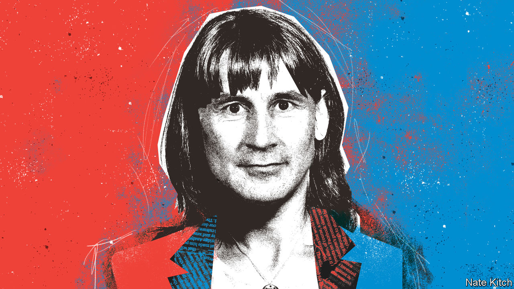

###### Bagehot

# Meet Ms Heeves, the face of Britain’s new political consensus 

##### How Labour and the Conservatives ended up agreeing on almost everything 

 

> Feb 2nd 2023 

In 1954  introduced readers to Mr Butskell. This portmanteau of the Conservative chancellor, Rab Butler, and his Labour predecessor, Hugh Gaitskell, was a personification of the post-war economic consensus that shaped Britain from the 1940s to the 1970s. Each party accepted the broad parameters of a generous welfare state, Keynesianism and full employment, until Margaret Thatcher emerged. 

Butskellism may be long dead, but another consensus is forming in British politics. On Brexit, the defining schism of British politics for the past seven years, each of the two main parties is committed to honing the edges of the arrangement, rather than forging one anew. From immigration to foreign policy to the future of the union, there is little to choose between the parties. When it comes to the size of the state and the shape of the economy, neither Jeremy Hunt, the Tory chancellor, nor Rachel Reeves, the Labour shadow chancellor, veer too far from each other’s visions. Mr Butskell has been succeeded by a new figure: Ms Heeves. 

Mr Hunt and Ms Reeves would be equally offended by the characterisation—yet more agreement!—but this is not a cosy consensus. Political parties are drawn together by shared nightmares rather than common goals, argues Phil Tinline in the “Death of Consensus”, a recent political history of 20th-century Britain. Consensus is agreement “on what to reject”. For those who lived through the 1930s, like Mr Butskell, the thing to fear was the dole queue. A policy of full employment followed. By the 1970s the nightmare took the form of trade-union militancy. And so along came Thatcher, whose legacy has survived subsequent Labour and Conservative governments. 

Different nightmares dominate the mind of Ms Heeves. The first is a paranoia about financial stability. Liz Truss, the shortest-lived prime minister ever, provided a terrifying example of how bad things can get, and how quickly. After her budget was unveiled last autumn, sterling plunged, gilt yields spiked and pension funds were almost impaled. Ms Truss lost her job; her growth-at-all-costs philosophy will not soon be repeated. Now fiscal orthodoxy rules supreme. Boosting growth or stopping climate change come a distant second to fiscal prudence in Ms Heeves’s world. 

Both parties have been burnt by experimentation. Ms Truss’s experiment did not end well. Nor did that of Jeremy Corbyn, the former Labour leader, who promised a radically different economy and took the party to its worst result in almost a century. In the next election the Tories will campaign on the idea that any embryonic recovery is not worth risking. Labour will argue that only they can provide competence. Sweeping change will not be on offer. Ms Heeves channels the slogan of Konrad Adenauer, a post-war German chancellor: “”

Above all, Ms Heeves fears a re-emergence of the miserable political paralysis that jammed Westminster between 2016 and 2019, after Brexit triggered a political nervous breakdown. Neither party wants to examine Britain’s relationship with the eu: the Conservatives because they botched it, and Labour because keeping schtum has given them a 20-point lead in polls. Instead Ms Heeves treats Brexit as a fact of life, like bad weather, rather than an active choice. Things can be easily ignored, if all sides want to ignore it. 

Heevesianism runs beyond the economy and Brexit. On Scotland, the parties move in lockstep. Chances of a second referendum on independence are close to nil, regardless of who is in power. A radical overhaul of Britain’s growth-choking planning laws—the closest thing the country has to a £50 note on the pavement—is unlikely. If the Conservative government were to collapse, Britain’s foreign policy would not budge. Labour’s peacenik era under Mr Corbyn is over; the Conservatives’ pacifist phase never began. 

Consensus does not mean copying. When Mr Butskell ruled, British policymaking was still erratic. The steel industry was nationalised by Labour in 1951, privatised by the Conservatives in 1953 and then renationalised by Labour in 1967. Likewise, should Britain’s finances perk up in the coming years, Mr Hunt will rush to cut taxes a little. A penny or two off income tax may tempt some voters. In the same circumstances, Ms Reeves would probably aim any windfall at Britain’s ailing public sector. Ms Heeves, like her predecessor, has a split personality at times. 

The parameters of political debate, however, are firmly set. What look like differences in policy are often mere differences in tone. Butler said both he and Gaitskell “spoke the language of Keynesianism. But we spoke it with different accents and with a different emphasis.” British politics now takes place in the interstices of a hulking consensus, with politicians reduced to squabbling over a few billion pounds-worth of annual state spending—mere crumbs off a £1trn ($1.2trn) cake. 

The inimitable Heeves

No consensus can last for ever, but once it sets in it is difficult to shift. It took free-market Conservatives like Thatcher a few decades to see off Mr Butskell. The growing band of Britons keen on returning to the eu may face a similar wait, just as those who demanded Britain’s departure spent four decades in the wilderness. Memories of the Brexit nightmare will have to fade. Anyone who wishes to increase the size of the state, à la Corbyn, or who dreams of throwing off the chains of fiscal orthodoxy, like Ms Truss, must hold tight until political amnesia sets in.

After years of political upheaval, betting on political stability may seem foolish. But things can settle down swiftly. J.H. Plumb, a British historian, mulled how English politics shifted from revolution and war during the 17th century to embryonic democracy by the start of the 18th century. It was not a slow evolution but a rapid shift. “Political stability, when it comes, often happens to a society quite quickly,” he concluded, “as suddenly as water becomes ice.” The rise of Ms Heeves was rapid. But her reign will be long. ■


