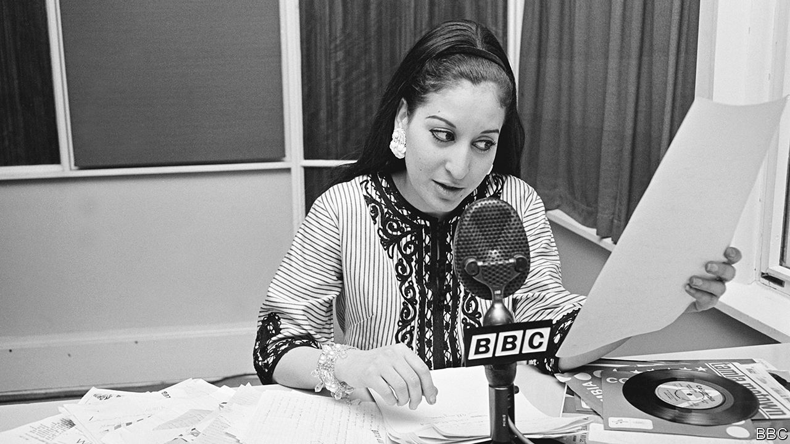

###### Worse service

# The BBC World Service shuts several foreign-language radio services 

##### BBC Arabic has gone off air; the Persian service is among those next to go 

 

> Feb 2nd 2023 

On the hour for 85 years the chimes of Big Ben have sounded across the Arab world, a rare certainty in a region rife with war, revolution and repression. And then the sonorous tones of the presenter, saying “” (“This is London”) at the start of each news bulletin. 

No more. On January 27 the British Broadcasting Corproation silenced its oldest foreign-language radio service, BBC Arabic. Many of the World Service’s 40-odd language broadcasts face the same fate. Staff say they have been told that by March the BBC will have stopped television transmission in Somali, Hausa and French for Africa, as well as radio output in Chinese and in the languages of Central Asia and the Indian subcontinent (not including Afghanistan). About a sixth of the World Service’s 2,500 jobs are to go. 

The bottom line is to blame. In 2014 the Foreign Office stopped core funding for the World Service, leaving the BBC to foot over 75% of a roughly £400m ($493m) annual bill. The freezing until 2024 of the , the corporation’s main source of funds, has made the strain intolerable. “How far is it appropriate for audiences in Leicester, for example, to continue picking up the tab for services in, for example, Lagos?” asked Richard Sharp, the BBC’s chair, speaking at a recent event for the Whitehall &amp; Industry Group, a charity, above an alley called Little Britain. Without government funding, he warned, “the future of the World Service is in jeopardy”.

Previous rounds of cuts have already depleted morale. Training has been pared back. There are fewer big interviews and scoops, more grammatical errors. Voluntary redundancies have hastened the departure of experienced staff. “You’re wiping out the collective memory of your organisation,” says Pierre Vicary, who heads the National Union of Journalists.

The BBC will continue to make foreign-language content, but more of it will be produced offshore and more of it will be distributed online, where consumption is growing fastest. The BBC says that hiring in regional bureaus saves money and brings content closer to its audience. It will also bring journalists closer to repressive governments. Staff in Cairo, Egypt’s capital, for instance, are subject to surveillance and have been hauled in for questioning. The BBC has told union leaders they cannot represent staff hired abroad.

Online content, though in growing demand, will also leave audiences stranded in countries where governments shut their people behind firewalls. Staff at the Persian service are aghast that the BBC is taking Persian radio off air next month, and is going online just as the Iranian authorities have cut the internet to silence nationwide protests. Audiences in countries with low and slow internet coverage will also suffer. 

The World Service insists it retains the loyalty of its audience. Some 60% of Nigerians consume BBC news every month, it says, compared with 9% who consume content from China’s state-run CGTN and 2% for Russia’s RT. But as the BBC withdraws, autocrats may seize ground that has been vacated. Iran International, a Saudi-funded broadcaster in London, has tempted many BBC Persian staff away by dangling higher salaries. 

Over time, warns Mr Sharp (whose own dealings with the politicians who appointed him are under scrutiny), trusted independent journalism could fall victim to the disinformation age. “The Russians and Chinese are together investing billions of dollars in their state-backed services, massively expanding their operations across Africa, South America and the Middle East,” he says. The BBC has in effect handed the problem of how to respond back to the British government. ■


