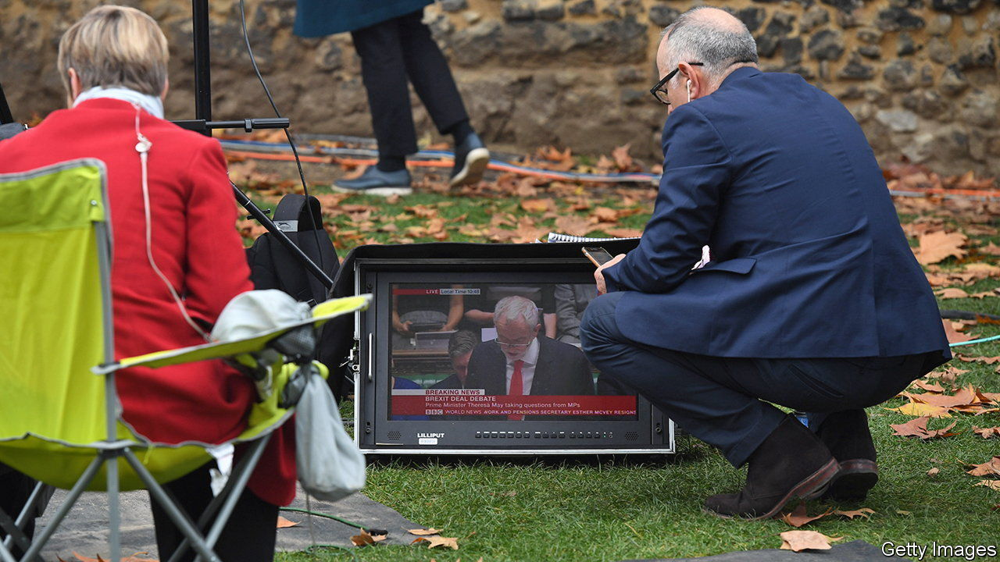

###### Economics on the box

# The BBC assesses its coverage of the dismal science 

##### It is not biased, but it is not impartial 

 

> Feb 2nd 2023 

“Debt costs help push government borrowing to 30-year high,” the website of the British Broadcasting Corporation (bbc) told users on January 24th. That headline exemplifies what an independent report by Michael Blastland, a former BBC radio producer, and Sir Andrew Dilnot, an economist, labels a breach of the Beeb’s commitment to impartiality, not through deliberate bias but “uninformed groupthink and lack of confidence to challenge arguments”.

In December Britain did indeed borrow £27.4bn ($33.7bn), the most for that month since records began in 1993. But the framing invites readers to make certain judgments. Why report the figure in pounds? Inflation over the intervening three decades means a pound is worth much less than it was in 1993; it might be more surprising if the record was not broken every December. There is also that journalistic urge to find a record to break. Yet 1993 holds no particular magic: it is just when the data series starts. 

Such choices are part of what the report says is a reflex assumption in the BBC’s coverage that debt is always and everywhere bad, rather than a tool that states can use well or badly. Whether this perspective harms the Labour Party, which has historically favoured higher spending, or the Tories, on whose watch debt has steadily risen, is uncertain. It definitely flattens debate.

The underlying problem, reckon the report’s authors, is that the BBC takes too much of a lead from Westminster. It uses the judgments of political reporters to decide which economic stories are important and then frames them as a two-sided contest between the left and the right. That lets the politicians determine what counts as a reasonable opinion. Both the government’s and the opposition’s embrace of  in 2010 meant that Keynesian economics, which might have advocated fiscal stimulus, did not get a fair shake. In that case, the consensus between the main political parties led to the false impression of consensus among economists.

Many economists had similar beefs about the BBC’s coverage of Brexit, accusing it of trying to balance the overwhelming consensus in the profession against a few  who suggested that leaving the EU would help boost growth. In that case, political rifts obscured agreement among economists. That may not be systematic bias but it nonetheless matters—76% of Britons get their news from the BBC, far more than will ever read an economics paper.■


