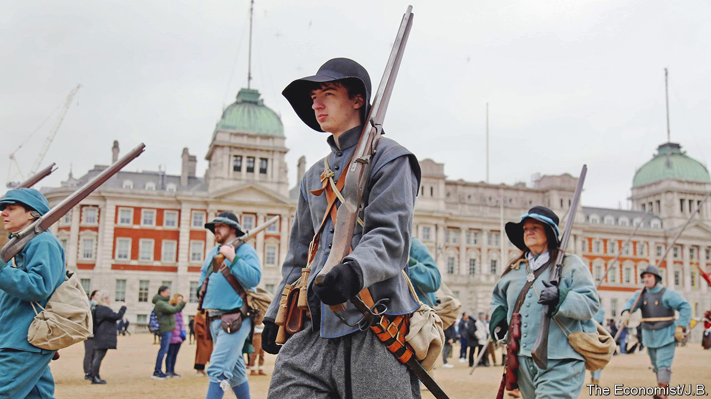
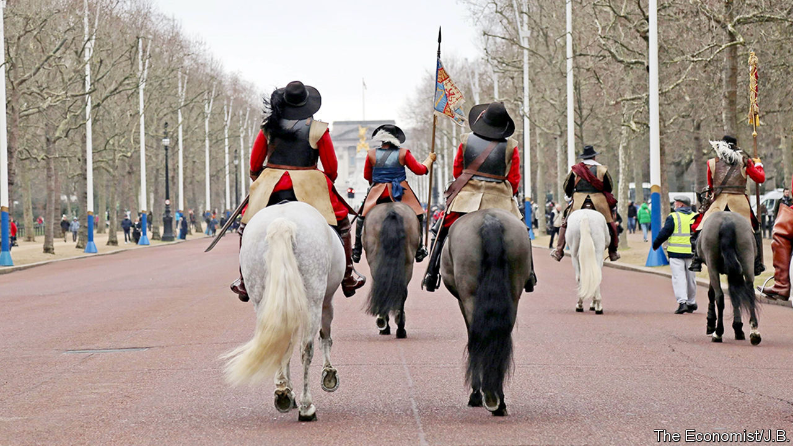

###### Once more unto the breeches

# The murder of a king makes for a most jolly day out 

##### Britons in breeches remember Charles I 

 

> Jan 31st 2023 

On a chilly Sunday in the capital, the King’s Army is mustering. A Cavalier in high-topped boots rummages in the boot of his car; another soldier checks his iPhone; a young musketeer in red eats a McMuffin (“sausage and egg”, he confirms, and “not really” period correct).

The King’s Army (“re-enacting seventeenth-century history since 1974”) is a wing of the English Civil War Society. They are gathering on the Mall, in the middle of London, to mark the execution of Charles I, which took place in Whitehall on January 30th 1649. Although, as a retired businessman in breeches and ostrich-feather hat explains, they tend to avoid that word “executed”. His Majesty, he says meaningfully, was “murdered.”

 


The death of Charles I has had many profound . It marked the only time that an English king had been tried and killed by his own people; it made the constitution buckle and reform. And it has meant that, for the past 50 years, people with a fondness for breeches and bonnets have turned up in central London to commemorate his “horrid murder” and to use the word “Hail”, fearlessly and frequently, in public. 

The crowd is a good one. People in armour clank past carrying port; a bandolier hangs on a car door; a musket lies beneath an M&amp;S bag; and a female vicar in “authentic” costume (though “obviously because I’m a woman I’m not authentic”) is present to give an address. A little after 11am, the army and its anachronisms are ready. A captain with rapier, sash and lace bib addresses his troops. “Everyone!” he shouts, “Turn your phones off!” With muffled drum, the procession begins. 

 


Dressing up for a murdered king is an odd habit but not, in England, an entirely unusual one. The day after the march, in a central London church, the Society of King Charles the Martyr meets to commemorate “Saint Charles” with prayers and plenty of Anglican pomp. There are bells and smells and relics; stuff is recited in Latin. The priests wear fancy old-fashioned hats, and the congregation is filled with the kind of people who look like they might enjoy a good claret. This is historical re-enactment with a halo.

There are two ways of seeing these ceremonies. Some people are there to solemnly reverence an English king who they think was cruelly killed. But many more seem to be reverencing doublets, dressing up and something which has enjoyed a more powerful and long-lasting reign over the English people—a romanticising nostalgia for the past. This, after all, is a nation that put up “Keep Calm and Carry On” posters during the covid-19 pandemic, and that voted for a Brexit which had been burnished with the sepia tint of the second world war.

Nostalgia can come with a cost, however, as historical re-enactors well know. Those gathering on the Mall used to be part of a single, large group with other civil-war re-enactors. But as a pikeman captain in a helmet with steel ear flaps explains, some years ago there was an acrimonious schism within this community. The other lot, he recounts, were rumoured to allow such ahistorical things as “too many people wearing lace”. And, he adds darkly, they held “Wellington-boot throwing competitions”. And so they split into separate camps. The politics of nostalgia have, it turns out, always been tricky. ■


