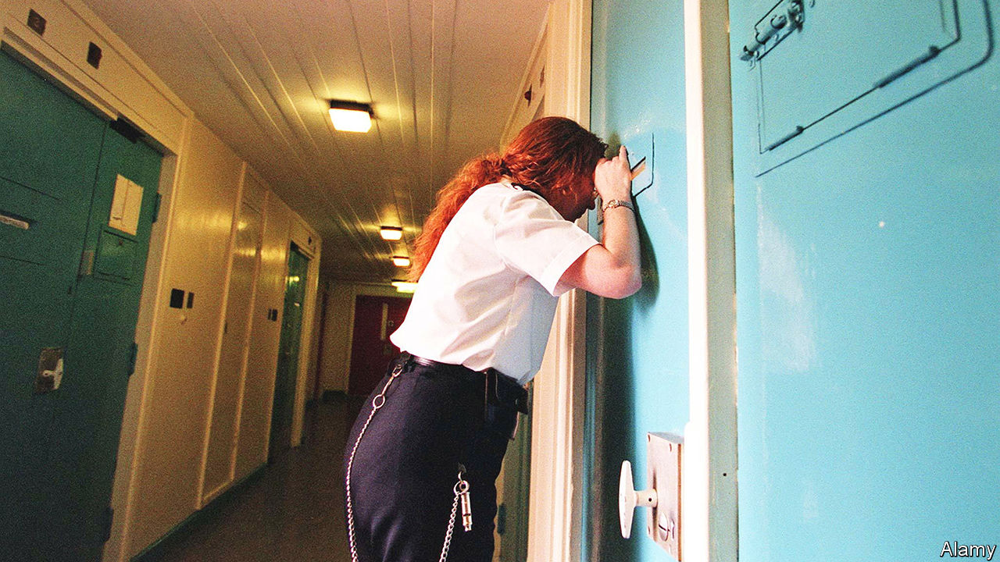
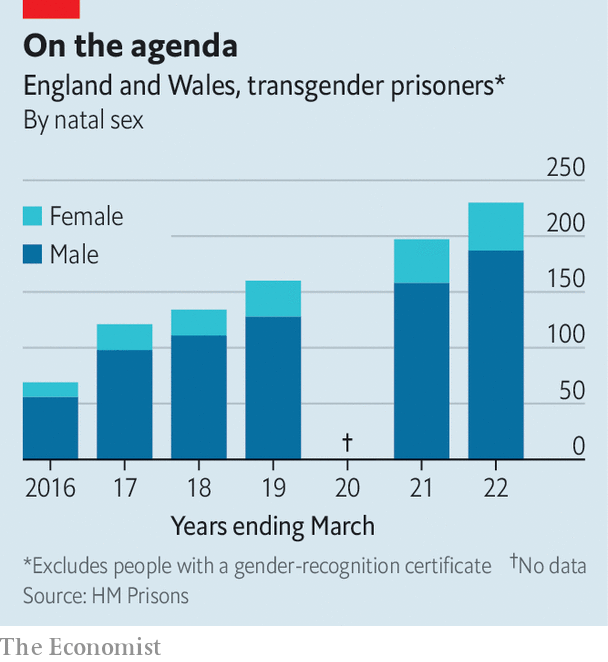

###### Prisons and gender

# Where should trans prisoners serve their sentences? 

##### Nicola Sturgeon may regret repeating the mantra “trans women are women” 

 

> Feb 2nd 2023 

The belief that gender identity is as important as biological sex was always going to cause problems. With children, it has led to the harmful prescription of . In sport, the inclusion of males on female teams has diminished  Yet the harms may be particularly egregious in the criminal-justice system. 

In January a male rapist was placed in a women’s prison in Scotland. Isla Bryson, who changed his name from Adam Graham after being arrested (thus forcing lawyers to refer to “her penis”), may have transitioned in the hope of a softer sentence, or to access potential victims, or both. But Scotland’s embrace of self-ID made it possible: since 2014 the Scottish Prison Service (SPS) has allowed prisoners to be housed with members of the sex with which they identify (regardless of whether they have taken hormones or undergone surgery). 

Isla Bryson has now been moved to a men’s prison. On January 29th the Scottish government said it would not place any “newly convicted transgender person with any history of violence against women…in a female prison”, pending a review. It has not said it would stop putting any males in women’s jails. Scottish Trans, a group which helped the SPS draw up its policy, said a blanket ban would be wrong. Nicola Sturgeon, the first minister, agreed, saying it was important not to “even inadvertently suggest that trans women somehow pose an inherent threat to women”. 

Campaigners for women’s rights (and others) point out that though most trans women pose no threat to women, there is no evidence that they pose less of a threat than other men. Most have not undergone sex-reassignment surgery. Many are heterosexual. Given that less than 2% of reported rapes lead to a conviction, claims that the prison service can weed out predatory males bear little scrutiny.

Putting males in female spaces also compromises women’s privacy. This is particularly important in prison. Women constitute less than 4% of the prison population, and tend to be locked up for low-level, non-violent crimes. A majority of them have been victims of domestic violence. One former female convict has described how she was “shaking with fear” when she was forced to share a shower block with trans women in a Scottish jail. 

England and Wales also allow some trans women to be housed with female prisoners. But the Ministry of Justice has made this more difficult. In January it said no prisoner with male genitals would be housed with women. Some women’s rights campaigners hope this will include those who hold a gender-recognition certificate (GRC), which means they are currently classed as female (regardless of their genital arrangements). Calls are growing for equality legislation to be amended to clarify that the protected characteristic of “sex”, which allows some spaces and services to exclude men, means biological sex. 

 


Where then should trans prisoners be placed? The question mostly relates to trans women, since most trans inmates are natal males (and few trans men ask to be transferred into men’s prisons). Some trans women are themselves too vulnerable to be housed with males. 

Part of the answer is vulnerable-prisoner units, which are used for those considered at particular risk (including some gay men and police informants). Because of the rise in the number of trans prisoners (see chart), some reckon a separate unit for transgender prisoners should be established. Jo Phoenix, a professor of criminology at Reading University, says this would help the criminal-justice system develop better ways of working with trans prisoners, including in such areas as rehabilitation. This is a group, she says, about which too little is known.

Scotland is unlikely to consider such policies any time soon. Ms Sturgeon, who seems to have succumbed to the influence of extreme trans activists, has struggled to explain how trans women are women except when they’re violent predators. Her position has been made more difficult by her championing of Scotland’s gender-recognition bill, which would have made it much easier for someone there to get a GRC than someone in England and Wales. When Westminster , Ms Sturgeon called it a “full-frontal attack” on the Scottish Parliament. But it was her party that stopped changes making it harder for male sex offenders to get a GRC. ■


