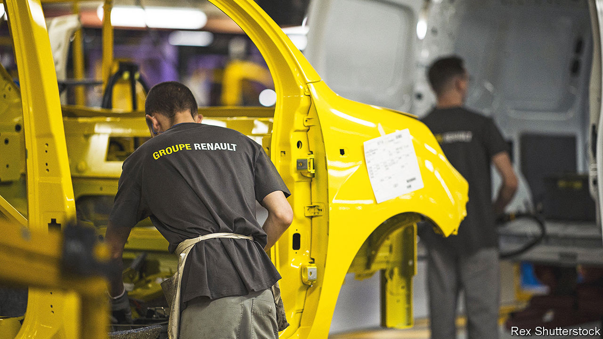

###### Entente cordiale

# An alliance between Renault and Nissan gets a reboot 

##### Both sides should be happier now 

 

> Feb 2nd 2023 

Relationships do not always live up to the hopes of yesteryear. In 2018 Carlos Ghosn, then boss of the Renault-Nissan-Mitsubishi alliance, predicted combined sales of 14m vehicles in 2022. In fact sales may not have hit half that number. Pandemic-era supply-chain snarl-ups are only partly to blame. Another reason was the failure of Mr Ghosn’s plan for a much closer bond between Nissan, the Japanese firm he had rescued from bankruptcy in 1999, and Renault (the smaller Mitsubishi has been less integral to the pact). Although the partners benefited from joint purchasing, a few shared factories and some common parts and designs, Nissan largely followed its own road: the Renault Zoe and Nissan Leaf, similar electric cars, shared few components. 

On January 30th, after months of wrangling, the companies at last reset the lopsided liaison resulting from Nissan’s salvage. This had involved the Japanese firm holding a 15% stake in Renault, with the French carmaker controlling 43% of Nissan. The uneven arrangement always infuriated the bigger and generally more profitable Japanese firm, which feared meddling by the French state, which owns 15% of Renault. Tensions were held in check only by the force of Mr Ghosn’s personality—until his detention in Japan for what he says were trumped-up charges designed to derail his plans for a closer tie-up. 

The new set-up would, if the boards sign off on it, reduce Renault’s voting rights at Nissan to 15%, with the remaining 28% of shares being put in a trust. This suits both firms, not least because it lets them avoid the near-impossible task of unpicking the longstanding union. Nissan would gain voting rights to match its hitherto non-voting Renault interest. For Renault, the change removes the frustration that its stake in Nissan did not translate into meaningful control. 

“Reloading the partnership” will include pursuing a few new projects. Nissan is likely to invest in Ampere, Renault’s electric-vehicle-and-software unit that it intends to spin off this year. Renault will keep pocketing the dividends from Nissan, though it is expected to sell down the stake held in trust over time. Both can spend less time papering over the cracks of a dysfunctional relationship, and more navigating their rapidly changing industry while fending off a convoy of new rivals. ■


