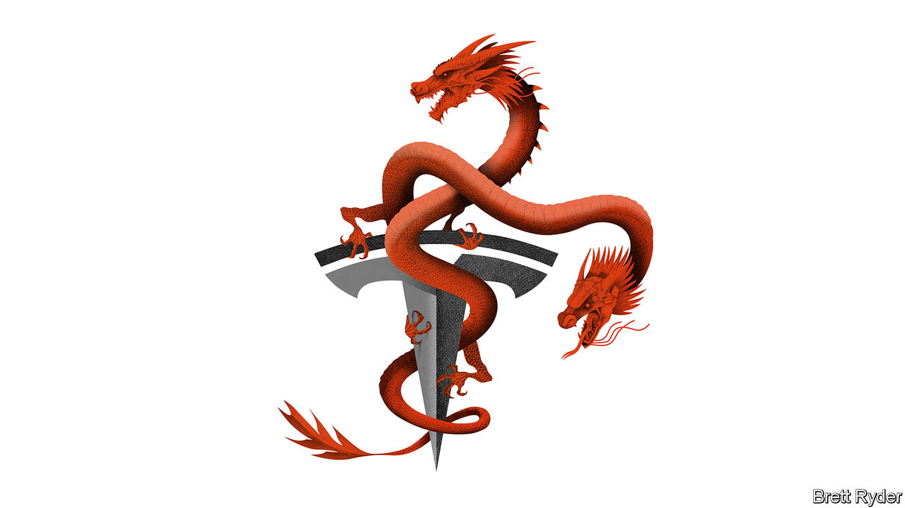

###### Schumpeter

# China’s BYD is overtaking Tesla as the carmaker extraordinaire 

##### It’s the Toyota of EVs 

 

> Feb 2nd 2023 

To get a sense of why Toyoda Akio announced on January 26th that he would hand over the keys to the world’s biggest carmaker to Sato Koji, his number two, watch the surreal video from 2021 of the two of them driving Toyota’s first Lexus electric vehicle (EV). Mr Toyoda is at the wheel. At first, it is clear that he is a bit of an EV sceptic: he notes that the car feels heavy to drive. Then he puts his foot to the floor, and as the speed picks up he whoops with joy like an overexcited Top Gun pilot. It is cringeworthy—but pertinent. Toyota is seen by many as an EV laggard. In announcing his decision to vacate his position to Mr Sato, who is 13 years younger, the chairman-designate made clear it was time for a new generation to speed up the move into the electric era. 

Much of the media commentary surrounding Mr Toyoda’s move casts it as a response to Tesla. That is too Western-centric. Tesla may be the world’s biggest EV producer and, according to Elon Musk, its boss, so far ahead of the competition that he cannot see the number two with a telescope. Yet it ignores a Chinese newcomer that, for all Mr Musk’s bombast, Toyota no doubt takes as seriously as it does Tesla. It is BYD, which this year may overtake Tesla as the biggest global seller of pure EVs (not including hybrids, which it also makes). BYD is Toyota’s EV partner in China as well as a rising competitor globally. More important, it emulates many of the traits that for decades have made Toyota the world’s most successful car company. 

Both East Asian firms share historical parallels. They did not start in the car industry. The company that gave rise to Toyota made automatic looms. BYD’s inaugural products were batteries for mobile phones. From the outset, they were so far behind their global carmaking rivals that they looked to do things differently. In pre-war Japan, Toyota toyed with using charcoal as a fuel instead of petrol. BYD used its battery expertise to focus on EVs and plug-in hybrids, known in China as new-energy vehicles (NEVs). They both honed their skills domestically and when they went abroad started in relatively underdeveloped car markets. 

Yet these tentative carmaking beginnings quickly developed a life of their own. In a six-year stretch from 1955 until 1961, Toyota’s exports grew more than 40-fold and it has not looked back since. BYD says it took 13 years to manufacture its first million NEVs. It took a year to get to the second million. Six months later it reached 3m. It lists operations in dozens of countries and says it has production bases in places ranging from China to Brazil, Hungary, India and beyond. It makes electric buses in California’s Mojave desert. It is now the world’s second-biggest producer of lithium-ion batteries, behind CATL of China, as well as a maker of commercial vehicles, such as lorries and taxis, and electronic gadgets. These give it a bridgehead for global expansion. 

It is on the factory floor and at the bottom line where things really matter, though. And here, too, BYD is what Tu Le of Sino Auto Insights, a consultancy, calls “the new Toyota”. The Japanese firm has been the industry’s manufacturing genius for decades; “The Toyota Way” is a combination of continuous improvement, or , lean manufacturing and unparalleled supply-chain management. BYD does things differently. It is one of the world’s most vertically integrated companies, making everything from its own seats to batteries and semiconductors. But like Toyota, it is a model of efficiency. Mr Le uses a Silicon Valley term, GSD, to describe its manufacturing prowess. It stands for “Get shit done”. Taylor Ogan, whose investment firm, Snow Bull Capital, has a stake in BYD, is awestruck by its level of automation. “The only humans you see in these factories are doing end-of-the-line inspections or fixing the robots. BYD has redefined auto manufacturing like Toyota did.” Warren Buffett, an icon of American investing, is also a fan—and a big shareholder.

Efficiency is the engine oil of profitability. BYD gives out maddeningly little up-to-date information about its operations. But on January 30th it gave a preliminary estimate of net profit in 2022. At $2.4bn-2.5bn it was more than five times higher than in 2021. Based on this, Mr Ogan says his firm’s calculations imply that in the past quarter the gross margin of BYD’s auto business surpassed that of Tesla, hitherto the most profitable big carmaker. He believes this reflects the fact that BYD, whose bread and butter comes from building plug-in cars for the mass market, is increasingly selling higher-margin premium EVs. Unlike Tesla, it has a wide variety of ranges and styles, and brings out new models regularly. 

The big unknown is America, where BYD currently sells no cars. It is not the first foreign carmaker to fear a backlash in the homeland of Detroit. Toyota, like other Japanese carmakers, fell victim to a US-Japan trade war in the 1980s. With Sino-American rivalry close to boiling point, the geopolitical pressures facing BYD are immense. It was expected to make a big inaugural splash at the Consumer Electronics Show in Las Vegas in January, but this did not happen. A big hurdle to entering America, says Mr Ogan, are the tariffs, dating back to Donald Trump’s presidency, on Chinese-made EV components, such as batteries. 

Build your defences

Eventually its launch in America seems inevitable. For all the geopolitical turmoil, American carmakers are so dependent on sales in China, the world’s biggest car market, that they cannot afford to lobby against Chinese entrants at home, lest China shuts them out in response. Moreover, BYD may offer the sort of EVs that, at less than $40,000 a pop, will electrify the mass market. And, if all else fails, BYD can seek Toyota’s help in cracking America, especially if their joint venture in China turns into a budding partnership. 

For now, it is safe to assume that Toyota recognises as much of a challenge from BYD as it does an opportunity. Like Toyota, BYD doesn’t shout about its strengths yet quietly delivers results. That is another thing that sets it apart from Tesla. ■


