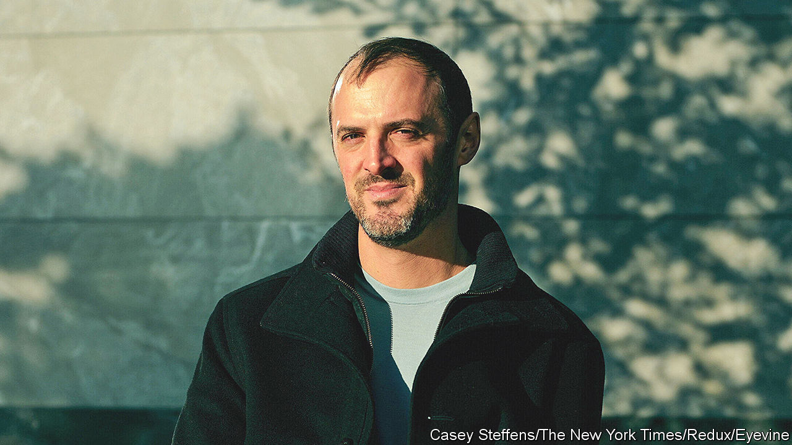

###### Fireworks artists

# Hindenburg Research, attacker of the Adani empire 

##### Meet the small short-selling firm that picked a fight with a giant 

 

> Feb 2nd 2023 

Naming a hedge fund is easy. Anodyne references to the natural world (peaks, stones, rivers or points) will usually do. Failing that, invoke ancient Greece. Christening a shock-and-awe short-selling outfit requires more creativity. Hindenburg Research, named after the doomed hydrogen-filled German airship, was founded by Nathan Anderson in 2017 to hunt for impending corporate disasters, and then hold a torch to them. The firm releases research reports on its website and typically profits when its targets’ shares plummet in value.

Hindenburg’s reports allege all manner and seriousness of mischief, from insider transactions to accounting alchemy. Its latest publication has catapulted its inventive moniker into the headlines worldwide. On January 24th it accused , a giant Indian conglomerate run by , of stock manipulation and fraud. The Adani Group says that the charges are baseless and released a lengthy rebuttal.

Mr Anderson’s operation sleuths at pace. In the past two years it has published 19 investigations. Compared with Adani, most are minnows. Firms going public through special-purpose acquisition companies (SPACs), a controversial corporate form made popular during the pandemic listing boom, have proved a rich hunting ground. Hindenburg gained notoriety in 2020, after it accused Nikola, a startup with plans to make battery-powered lorries which listed via a SPAC, of rolling a powerless vehicle down a hill in a misleading promotional video. Nikola’s founder was later found guilty of defrauding investors by a federal court in New York. 

Hindenburg’s targets often see a swift share-price drop, regularly of more than 10%. The Adani Group’s listed firms have so far lost around half their combined value. Nikola’s is down by over 90%. Even so, it is famously tough to turn a profit from , where potential gains are capped and losses, made when share prices rise rather than fall, are not. Carson Block of Muddy Waters, a high-profile short-seller, has questioned whether it is worth the stress. Bill Ackman, an American investor who has tweeted his support for Hindenburg in its pursuit of Adani, announced last year that he was quitting activist short-selling. 

Few believe that trying to expose fraud is anything but good for markets. That doesn’t lift the cloud of suspicion surrounding short-sellers and their reliability. Mr Anderson has acknowledged that Hindenburg teams up with outside “investors” but declined to identify them. To some, such bedfellows are necessary; wealthy individuals or funds can provide financial backing, tips and research without attracting the public scrutiny that comes with shorting. To others, opaque relationships open the door to conflicts of interest. Regulators in America may soon force additional transparency. In the meantime Hindenburg will continue to seek out potentially flammable marks. ■


