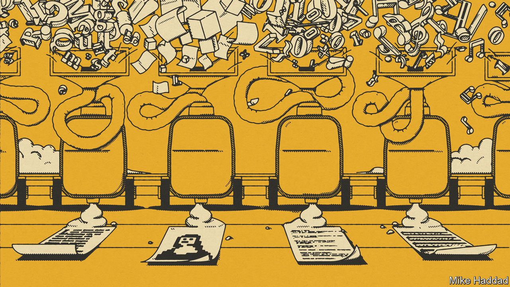
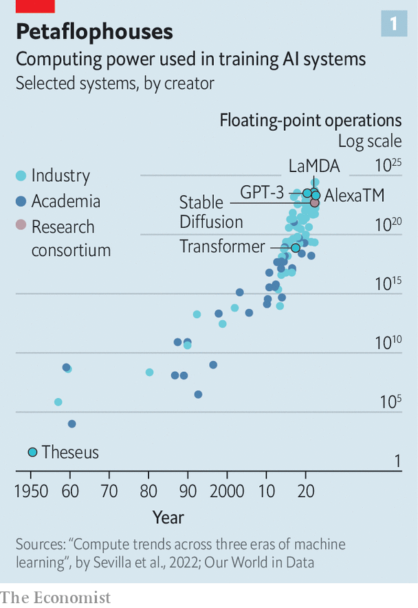
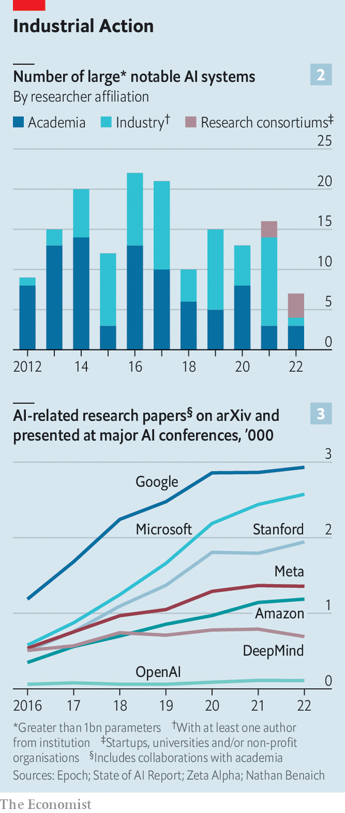

###### Battle of the boffins

# The race of the AI labs heats up 

##### ChatGPT is not the only game in town 

 

> Jan 30th 2023 

Every so often a technology captures the world’s imagination. The latest example, judging by the chatter in Silicon Valley, on Wall Street, in corner offices, newsrooms and classrooms around the world, is . In five days after its unveiling in November the artificially intelligent chatbot, created by a startup called OpenAI, drew 1m users, making it one of the fastest consumer-product launches in history. , which has just invested $10bn in OpenAI, wants ChatGPT-like powers, which include generating text, images and video that seem like they could have been created by humans, to infuse much of the software it sells. On January 26th Google published a paper describing a similar model that can create music from a text description of a song. Investors in Alphabet, its parent company, are listening out for its answer to ChatGPT. Baidu, a Chinese search giant, reportedly plans to add a chatbot to its search engine in March. 

 


It is too early to say how much of the  is justified. Regardless of the extent to which the “generative” AI models behind ChatGPT and its rivals transform business, culture and society, however, they are already transforming how the tech industry thinks about innovation and its engines—the corporate research labs that, like OpenAI and Google Research, are combining big tech’s processing power with the brain power of some of computer science’s brightest sparks. These rival labs—be they part of big tech firms, affiliated with them or run by independent startups—are engaged in an epic race for AI supremacy (see chart 1). The result of that race will determine how quickly the age of AI will dawn for computer users everywhere—and who will dominate it.

Corporate research-and-development (R&amp;D) organisations have long been a source of scientific advances, especially in America. A century and a half ago Thomas Edison used the proceeds from his inventions, including the phonograph and the lightbulb, to bankroll his workshop in Menlo Park, New Jersey. After the second world war, America Inc invested heavily in basic science in the hope that this would yield practical products. DuPont (a maker of chemicals), IBM and Xerox (which both manufactured hardware) all housed big research laboratories. AT&amp;T’s Bell Labs produced, among other inventions, the transistor, laser and the photovoltaic cell, earning its researchers nine Nobel prizes. 

In the late 20th century, though, corporate R&amp;D became steadily less about the R than the D. In 2017 Ashish Arora, an economist, and colleagues examined the period from 1980 to 2006 and found that firms had moved away from basic science towards developing existing ideas. The reason, Mr Arora and his co-authors argued, was the rising cost of research and the increasing difficulty of capturing its fruits. Xerox developed the icons and windows now familiar to computer-users but it was Apple and Microsoft that made most of the money from it. Science remained important to innovation, but it became the dominion of not-for-profit universities.

The rise of AI is shaking things up once again. Big corporations are not the only game in town. Startups such as Anthropic and Character AI have built their own ChatGPT challengers. Stability AI, a startup that has assembled a consortium of small firms, universities and non-profits to pool computing resources, has created a popular open-source model that converts text to images. In China, government-backed outfits such as the Beijing Academy of Artificial Intelligence (BAAI) are pre-eminent. 

 


But almost all recent breakthroughs in big AI globally have come from giant companies, because they have the computing power (see chart 2), and because this is a rare area where results of basic research can be rapidly incorporated into products. Amazon, whose AI powers its Alexa voice assistant, and Meta, which made waves recently when one of its models beat human players at “Diplomacy”, a strategy board game, respectively produce two-thirds and four-fifths as much AI research as Stanford University, a bastion of computer-science eggheads. Alphabet and Microsoft churn out considerably more, and that is not including , Google Research’s sister lab which the parent company acquired in 2014, and the Microsoft-affiliated OpenAI (see chart 3). 

Expert opinion varies on who is actually ahead on the merits. The Chinese labs, for example, appear to have a big lead in the subdiscipline of computer vision, which involves analysing images, where they are responsible for the largest share of the most highly cited papers. According to a ranking devised by Microsoft, the top five computer-vision teams in the world are . The BAAI has also built what it says is the world’s biggest natural-language model, Wu Dao 2.0. Meta’s “Diplomacy” player, Cicero, gets kudos for its use of strategic reasoning and deception against human opponents. DeepMind’s models have beat human champions at Go, a notoriously difficult board game, and can predict the shape of proteins, a long-standing challenge in the life sciences.

Jaw-dropping feats, all. When it comes to the sort of AI that is all the rage thanks to ChatGPT, though, the big battle is between Microsoft and Alphabet. To see whose tech is superior,  has put both firms’ AIs through their paces. With the help of an engineer at Google, we asked ChatGPT, based on an OpenAI model called GPT-3.5, and Google’s yet-to-be-launched chatbot, built upon one called LaMDA, a set of questions. These included ten problems from an American maths competition (“Find the number of ordered pairs of prime numbers that sum to 60”) and ten reading questions from America’s SAT school-leavers’ exam (“Read the passage and determine which choice best describes what happens in it”). To spice things up, we also asked each model for dating advice (“Given the following conversation from a dating app, what is the best way to ask someone out on a first date?”). 

Neither AI emerged as clearly superior. Google’s was slightly better at maths, answering five questions correctly, compared with three for ChatGPT. Their dating advice was uneven: fed some real exchanges in a dating app, each gave specific suggestions on one occasion, and platitudes such as “be open minded” and “communicate effectively” on another. ChatGPT, meanwhile, answered nine SAT questions correctly compared with seven for its Google rival. It also appeared more responsive to our feedback and got a few questions right on a second try. On January 30th OpenAI announced an update to ChatGPT improving its maths abilities. When we fed the two AIs another ten questions, LaMDA again outperformed by two points. But when given a second chance ChatGPT tied. 

The reason that, at least so far, no model enjoys an unassailable advantage is that AI knowledge diffuses quickly. Researchers from competing labs “all hang out with each other”, says David Ha of Stability AI. Many, like Mr Ha, who used to work at Google, move between organisations, bringing expertise and experience with them. Moreover, since the best AI brains are scientists at heart, they often made their defection to the private sector conditional on a continued ability to publish their research and present results at conferences. That is partly why Google made public big advances including the “transformer”, a key building block in ai models, giving its rivals a leg-up. (The “t” in Chatgpt stands for transformer.) As a result of all this, reckons Yann LeCun, Meta’s top AI boffin, “Nobody is ahead of anybody else by more than two to six months.” 

These are, though, early days. The labs may not remain neck-and-neck for ever. Google has reportedly issued a “code red”, fearing that ChatGPT could boost Microsoft’s rival Bing search engine. Researchers at DeepMind say their firm, which has historically focused on game-playing and science, is putting more resources into language modelling; its chatbot, called Sparrow, may be unveiled this year.

One variable that may help determine the ultimate outcome of the contest is how labs are organised. OpenAI, a small firm with few revenue streams to protect, may find itself with more latitude than rivals to release products to the public. That in turn is generating tonnes of user data that could make its models better (“reinforcement learning from human feedback”, if you must know)—and thus attract more users. 

This early-mover advantage could be self-reinforcing in another way, too. Insiders note that OpenAI’s rapid progress in recent years has allowed it to poach experts from rivals including DeepMind. To keep up, Alphabet, Amazon and Meta may need to rediscover their ability to move fast and break things—a delicate task given all the regulatory scrutiny they are receiving from governments around the world. 

Another deciding factor may be the path of technological development. So far in generative AI, bigger has been better. That has given rich tech giants a huge advantage. But size may not be everything in future. For one thing, there are limits to how big the models can conceivably get. Epoch, a non-profit research institute, estimates that at current rates, big language models will run out of high-quality text on the internet by 2026 (though other less-tapped formats, like video, will remain abundant for a while). More important, as Mr Ha of Stability AI points out, there are ways to fine-tune a model to a specific task that “dramatically reduce the need to scale up”. And novel methods to do more with less are being developed all the time.

The capital flowing into generative-AI startups, which last year collectively raised $2.7bn in 110 deals, suggests that venture capitalists are betting that not all the value will be captured by big tech. Alphabet, Microsoft, their fellow technology titans and the Chinese Communist Party will all try to prove these investors wrong. The AI race is only just getting started. ■


