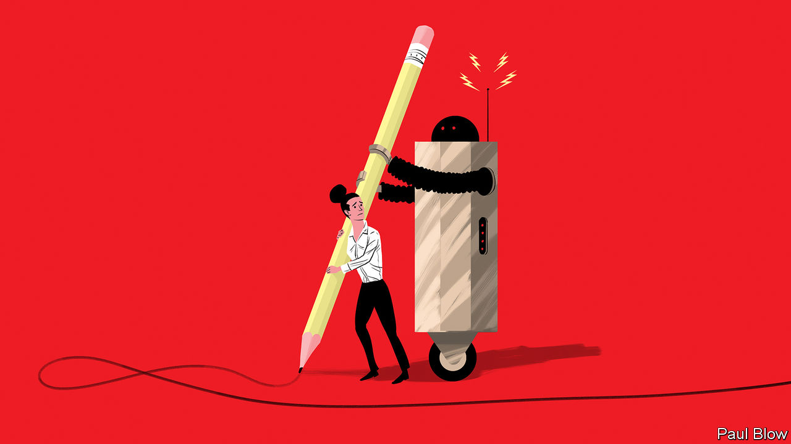

###### Bartleby

# The relationship between AI and humans 

##### What questions do technologies like ChatGPT raise for employees and customers? 

 

> Feb 2nd 2023 

If you ask something of ChatGPT, an artificial-intelligence (AI) tool that is all the rage, the responses you get back are almost instantaneous, utterly certain and often wrong. It is a bit like talking to an economist. The questions raised by technologies like ChatGPT yield much more tentative answers. But they are ones that managers ought to start asking. 

One issue is how to deal with employees’ concerns about job security. Worries are natural. An AI that makes it easier to process your expenses is one thing; an AI that people would prefer to sit next to at a dinner party quite another. Being clear about how workers would redirect time and energy that is freed up by an AI helps foster acceptance. So does creating a sense of agency: research conducted by  and the Boston Consulting Group found that an ability to override an AI makes employees more likely to use it. 

Whether people really need to understand what is going on inside an AI is less clear. Intuitively, being able to follow an algorithm’s reasoning should trump being unable to. But a piece of research by academics at Harvard University, the Massachusetts Institute of Technology and the Polytechnic University of Milan suggests that too much explanation can be a problem. 

Employees at Tapestry, a portfolio of luxury brands, were given access to a forecasting model that told them how to allocate stock to stores. Some used a model whose logic could be interpreted; others used a model that was more of a black box. Workers turned out to be likelier to overrule models they could understand because they were, mistakenly, sure of their own intuitions. Workers were willing to accept the decisions of a model they could not fathom, however, because of their confidence in the expertise of people who had built it. The credentials of those behind an AI matter. 

The different ways that people respond to humans and to algorithms is a burgeoning area of research. In a recent paper Gizem Yalcin of the University of Texas at Austin and her co-authors looked at whether consumers responded differently to decisions—to approve someone for a loan, for example, or a country-club membership—when they were made by a machine or a person. They found that people reacted the same when they were being rejected. But they felt less positively about an organisation when they were approved by an algorithm rather than a human. The reason? People are good at explaining away unfavourable decisions, whoever makes them. It is harder for them to attribute a successful application to their own charming, delightful selves when assessed by a machine. People want to feel special, not reduced to a data point. 

In a forthcoming paper, meanwhile, Arthur Jago of the University of Washington and Glenn Carroll of the Stanford Graduate School of Business investigate how willing people are to give rather than earn credit—specifically for work that someone did not do on their own. They showed volunteers something attributed to a specific person—an artwork, say, or a business plan—and then revealed that it had been created either with the help of an algorithm or with the help of human assistants. Everyone gave less credit to producers when they were told they had been helped, but this effect was more pronounced for work that involved human assistants. Not only did the participants see the job of overseeing the algorithm as more demanding than supervising humans, but they did not feel it was as fair for someone to take credit for the work of other people. 

Another paper, by Anuj Kapoor of the Indian Institute of Management Ahmedabad and his co-authors, examines whether AIs or humans are more effective at helping people lose weight. The authors looked at the weight loss achieved by subscribers to an Indian mobile app, some of whom used only an AI coach and some of whom used a human coach, too. They found that people who also used a human coach lost more weight, set themselves tougher goals and were more fastidious about logging their activities. But people with a higher body mass index did not do as well with a human coach as those who weighed less. The authors speculate that heavier people might be more embarrassed by interacting with another person. 

The picture that emerges from such research is messy. It is also dynamic: just as technologies evolve, so will attitudes. But it is crystal-clear on one thing. The impact of ChatGPT and other AIs will depend not just on what they can do, but also on how they make people feel.■


