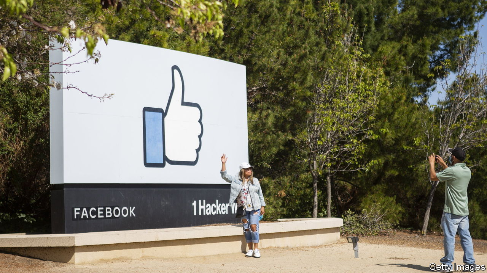

###### Mark to market

# Things are looking up for Meta 

##### Is the worst over for Mark Zuckerberg’s social-media empire? 

 

> Feb 2nd 2023 

FOR MARK ZUCKERBERG, the first three quarters of last year were rough. In July 2022 his social-media empire, , announced its first ever year-on-year decline in quarterly revenues. Three months later it reported another. Investors sneered at his expensive pivot from a lucrative ads business to , on which Mr Zuckerberg was splurging $10bn a year. By November Meta had lost roughly three-fifths of its market value since its peak of $1.1trn in August 2021, when the covid-19 pandemic meant that much of daily life was being lived online. Shortly after he sacked 11,000 people, or 13% of its workforce. All the while, he has been fending off trustbusters and, in TikTok, a rival that has proved considerably more adept than previous challengers such as Snap or Pinterest at attracting eyeballs—and with them advertising dollars. 

On February 1st Mr Zuckerberg reported another decline in sales for the last three months of 2022, of 4.5% year on year. But the drop was smaller than expected. The company also put out an optimistic forecast for the current quarter, in which it thinks revenue could reach $28.5bn. That would be more than in the first three months of 2021, before Apple introduced privacy rules for its iDevices that made it considerably harder for advertisers to track users across the internet. Costs are coming under control, Mr Zuckerberg promised, and the company would be “be more proactive about cutting projects that aren’t performing or may no longer be as crucial”. The firms said it would buy back an additional $40bn-worth of shares. To top it off, on the same day a judge in California threw out a lawsuit brought by the Federal Trade Commission (ftc) to block Meta’s acquisition of Within, a maker of a popular virtual-reality fitness app.

Investors greeted all this with a big “like”. Meta’s share price, which had already risen by over 70% in the previous three months, leapt by another 20% or so after hours. That would put its market capitalisation at $484bn. Squint and the company, which had been all but relegated from the ranks of big tech, is back in the fold. 

Can the hot streak last? Mr Zuckerberg has reasons for cautious optimism. Meta has come up with ways to work around Apple’s privacy settings. Its  are improving, both in the lab and in the real world—specifically, in the world of Reels, where algorithms for serving up short videos on Facebook and Instagram, Meta’s two profit motors. These are reportedly getting cleverer at creating engagement. TikTok, which is owned by a Chinese company, is under increasing scrutiny in America, where some politicians are calling for a ban on the popular app. Even Apple has given Mr Zuckerberg’s vision of the metaverse a backhanded compliment, by working on its own virtual-reality-like headset.

Plenty could still go wrong. What used to be recession-proof digital-ad spending is becoming more cyclical, and the economic cycle is turning downwards. Even if Meta’s Western markets avoid a recession, advertisers are likely to rein in spending. Despite a degree of bipartisan support for a TikTok ban, political gridlock in Washington makes any actual legislation to that effect unlikely in the near future. Its courtroom win over Within notwithstanding, Meta still faces other—more serious—challenges from regulators at home (where another FTC lawsuit calls for its break-up) and in Europe (where tough new rules on large digital platforms are being finalised). And few people are burning to migrate to the metaverse. Late last year Horizon Worlds, Meta’s main metaversal attraction, was reportedly losing users. Mr Zuckerberg is not out of the woods. But he no longer seems lost in the jungle. ■


