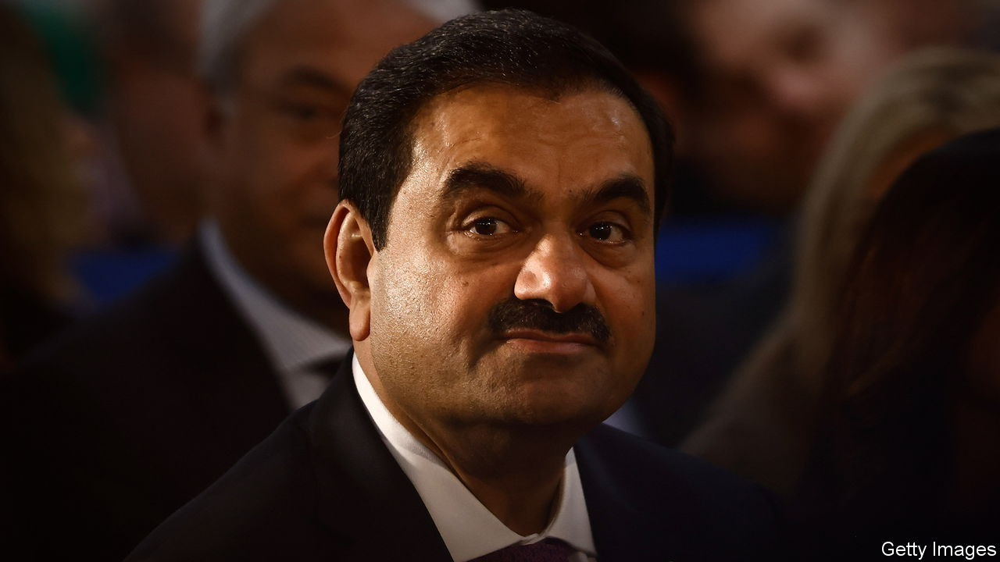
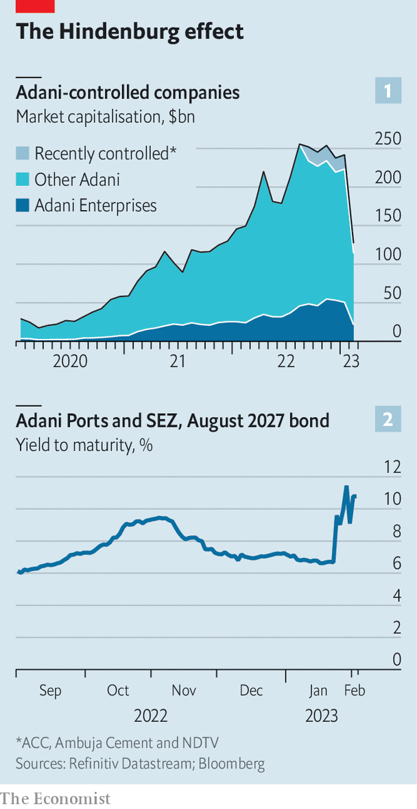
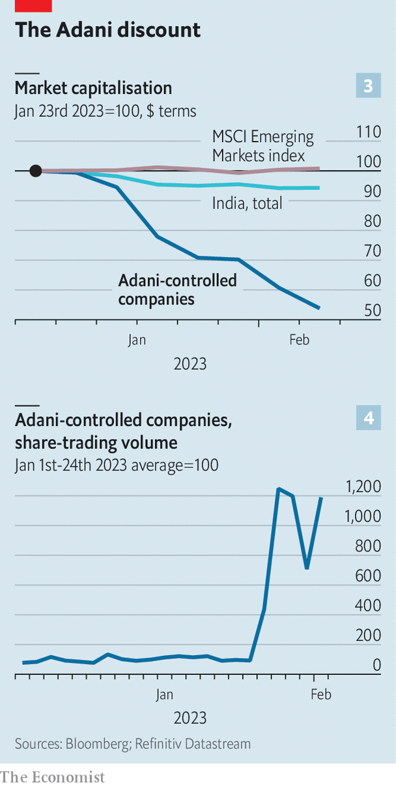

###### Adani under fire

# What next for Gautam Adani’s embattled empire? 

##### A scrapped $2.5bn share offering is the first victim of a short-seller’s attack 

 

> Feb 1st 2023 

GAUTAM ADANI is no stranger to ambush. In 1998 the  was kidnapped and reportedly released for a multimillion-dollar ransom. In 2008 he was at the Taj Mahal Palace Hotel in Mumbai during a terrorist attack, and spent a night hiding in the basement. 

 


Now he faces an assault of a different kind—not on his person but on the conglomerate that bears his name. In the space of a week a staggering $108bn, or nearly half, has been  from the market value of the Adani Group’s ten listed firms (see chart 1). The yields on some of those firms’ bonds at times spiked into distressed territory (see chart 2). Mr Adani’s personal fortune, the world’s third-biggest at the start of the year, has shrivelled by more than $50bn. A $2.5bn secondary share offering of his flagship listed entity, Adani Enterprises, was abruptly pulled on February 1st. The rout, which continued as  went to press on February 2nd, raises questions about one of India’s mightiest business houses, the fate of its pharaonic ambitions in everything from clean energy to media—and about India’s tycoon-powered version of capitalism.

The haemorrhage was caused by what looks—next to an industrial empire spanning ports, power stations and much besides—like a peashooter. On January 24th , a New York investment firm, published a report accusing the Adani Group of pulling “the largest con in corporate history”. Hindenburg, which had taken short positions on some internationally traded Adani bonds and derivatives, detailed allegations of stock manipulation and other financial mischief. The purpose, according to the short-seller, was to inflate the market value of Mr Adani’s listed companies. Within days the Adani Group issued a 413-page rebuttal, calling Hindenburg’s report “all lies”—and a “calculated attack” on India itself. The Adani Group said it had always been in “compliance with all laws”.

This forceful response initially looked like enough to let Adani Enterprises conclude its secondary share offering, which was due to price on February 1st. With the firm’s existing shares trading below the offering’s issue price, retail investors showed tepid interest. Still, Adani Enterprises managed to line up anchor investors (among them the Life Insurance Corporation of India, or LIC, the State Bank of India, and some big American banks) and a handful of deep-pocketed backers who apparently did not mind paying over the odds. These included International Holding Company, an Emirati fund with investments in Adani companies, which chipped in $400m, as well as, reportedly, several family offices of fellow Indian plutocrats.

Then, on the afternoon of February 1st, Bloomberg reported that Credit Suisse, a bank, had stopped accepting Adani firms’ bonds as collateral for margin loans to its private-banking clients. The share price of Adani Enterprises collapsed by nearly 30%. Those of other Adani firms also slid. The prices of their bonds, having clawed back earlier losses the day before, took another hammering. It was later that evening that the Adani Group cancelled the secondary offering, pointing to “unprecedented” market conditions. 

What comes next is uncertain. Adani executives have been dispatched around the world to reassure nervy investors. An internal risk team first created to deal with the covid-19 shock, then deployed to tackle problems arising from supply-chain disruptions caused by the war in Ukraine, has been put on high alert. Spending plans are said to be funded for the next two or three years. In the statement calling off the share issue, Mr Adani said, “Our balance-sheet is very healthy with strong cashflows and secure assets, and we have an impeccable track record of servicing our debt.”

The threat to the empire does not appear existential. Mr Adani is considered an able operator and his companies own many valuable assets. They run some of India’s biggest ports (plus a few in Australia, Israel and Sri Lanka), warehouse 30% of its grain, operate a fifth of its power-transmission lines, accommodate a quarter of its commercial air traffic, and produce perhaps a fifth of its cement. A Singaporean joint venture vies to be India’s largest food company. In the last financial year the group’s listed companies had total revenues of $25bn, equivalent to 0.7% of Indian GDP, and a net profit of $1.8bn. Their combined annual capital spending of around $5bn accounts for 7% of the total for India’s 500 biggest non-financial firms. 

In his statement, Mr Adani insisted that the decision to scrap the secondary offering “will not have any impact on our existing operations and future plans”. No rating agency has yet reappraised the group’s debt, which boasts an investment grade. Nor have Hindenburg’s allegations so far led compilers of global stockmarket indices to drop Adani firms from their benchmarks. One of the index-managers, FTSE Russell, has said it does not at this point intend to take action. Another, MSCI, is expected to weigh in soon. 

Yet it is hard to believe that Mr Adani’s nation-building designs will be unaffected. Between 2023 and 2027 his group was forecast to spend more than $50bn on investments. It is building a new airport near Mumbai, splurging $5bn on three seaports, and planning to construct a $5bn steel mill in partnership with POSCO, a South Korean conglomerate. Its envisioned projects in renewables and hydrogen were seen as the cornerstone of an effort, championed by India’s prime minister, Narendra Modi, to turn the country into a global clean-energy powerhouse. All this requires masses of capital, a slug of which was meant to come from the new share offering. If the yields on Adani bonds remain elevated, and its share prices depressed, securing the necessary funds will prove difficult.

 


Then there are the possible spillovers to the rest of India Inc. So far the knock-on effects on firms like LIC and State Bank of India have been painful but not life-threatening; their share prices declined by 8% and 5%, respectively, on February 1st. LIC says that Adani shares make up less than 1% of its assets under management. Virtually no Indian mutual funds hold significant stakes in the group’s companies (a fact that Hindenburg cited in its report as evidence of the Indian market’s lack of confidence in them). State Bank of India, which is also a lender to the group, says it is not concerned about its loans to Adani companies, which are secured by cash-generating assets. CLSA, a broker, puts Indian lenders’ total exposure to the five biggest Adani firms at $24bn—a manageable 0.5% of all loans across the Indian banking sector.

Foreign investors are not taking any chances. In the past week Indian stocks have underperformed other emerging markets (see chart 3). In just two days, Friday January 27th and Monday January 30th, global funds pulled a net $1.5bn from the Indian stockmarket. Compliance-obsessed Western multinationals may think twice before forging new partnerships with tycoons, in recent years their preferred route to the vast Indian market.

As the week’s drama unfolded, Mr Adani was himself abroad, officially taking ownership of the port in Haifa he acquired in 2022 for $1.2bn—and unofficially doubtless trying to send a reassuring message to his foreign backers. “I promise you that in the years to come we will transform the skyline we see around us,” he told his Israeli audience on January 31st. He first has an awful lot of repair work to be getting on with at home. ■


