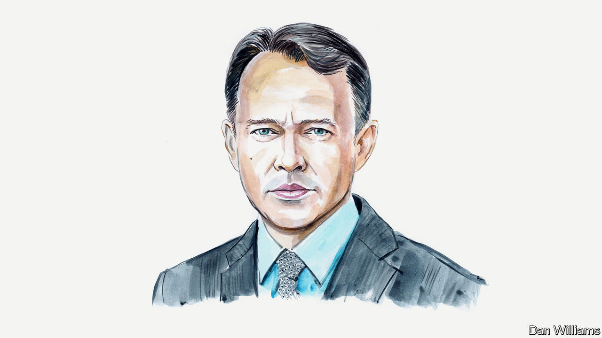

###### Russia and Ukraine

# Talks between Russia and Ukraine would save lives, argues Christopher Chivvis 

##### The foreign-policy expert writes as part of a series debating the wisdom of peace negotiations 

 

> Jan 29th 2023 

ON FEBRUARY 24TH, the war in Ukraine will pass its one-year mark with no end in sight. The costs are mounting, Europe faces an epic refugee crisis, tens of thousands of people have died and total casualties now run into the hundreds of thousands. Plans to provide Ukraine with Western tanks, announced in recent days, indicate that America, Germany and others are settling in for a much longer war. But in a prolonged conflict, far more will perish. Western leaders would be making a big mistake by not pushing for negotiations to end the fighting, even as they continue to support Ukraine. 

Volodymyr Zelensky, Ukraine’s president, has said he favours peace talks—but only after Ukraine wins back important territory. He wants to reclaim not only what Ukraine lost in 2022, but also what it lost in 2014 when Russia annexed Crimea and occupied parts of the Donbas region. 

I sympathise with Ukraine’s desire to fight on until it drives Russian forces from all Ukrainian territory. I’m sure Ukrainian leaders worry that peace talks will demoralise their troops, who are fighting so bravely. Their cause is just. But their war aims are unrealistic. Western tanks are a symbol of commitment and they will eventually improve Ukraine’s chances of piercing Russian fortifications. But they are not a game changer.

With luck the tanks may encourage Vladimir Putin to consider negotiations seriously. But he still cannot afford to retreat with nothing to show for his war, however deplorable it is. Given how much he has staked on this operation, its failure—let alone a larger loss that includes Crimea or other territory Russia took in 2014—would risk a revolt from inside Russia’s elites that destabilises his regime. This is also a deeply personal crusade for Mr Putin who probably sees it as the dénouement of his long reign.

Ukraine’s war aims also look unrealistic because Mr Putin is not about to run out of money. China supports him politically and buys Russian oil and gas. And sanctions haven’t crippled the Russian economy as initially hoped. His troops are still being paid and the Russian army is dug in. Its trenches can be seen from satellite photographs, weaving out like threads along the frontlines in the east and the south. Mr Putin has also called up a large reserve army and discovered new ways to restock Russia’s arsenal. (The Kremlin has figured how to produce KH-101 cruise missiles domestically in spite of sanctions and has bought weapons from Iran and North Korea.)

Ukraine cannot achieve its grandest objectives without an even greater increase in support from the West. This is why it has asked not only for tanks, but also F-16 fighter aircraft, Grey Eagle drones, ATACM long-range missiles and cluster munitions. Perhaps an enduring conflict would see Ukraine seize back the Donbas region; but it could also see renewed assaults on Kyiv. The West, however, lacks the vital interest that would justify the escalation risks, military, political and human costs entailed by supporting Ukraine’s grandest aims.

In America Congress has already voted for over $100bn in military, financial and other support to Ukraine. But public support for such measures is fading. A poll published in December from the Chicago council, an American think-tank, found that the share of Americans who believe that Washington should support Ukraine for “as long as it takes” dropped to 48%, down from 58% in July. And the differences between NATO allies over how far to proceed in the war will remain.

For everyone, the risk of escalation into a broader, more destructive war will also persist as long as the fighting does. A long conflict is sure to eat up scarce European resources, prevent millions of refugees from returning home and weaken the economic climate. Mr Putin’s nuclear sabre-rattling is condemnable and self-serving, but a responsible approach to the war means taking the possibility seriously that he will use nuclear weapons. There is just too much to lose. That is why a much more robust diplomatic track is needed, even as we keep up the pressure on Russia globally.

Those who favour continuing the war perhaps believe there is a military alternative to negotiation that resolves the underlying conflict between Russia and Ukraine. There is not. Yes, it would be nice if Ukraine clawed back some more territory. But at what cost and for what strategic gain? Even in the unlikely event that the West were to back Ukraine to the hilt for many years and were eventually to force Russia out of all Ukrainian territory, Russia would probably restart the war at some point to salvage its lost gains and its reputation. A regime-change operation in Moscow might prevent this, but it would be wildly risky.

Getting diplomacy going will require tough conversations to persuade Ukraine to adopt a more realistic approach to its war aims. Western tanks for Ukraine will make this more difficult, but they also strengthen the West’s ability—and its right—to do so. After all, America already limits Ukraine’s use of its weapons in several ways, for example, by prohibiting strikes into Russia. Meanwhile, greater public openness to negotiations among Western leaders might help Mr Zelensky make the case to his own citizens and security services. And Western military support should continue alongside—deterrence and détente can be complementary.

Mr Putin is an autocrat with an axe to grind about NATO. Whether or not he would enter talks with any seriousness is unknown. But the decision to send tanks may encourage him to do so. Concern that a negotiated settlement would “reward” Mr Putin, and perhaps encourage Chinese aggression in Taiwan, is overblown. If the negotiations froze the battlelines where they are now, Mr Putin would have paid a very high price for very limited gains. His armed forces have displayed their incompetence to the whole world. Russia is now a pariah state and its relationship with Europe—for centuries its most important—is destroyed. Sanctions will slow Russia’s economic growth for years to come, even if they are eventually moderated in return for concessions from the Kremlin.

Many critics of negotiations object to the idea of diplomacy with a man like Mr Putin on principle, but Western powers should and do regularly negotiate with adversaries, including contemptible ones, when it serves national interests and prevents violence and human suffering. 

At first, negotiations wouldn’t seek to settle the conflict once and for all, much less resolve Russia’s litany of gripes about NATO. Diplomats would have to aim low at first, starting with limited ceasefires and transparency measures. The arrangement brokered in July to allow Ukrainian grain exports indicates that negotiations on specific problems can work. If a ceasefire held, broader negotiations over deeper differences could then take place later on. Even a temporary end to the fighting would offer a chance for emotions to cool, lives to be saved and resources spared.

Talks also offer promise of post-conflict reconstruction. And that is where Ukraine’s true victory over Russia will lie: in becoming a vibrant democracy well integrated into Europe. That process, already likely to last until the 2030s, could stretch out for many years more if the war continues, judging by historical precedents in the Balkans, Iraq and Afghanistan.

Negotiations might fail outright, but the parties who would be involved in them cannot really know until they try. Talks could also succeed initially but produce a peace that collapses in a few years—like the Minsk accords that ended the 2014 war. Although imperfect, even this outcome would be better than several years of more fighting. Another frozen conflict is preferable to a never-ending war that puts Europe, Ukraine and ultimately the world at risk for years to come.■

_______________


