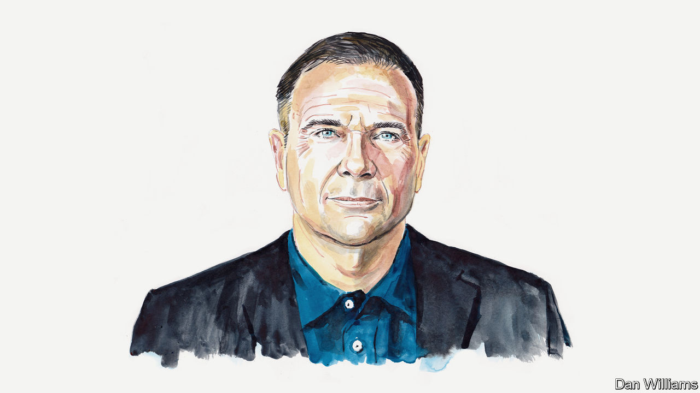

###### Russia and Ukraine

# Ukraine should—and, properly supported, can—seize Crimea, argues Ben Hodges 

##### A retired American general writes as part of a series debating the wisdom of peace negotiations 

 

> Jan 29th 2023 

IT IS ALMOST one year since Russian troops invaded Ukraine. In that time thousands of innocent civilians, as well as soldiers from both sides, have been killed. Towns and cities have crumbled under Russian strikes. The devastation has led some to call for Ukraine to sit down with Russia and negotiate peace. Yet the morale of Ukraine’s armed forces is as strong as ever, and its soldiers have defended their homeland more successfully than most thought possible. It would be a huge mistake for the country to enter into peace talks with Russia now. 

There are many reasons why negotiating with Russia would be foolish. If this war is about more than just Ukraine, and instead about the preservation of the international rules-based order and the prevention of Russian aggression against Europe, then it should be unacceptable for Russia to be rewarded for its invasion. Yet any peace deal which granted it territory would do just that. And talks have been tried before. The Minsk agreements, signed after Russia invaded Ukraine in 2014, led to a frozen conflict which Vladimir Putin thawed at a moment of his choosing.

The most important reason why Ukraine should not negotiate with Russia is that it may now have a chance to win back Crimea. It is the most crucial piece of territory Russia seized in 2014 and it will prove the decisive terrain of this war, too. Ukrainians know that as long as Russia retains Crimea they are more vulnerable to future attacks than before Russia seized it. And while Russia has it, Ukraine cannot rebuild its economy. That is because the Russians are able to interfere with activity in all of Ukraine’s ports from Crimea, disrupt shipping from places such as Odessa and block access to the Sea of Azov. 

Crimea is also useful to Russia itself. It is home to the Black Sea Fleet, a launchpad for drones and other weapons, a logistics hub and a trading port for Russian merchant shipping. Because Crimea is decisive, and because it is becoming clearer that Ukrainian forces can liberate Crimea, Ukraine must not negotiate now. Russia would never agree to trade Crimea away. 

Instead Ukraine should fight to liberate Crimea. First, it should isolate Crimea with a combination of long-range precision weapons and armoured forces. Isolation requires disrupting and then severing the only two land lines of communication that connect Crimea to Russia: the Kerch Bridge and the land bridge from Rostov in Russia through Mariupol and Melitopol in Ukraine and into Crimea. Second, it should strike critical targets on the Crimean peninsula for months until it becomes untenable for Russian air, land and naval forces to remain stationed there. Precision strikes on Sevastopol, Dzhankoi and Saky will render these very vulnerable naval bases, logistics sites and airbases unusable for Russian forces. This, rather than a conventional frontal attack against all Russian defences in the region, will compel Russian forces to leave Crimea.

Certain officials in the Pentagon question whether Ukraine can eject Russia from Crimea. But I believe that the calibre of Ukraine’s leadership and the will of its armed forces mean that it has a very real chance of success, assuming we, the West, give Ukraine the specific capabilities it needs. So let’s get going. Give Ukraine weapons such as the Army Tactical Missile System, which has a range of 300km (186 miles), and Ground-Launched Small Diameter Bombs, with a range of 150km. If the West moves quickly, Ukraine could liberate Crimea by the end of August. If not, Crimea will remain a sanctuary for Russian supplies and weaponry.

Some argue that the Kremlin has a “red line” regarding Crimea and that it is prepared to fight to hold on to it at all costs, including deploying a nuclear weapon if it appeared likely to lose it. Yes, the nuclear threat from the Kremlin must be taken seriously—Russia has thousands of nuclear warheads and it clearly does not care how many innocent people are killed in this war. But I think it is very unlikely it would deploy a nuclear weapon of any type, even for Crimea. 

The Kremlin believes Washington’s warning of “catastrophic consequences” should Mr Putin use a nuclear weapon. It also knows that using such a weapon actually gives it no battlefield advantage, for two reasons. First, there is no large concentration of Ukrainian troops in a single place, so using one nuke would hardly wipe out Ukraine’s soldiers. Second, Russia has no large, mobile exploitation force suitably trained and equipped to operate in a contaminated area. The Chinese and others have also made it clear to the Kremlin that they object to Russia using a nuclear weapon. In fact, Russia’s nuclear weapons are most effective when it doesn’t actually use them. 

Rather than push Ukraine’s leadership towards the negotiating table, America and other Western nations should support Ukraine to win in Crimea. We’ve learned from this past year that Ukranian precision can defeat Russian heft with appropriate weaponry and smart timing. The West should help with both. ■

_______________


