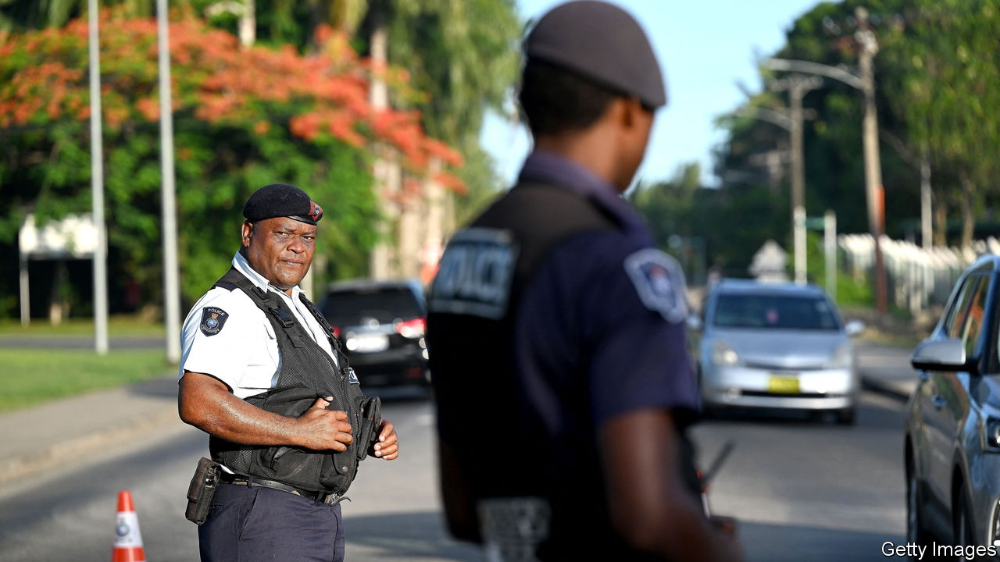
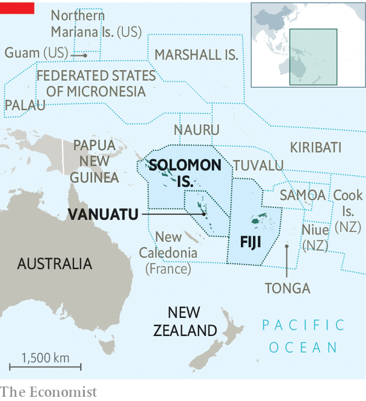

###### Irreconcilable differences

# A geopolitical setback for China in the Pacific 

##### Fiji says Chinese police officers should go home 

 

> Feb 2nd 2023 

China’s diplomatic  seemed unstoppable for much of last year. In April 2022 it signed a security pact with the Solomon Islands that laid the ground for Chinese forces to operate there. Later in the spring China’s foreign minister, Wang Yi, sealed several more deals on an unprecedented eight-country Pacific tour. Although he didn’t quite nail down a broader regional security agreement, he made it clear that China would keep pushing for it. “Don’t be too nervous,” he told  back then. 

Nerves are more likely to be jangling now among Chinese officials. On January 25th they suffered one of their worst setbacks in the region when Sitiveni Rabuka, Fiji’s prime minister, suddenly announced that he would terminate a security agreement with China dating to 2011. It had allowed Fijian police officers to train in China and Chinese officers to work in Fiji for up to six months at a time. “There’s no need for us to continue,” Mr Rabuka told the . “Our systems are different.” 

 


Worse still for China, Mr Rabuka said that police officers from Australia and New Zealand could continue to work in Fiji because their political systems were similar to the Pacific-island country’s. His decision dealt a blow not just to Chinese efforts to secure a strategic foothold in a region long dominated militarily by America and its allies. It also undermined China’s efforts to present its political system as a superior alternative to liberal democracy. And it comes as  in the South China Sea are pushing back against it, too. 

Mr Rabuka’s move appears to be as much about establishing his own authority at home as about great-power competition. His predecessor, Frank Bainimarama, hatched the deal with China in 2011 to compensate for his then poor relations with America and its regional allies, Australia and New Zealand. All three had imposed sanctions on Fiji after Mr Bainimarama seized power in a coup in 2006. They lifted them after he won democratic elections in 2014, but he continued to pursue economic and security ties with China. 

Mr Bainimarama lost an election in December. He initially conceded defeat but later backtracked, calling for senior officials to refuse the new government’s demand that they resign. In the election’s aftermath, the police chief called in the armed forces, citing a risk of ethnic unrest. That raised fears of another coup. Fiji has seen four since its independence from Britain in 1970—including two by Mr Rabuka. The police chief, who was close to Mr Bainimarama, was suspended on the same day the China deal was scrapped. Concerns about Fiji’s political instability endure. 

Even so, the termination of China’s deal is a geopolitical win for America and its allies. China has recently sought to upgrade its links in the Pacific in a bid to contest America’s influence and establish a military foothold there. Though it denies seeking a base, China has probably approached Vanuatu and the Solomon Islands about one, the Pentagon says. China also recently donated more combat-related kit to Pacific countries, giving Fiji a naval vessel in 2018 and 47 military vehicles in 2022. A Chinese police liaison officer has been based in Fiji since 2021. China’s embassy in Fiji responded to Mr Rabuka’s decision by saying that no external force would disrupt their military and police co-operation.

Since China’s Solomons deal, America and its allies have stepped up their diplomatic and economic engagement in the region. President Joe Biden hosted 12 Pacific leaders (including Mr Bainimarama) at the White House in September. They agreed to work together to build a region in which “democracy will be able to flourish”. America also pledged to provide an additional $810m in aid to the region. 

Australia’s foreign minister, Penny Wong, has been active too, visiting several Pacific nations, including Fiji. In October Australia and Fiji signed agreements on expanding police co-operation and deploying military forces on each other’s territory. The Chinese government, meanwhile, is pressing ahead with its agreement with the Solomons, which sent 32 police officers to train in China in October. China also held a virtual meeting with police officials from six Pacific countries in November. It will no doubt have more to offer. For the moment, though, last year’s Pacific foray is starting to look like overreach. ■


