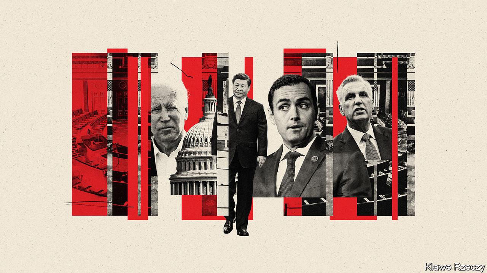

###### A representative problem

# A new challenge to relations between America and China 

##### As Xi Jinping tries to ease tensions, a congressional committee risks exacerbating them 

 

> Jan 29th 2023 

THERE HAS been a lull in the  between China and America in recent weeks. Fears of a , though still widespread, have ebbed since Presidents Joe Biden and Xi Jinping  in November and agreed to resume high-level dialogue in less sensitive areas, including climate change. Their senior economic officials had “frank exchanges” in Zurich in January but agreed to enhance communication. And both sides seem keen to build on that momentum when Antony Blinken heads to China in early February on the first visit there by an American secretary of state since 2018. 

But a fresh challenge to those efforts is now emerging in the shape of a Republican-led congressional committee that will investigate many of the most divisive areas of China-America relations. The House of Representatives’ new China Select Committee has no legislative authority but can issue subpoenas and hold hearings. “There is bipartisan consensus that the era of trusting Communist China is over,” Kevin McCarthy, the Republican speaker of the House, told legislators on January 10th, shortly before they approved the committee by 365 votes to 65. Mike Gallagher, the committee’s chairman, wants to hold its first hearing by March “at the latest”. 

Congressional angst over China has come in waves ever since the Communist victory in 1949. In the aftermath, a poisonous debate over “who lost China?” led to an investigation by the since disbanded Senate Internal Security Subcommittee, which tried to blame left-leaning academics and diplomats. That scarred a generation of China experts and helped fuel the rise of Joseph McCarthy (no relation of Kevin), the Republican senator who led a witch-hunt for Communist sympathisers in the 1950s.

In the late 1990s another surge of apprehensiveness came with two China-related scandals—one involving campaign contributions, another the sale of American space technology—followed by President Bill Clinton’s decision in 2000 to grant China “permanent normal trade relations”. The same year, Congress created the Congressional-Executive Commission on China (CECC) and the US-China Economic and Security Review Commission (USCC), which report annually to the legislature. 

The new China committee overlaps with them in some ways, but differs in key respects that could cause trouble, especially for Mr Xi’s efforts to reassure Western businesses alarmed by his recent policies and the tensions over Taiwan. The CECC mainly scrutinises human-rights issues. Though it has subpoena powers, it rarely uses them. The USCC examines the national-security implications of relations with China but generally takes willing testimony from officials and academics.

The China Select Committee, by contrast, is designed to conduct high-profile investigations into almost any aspect of relations between America and China. Issues it could address include American arms sales to Taiwan, investments in China by American pension funds and Chinese ownership of American farmland, as well as China’s political-influence operations in America and its role in fentanyl production, according to Republicans involved. 

It also has an articulate and relatively youthful chairman in Mr Gallagher, a 38-year-old Republican representative and former Marine intelligence officer with an international-relations doctorate from Georgetown University. While President Biden talks of avoiding a new cold war with China, Mr Gallagher argues that it is already under way and that America must accelerate legislative and executive action to prevail. At the same time, he appears mindful of the need to co-ordinate with other congressional committees and maintain bipartisan support for his own, calling for “serious, sober” people to join.

Republicans have named 13 members of the committee in all. They include several China hawks, but mostly figures who can work across the aisle. Only five served on Mr McCarthy’s 15-member China Task Force, which was designed to be bipartisan when launched in 2020 but lost Democrats’ support, partly over fears that it would overpoliticise the China issue. The sole Asian-American is Michelle Steel of California, who was born in South Korea.

Democrats have nominated 11 members, including three Asian-Americans. Raja Krishnamoorthi of Illinois, an Indian-American member of the Intelligence Committee, is taking the ranking slot. He said he was looking forward to working with colleagues from both parties to counteract the Chinese Communist Party’s “escalating aggression”, citing its threats against Taiwan and theft of American intellectual property. But he also urged the committee to avoid rhetoric that could fuel hostility towards Asian-Americans. 

Agenda items

It is still unclear which issue the committee will tackle first. But Mr Gallagher says a priority is to address what he says is a backlog of weapons, worth $18bn-19bn, approved for sale to Taiwan but not yet delivered. He has also called repeatedly for TikTok, a Chinese-owned short-video app, to be banned or sold to an American entity.

All that will be hard for Mr Xi to stomach. For him, though, one of the biggest risks is that he overreacts, throwing more red meat to congressional hawks while missing the point that much of what the committee does will be political theatre. Although Chinese officials have toned down their rhetoric in recent weeks, they have been vitriolic in the past about the two China-focused commissions. In 2020 China imposed sanctions on the CECC and two of its Republican members.

Some experts who advise the Chinese government now fear that Republicans are trying to hijack China policy and push the two countries deeper into a cold-war-style confrontation. The new committee will act as a “stone thrower”, undermining any efforts by Mr Biden to work with China, says Dong Chunling of the China Institutes of Contemporary International Relations, a think-tank linked to China’s state security ministry. As America’s next presidential poll draws closer, its two parties’ China policies are likely to converge, he predicts, and relations with China could become a victim of America’s political struggles.

The committee could indeed make it harder for Mr Biden to manage China relations. Although his administration shows no sign of softening its stance on key issues such as Taiwan or the technology trade, it wants to work with China on building “guardrails” to prevent conflict. It is also hoping to co-operate in areas of global concern, such as cutting methane emissions and preparing for the next pandemic. The committee has no formal power to stop such initiatives. But its hearings will no doubt inflame public opinion, cramping Mr Biden’s room for manoeuvre.

That raises another potential problem for the American president. If the committee nudges him towards a more confrontational posture towards China, he risks alienating allies—particularly in Europe. Although many of them share some American concerns about Mr Xi’s policies, they are also anxious to re-engage with China commercially and are wary of being sucked into a military confrontation in Asia.

Yet there are pitfalls for Republicans, too. One is that their committee members become too critical of the Biden administration. Congressional committees derive credibility less from formal powers than from media interest, which can quickly wane if they descend into partisan bickering, says Robert Kelner, who heads the congressional-investigations practice at Covington &amp; Burling, an American law firm. “If the media loses interest in a congressional investigation, that investigation is going to come to an end,” he says.

The other big risk is that the committee’s hearings lend weight to Democrats and other critics who worry about it fuelling anti-Asian violence. On January 10th, 23 House representatives issued a statement expressing concern over the committee’s direction and warning that “reckless and prejudiced rhetoric and policy” from Donald Trump and congressional Republicans had contributed to a rise of 339% in anti-Asian hate crimes in 2021. 

Mr Gallagher dismisses those concerns, saying he aims to protect the Chinese diaspora from the Communist Party. But he does acknowledge the need to tread carefully, noting recently that Joseph McCarthy was also a former Marine intelligence officer from Wisconsin. “The lesson of Joseph McCarthy is that there’s always a risk of going overboard,” he said. “It’s on me to prove that the committee is a forum for serious, sober, statesman-like debate.” ■


