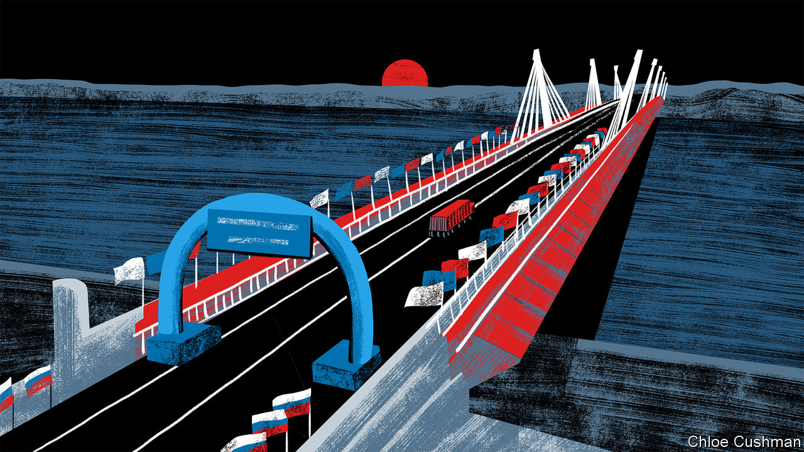

###### Chaguan

# Why Vladimir Putin is not a pariah in China 

##### On the frozen China-Russia border, locals talk about the past and future 

 

> Feb 2nd 2023 

For generations China’s people have been told that the outside world is—rather often—an unsafe and disappointing place. Communist Party ideologues teach that foreigners’ quarrels are best understood as contests of strength and self-interest. Relentlessly, official speeches and news reports cast doubt on the notion that other countries’ actions are explained by moral values, whatever outsiders claim.  is presented as an exception: a peace-loving giant that seeks only to do good. 

Instilling cynicism about the world serves the party well. Without it, February 4th could be a ticklish anniversary for President Xi Jinping. It is a year since his declaration that  enjoy a “friendship without limits”, days before Vladimir Putin launched his blood-soaked, land-grabbing invasion of Ukraine. 

Russian savagery quickly obliged once-close partners, such as Germany, to declare Mr Putin a dangerous warmonger. Mr Xi has more room for manoeuvre because Russia is not a pariah in mainstream Chinese opinion. In part, propaganda and censorship explain why. Each night for almost a year, the main evening news has blamed the Ukraine conflict on America and the NATO defence alliance, which are accused of pushing Russia into a corner by expanding eastwards. As recently as January 30th, the foreign ministry in Beijing charged America with prolonging the war and of “profiteering from the fighting” by sending heavy weapons to Ukraine. Many Chinese who hear talk of Russian war crimes, such as an alleged massacre of civilians in Bucha, suspect that it is “fake news” invented by Ukraine and allies in the West, suggests Professor Wang Yiwei of Renmin University.

In part, something starker is at work. In its teachings the party implies that it is simply naive to ask whether governments are wicked or virtuous. Their impact on China is what counts. Russia has large armed forces and commodities to sell, and shares China’s resentment of America. China’s rulers, and still less its people, do not care who controls this or that oblast of Ukraine. But China does have a vital interest in discrediting American-led alliances, because those may threaten China one day in its East Asian backyard. It is thus desirable for Russia to successfully defy and divide the West, discredit NATO and survive sanctions imposed on it.

Indifference towards Russia’s ruthlessness is not quite the same as approval of all Mr Putin’s actions. Members of China’s foreign-policy establishment, such as Professor Wang, admit to dismay that Russia has annexed chunks of Ukraine, which reminds scholars of tsarist Russia’s seizure of 1.5m square kilometres of territory from China’s last, enfeebled imperial dynasty. But a foreign power need not be admirable to be useful.

Heilongjiang province, in China’s frozen far north, is an unusually good place to observe such chilly pragmatism. When China and the Soviet Union came close to all-out war in the late Mao era, Red Guards ransacked an onion-domed Russian Orthodox cathedral in Harbin, a city founded as a railway hub by tsarist troops and settlers over 120 years ago. Today Harbin markets the ex-cathedral as a romantic, “European-style” tourist site. On a recent evening Chaguan bought a ticket and asked selfie-snapping visitors whether the Ukraine war has changed their views of Russia. Not really, said two university students from the nearby province of Liaoning. Russia is good because it has not betrayed China’s global or national interests, said one. Conversation turned to the changing global balance of power. China learned Marxist-Leninism from Russia and is now a “soaring dragon of the East”, while the West is in “slow decline”, added his friend.

A slow sleeper train then carried Chaguan north to the city of Heihe, on the ice-bound border river with Russia. In 1900 Russian Cossack troops seized the river’s northern bank by driving Chinese farmers and labourers into the water. Thousands drowned. A British passport secured entry to the nearby Aihui History Museum (Russian citizens are “generally” not admitted, museum guards confessed), where this grim massacre is commemorated by a 69-metre-long panoramic painting. It shows Cossacks raping women, driving Chinese into the river at bayonet-point and machine-gunning those in the water. In all, the museum records centuries of Russian invasions. A text at the exit tells visitors the lesson to draw from this history: work to make China and its armies strong, do not nourish hatreds. “If you’re weak, you’re bullied. If you fall behind, you’ll be beaten,” it counsels.

Just upstream of the museum stands Heihe’s hope for the future, the first China-Russia road bridge over the border river. It opened in summer 2022 after years of Russian foot-dragging, driven by fears of China dominating Russia’s sparsely peopled far east. “Of course” locals remember Russia’s past depredations, said a woman whose shop sells Russian honey, chocolates and other souvenirs to Chinese tourists (or did before covid controls sealed the city for almost three years). But if cross-border trade opens up, “Heihe has a chance to really take off.”

Might trumps right

A neighbouring shopkeeper called Russia poor and China rich. He proudly reported that “beautiful” Russian women marry Chinese men. He has never heard of Chinese women taking Russian husbands. He deemed Russia “all right”, as a country. A friend joining him for a smoke denounced America, Britain and their allies for meddling in Ukraine. If Russia chooses to attack Ukrainians, that is a civil war, the friend growled: “It is all the same country.”

A third trader predicted that shoddy Russian infrastructure will slow local development, though cheap oil and gas from Russia should help China overall. He blamed deaths in Ukraine on the West, because without NATO weapons the smaller country would have lost to Russia “long ago”. His focus on relative strength, rather than the rights and wrongs of invasion, made for a bleak view of peacemaking. It suits leaders in far-off Beijing just fine. ■


