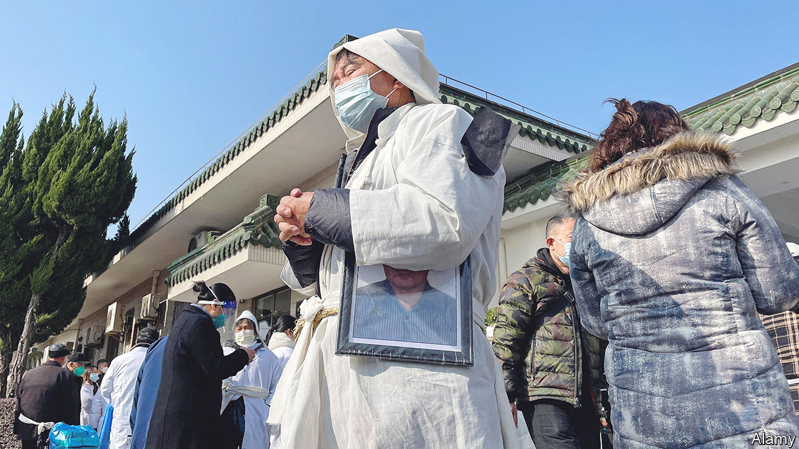
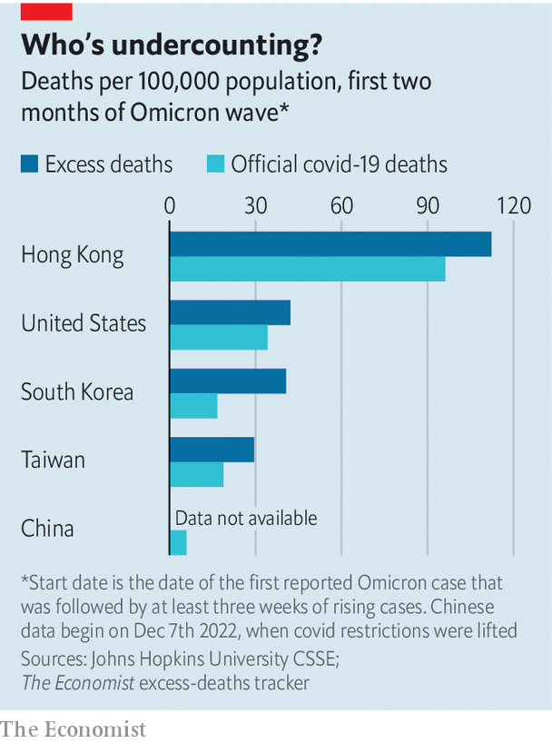

###### Death and denial

# Will we ever know how many people died of covid-19 in China? 

##### The official data are not to be believed 

 

> Feb 2nd 2023 

The wave of  that swept through China recently appears to have abated. Over 80% of the population has caught the virus in the last two months, says the government. The number of new cases is falling.  “can stand the test of history”, said Wang Wenbin, a spokesman for the foreign ministry, on January 10th. “We protected people’s lives and health to the greatest extent possible.”

Official data support Mr Wang’s claim. The government says around 5,000 people died at the start of the pandemic in 2020, before China put in place strict “zero-covid” controls. Over the next three years few Chinese even caught the virus. After the zero-covid policy was scrapped in December, a further 80,000 died, according to the state. By this accounting, China fared much better during its Omicron wave of the virus than other countries (see chart).

 


But there is little doubt that China’s data are misleading. Doctors report being pressed to leave covid off death certificates. People who die at home are not counted at all by the state. Reports of overwhelmed hospitals and crematoriums suggest a far higher death toll. China was poorly prepared for this wave. Many old people were not fully vaccinated and supplies of covid drugs were inadequate.

’s own model predicted that if the virus spread unencumbered in China, between 1m and 1.5m people would die of covid during this wave. At a forum on December 17th, Wu Zunyou of China’s Centre for Disease Control and Prevention suggested that the Omicron variant, which is circulating in China, had a case-fatality rate of around 0.1%. That would imply a range of deaths in line with our model. “My starting-point would be 1m deaths,” says Ben Cowling, a professor of epidemiology at the University of Hong Kong.

Chinese officials will not like hearing that. They have spent months shaming America for passing 1m covid deaths. “It proves the irresponsibility and incompetence of American politicians in anti-epidemic measures,” said a commentary in the , a party mouthpiece, in October. State television often pointed to the number of covid deaths in Western countries as a way of justifying brutal lockdowns at home. Even if China were to release a covid death toll in line with independent estimates, its propaganda organs could still boast of having many fewer deaths per 100,000 people than America and other Western countries.

China has said it will eventually release an estimate of “excess deaths”: the gap between how many people died during the outbreak, regardless of cause, and how many deaths would have been expected otherwise. That would, in theory, take in undiagnosed covid deaths and those who died as a result of overwhelmed health services. But experts are sceptical that the number will reflect reality.

In general, Chinese people are moving on with their lives. Many travelled home for the lunar new-year holiday last month. Factory activity increased in January, as workers quickly shook off infections. But some of those who have lost loved ones are angry. “They basically sent old people to their deaths,” says a woman whose grandmother died. She will not be waiting for the state to release more data: “I don’t believe a word the government says.” ■


