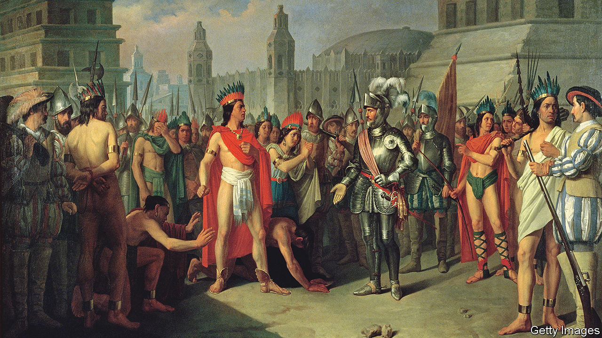

###### Transatlantic histories

# As Europeans went west, indigenous people travelled the other way 

##### Caroline Dodds Pennock remembers their stories and impact in “On Savage Shores” 

 

> Feb 2nd 2023 

. By Caroline Dodds Pennock. 

In recent decades indigenous people around the world have fought to rebuild cultures wrecked by colonialism, invoking a common phrase: “We are still here.” From protests against  to bids to reclaim land, and from the revival of native cuisines to , a renaissance is refuting the tired view that these cultures are vanishing. 

According to Caroline Dodds Pennock’s absorbing account of indigenous peoples in 16th-century Europe, their roles in earlier history have been simplified or erased, too. “On Savage Shores” shatters the Eurocentric assumption that, half a millennium ago, people and ideas flowed in , from the old world to the “new”. Her study painstakingly reconstructs the first century of contact between colonial powers and the peoples of the Americas, documenting thousands of natives who travelled east, often involuntarily, to a continent they considered no less “savage” than the conquistadors had found their own.

Long before Buffalo Bill’s Wild West shows began touring Europe in the late 19th century—and even before the first permanent English settlement in North America, at Jamestown in 1607—indigenous people lived in European courts and cities. Ms Dodds Pennock, a scholar of Mesoamerica, mainly focuses on the peoples of Central and South America, which were invaded and exploited by conquistadors from Spain and Portugal. But readers meet scores of individuals ferried across the Atlantic, from Nunatsiavut, Roanoke and Brazil to London, Seville and Rouen.

After trumpeting his “discovery” of America in 1492, on his next trip Christopher Columbus focused on kidnapping Taíno people from the Caribbean to sell as slaves at home. One Taíno boy he “adopted” as his own was the first of many émigrés forcibly Christianised to justify the Spaniards’ “civilising mission”. For his part, after laying waste to the Aztec capital in 1519,  sent the gifts offered by its ruler, Moctezuma, back to the Spanish king. These included a hoard of exquisite gold and silver treasures—and at least five emissaries from the Totonac people of Mexico, who barely rated a mention in one observer’s breathless report. 

Only through oral histories and forensic reading of archival documents can the voices of such travellers be heard, the author writes. By 1600 as many as 2m people from the Americas were enslaved, she recounts, many of them transported to Europe. Some high-ranking travellers came as diplomats trying to broker better conditions for their people; others were forced into service as interpreters. Two such intermediaries arrived in London in 1584 with  and were instrumental in developing an Algonquian written alphabet (credited solely to Ralegh’s navigator, Thomas Hariot).

Meanwhile, for all the splashy biographies of indigenous American crops like  and tobacco, says Ms Dodds Pennock, those who grew and sold such goods were overlooked for centuries and are still neglected. Perhaps unconsciously, Europeans emulated indigenous peoples’ rituals for smoking and coffee-drinking; but, the author argues, they failed to adopt their system of “reciprocity between the land and its inhabitants”. She cautions against romanticising indigenous beliefs, yet notes that “European value-systems tended to extraction and profit, rather than sustainability and the sharing of resources.”

The impact on European culture of these travellers is hard to measure. It is clear in language: Quechua provided  and  the Aztec-Mexica tongue supplied and . The book’s wider claim—that the indigenous presence shaped European society—is less convincing. Still, the views of native peoples on their colonisers continue to resonate. Michel de Montaigne, a French essayist, inquiring of three Tupinambá from present-day Brazil, reported their wonder at how “among us some men were overstuffed with all sorts of rich commodities while their [compatriots] were begging at their doors, emaciated from hunger.” ■


