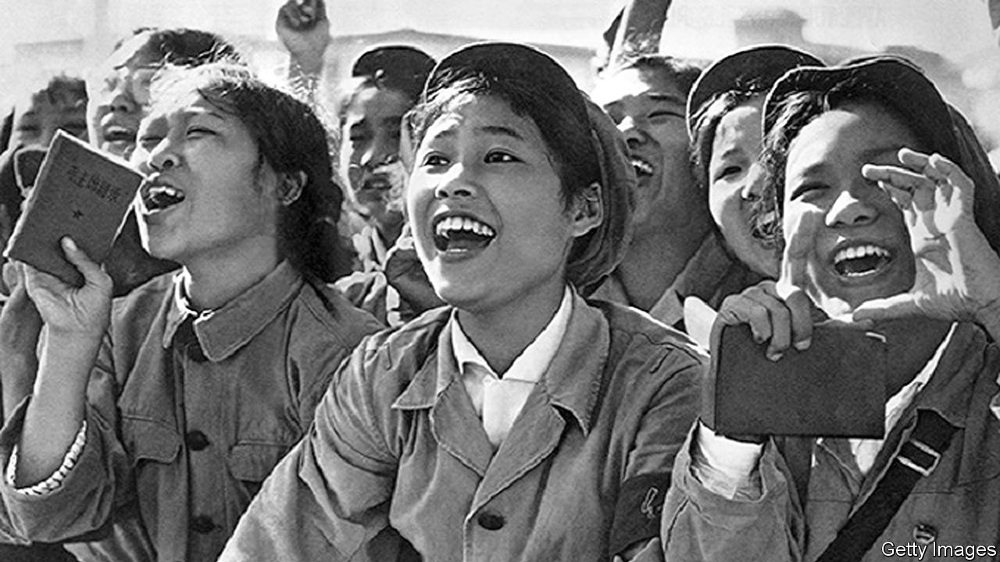

###### Bad memories

# Explaining Chinese amnesia over the Cultural Revolution 

##### In “Red Memory” Tania Branigan looks at how and why China chooses to forget 

 

> Feb 2nd 2023 

By Tania Branigan. 

At first glance Zhang Hongbing is deserving of pity. In the 1960s, while still a teenager, he watched his father being beaten until his urine ran red. The older man, a veteran of China’s Communist Party, had been accused of being a capitalist. Then Mr Zhang’s mother, Fang, fell under suspicion. She was branded a counter-revolutionary and later executed.

Such horrors were not uncommon during , a decade of Maoist madness that began in 1966. Gangs of Red Guards, whipped up by , persecuted those deemed too capitalist, traditional or reactionary. Frenzied young people led the initial charge, though the fighting between rival adult factions was more deadly. In all, as many as 2m people were killed in the upheaval; the lives of many millions more were ruined.

What makes the death of Fang stand out is that her husband and son had themselves been her accusers. Mr Zhang tells Tania Branigan, the author of “Red Memory”, that he saw his mother as a “monster” after she insulted Mao. Father and son then left to report her, probably knowing she would be killed. Today Mr Zhang is repentant. Yet his memory seems odd: “He existed in it not as a human who loved and feared and doubted, but as a Maoist algorithm: inputs, rules, outputs.” 

How people remember that horrible decade—or why they have forgotten it—is the underlying theme of this penetrating and perceptive book. Ms Branigan has spoken to those who experienced the revolution as victims, perpetrators or both. Mr Zhang is more open than most Chinese. Some have been silenced; some fear repercussions. “Others hush as if it were a curse, so powerful that its very mention darkens current peace and prosperity,” writes the author. “And so the party and those it rules have conspired in amnesia.”

Under Mao’s successor as paramount leader, , the party admitted the Cultural Revolution was a “catastrophe”. Deng himself had been purged—twice. His resolution stated: “It is impermissible to overlook or whitewash mistakes, which in itself would be a mistake and would give rise to more and worse mistakes.” It attacked Mao’s personality cult and tyrannical style. Around the same time, books about the trauma, called “scar literature”, appeared. This was the closest China has come to a reckoning.

China’s current leader, , was also a victim. His father, who had fought alongside Mao in China’s civil war, was persecuted. His half-sister reportedly killed herself during the period. Mr Xi himself was sent to live in a cave in the countryside for seven years. Today the party paints this as a formative experience, one that turned Mr Xi into a man of the people. That is in keeping with his attacks on “historical nihilism”. China’s online censors have deleted millions of posts containing “harmful” discussion of the past.

Mr Xi was disgusted by the chaos of the Cultural Revolution. But  of party history, produced in 2021, removes references to Deng’s verdict and his warnings about one-man rule. Mr Xi has accumulated more power than any leader since Mao and created his own cult of personality. The Cultural Revolution’s legacy is thus more relevant than ever, writes Ms Branigan. But, she notes, there is “an inverse relationship between utility and acceptability: what makes the era’s lessons so vital is also what makes them impermissible.” ■


