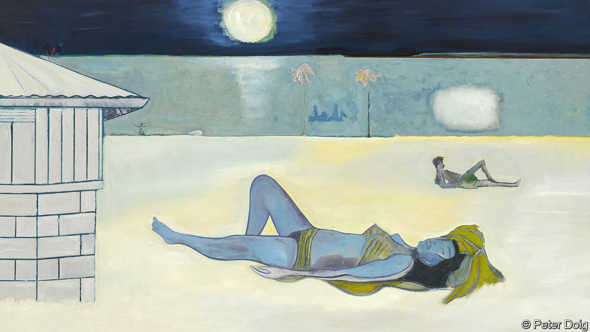

###### Contemporary art

# Look closely at Peter Doig’s paintings. Then look again 

##### His new show opens at the Courtauld Gallery on February 10th 

 

> Feb 2nd 2023 

Born in Scotland, then brought up in Trinidad and Canada, Peter Doig had a childhood of sharp contrasts: big northern wintry skies and the bright Caribbean sunrise, icy cold and humid tropical heat. These formative years inspired a distinctive body of art that has acquired a discreet but influential following. 

Among his collectors are Viktor Pinchuk, a Ukrainian tycoon, and Pierre Chen, a Taiwanese electronics billionaire. Both were intrigued by Mr Doig’s early paintings, with their acres of silver birches, veils of flocked snow, white cabins and forsaken canoes. In November 2021 “Swamped”, one of his best-known works, sold at Christie’s for almost $40m. Instantly recognisable as a Doig, it features a forest lake and one of those trademark canoes, which, wrote Kevin Snowdon, a British poet, are “Mirrored in exactitude in the black dark water”.

The imagery in Mr Doig’s work is only part of its appeal. Another key aspect, argues Richard Shiff, an art historian at the University of Texas at Austin, is the way his paintings “drift” or gradually reveal themselves. The artist uses observation as much as imagination, drawing on film, photography, other artists’ paintings and his own dreams to create pictures that develop unpredictably. They call for extended looking. What his work is really about is never immediately obvious. 

When Mr Doig begins a painting, he says, he almost never knows where it will end. He once saw a man wringing the neck of a pelican on a beach in Trinidad. The image became a painting years later when he remembered an abstract work by  that he had once seen, showing a shaft of sunlight on trees. The picture that eventually emerged manages to be at once ethereal and menacing: the light is a celestial blue, but the figure of the man is a darkly unknowable silhouette. 

Mr Doig, who studied in London at Wimbledon School of Art and Central Saint Martins, came of age at a moment when painting was deeply uncool, especially in Britain. Artists and galleries were preoccupied with sharks pickled in formaldehyde and unmade beds. But he stuck with painting, basing himself in a barn at his parents’ house in Canada and patiently honing his craft. He made ends meet by working on film and stage sets, which taught him to manage large canvases. In 1994 he was shortlisted for the Turner prize for a snowy mountain landscape. In 2002 he moved back to Trinidad with his growing family (he has seven daughters and a son).

After decades abroad, Mr Doig has returned again to London. On February 10th he opens a new exhibition at the Courtauld Gallery in two rooms that have hosted shows of  and, more recently, Henry Fuseli, a Swiss Romantic. Mr Doig is the first contemporary artist to be displayed in them.

The Courtauld is also the home of Britain’s finest Impressionist collection, and some of the paintings in the new show recall and respond to those works. A depiction of an alpinist by Mr Doig speaks to Paul Cézanne’s view of Lake Annecy, a tropical bather (pictured on previous page) gestures at ’s nude “Nevermore”. A mysterious Trinidadian musician echoes the double bassist serenading Georges Seurat’s can-can dancers. But the most interesting connection is to Ambroise Vollard, a French art dealer and supporter of Cézanne, Gauguin and Matisse, who was painted by Pierre-Auguste Renoir.

In 1906 Vollard sent André Derain, who with Matisse was among the founders of Fauvism, to London. An exhibition of Claude Monet’s paintings of the city had recently been staged in Paris, and the dealer wanted Derain, whom he had just signed on, to try his hand at catching the shifting light over the Thames, its boats and embankments. Over three visits Derain produced a memorable body of work last seen together in 2006—at the Courtauld.

The biggest new picture in Mr Doig’s show is a view of Regent’s Canal, his first London scene since the 1980s. Artists such as Algernon Newton and  painted the same area, usually in muddy greys, browns and greens. Mr Doig tips his brush instead at Derain’s bright, Fauvist take on London. A little boy with a blue jacket and a pensive look sits at a green table. A cherry red bridge stands against a darkening sky, a highway to uncertainty.

The horizontal planes place you at an angle to the whole scene, as if you have suddenly stumbled upon it. Your eye drifts across the picture and there, to the left, is another figure you may not at first have noticed. A ferryman at the wheel of a barge, he seems to be just about to leave the painting. What is he looking at? What is he thinking? As with all Mr Doig’s best work, you are drawn back to look again. ■


