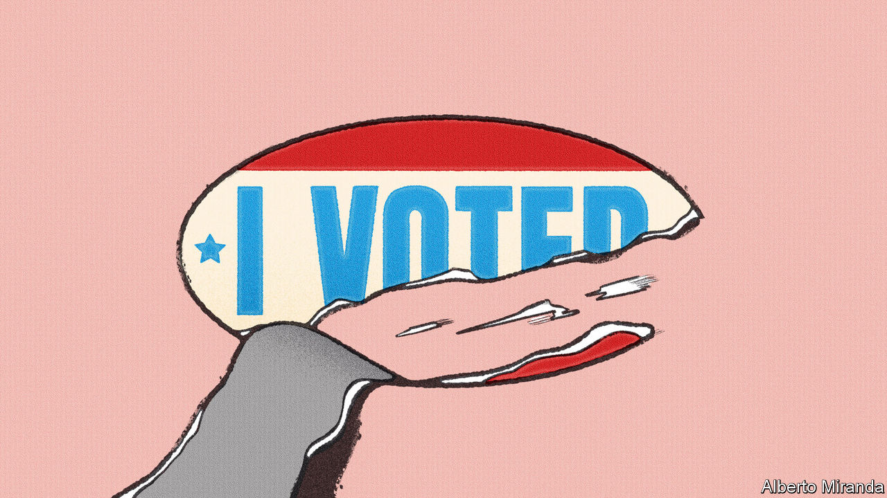

###### Democracy and its discontents

# Martin Wolf’s new book analyses the West’s malaise 

##### “The Crisis of Democratic Capitalism” is bleak but oddly comforting 

 

> Feb 2nd 2023 

By Martin Wolf. 

For anyone old enough to remember the fall of communism, recent history has been something of a shock. The triumph of liberal political and economic systems has been spoilt: by rich-country blunders, the rise of authoritarian China, and ultimately by a distressing loss of faith in democracy itself in what was once called the free world. This crisis of democracy looks less dire than it did a year or two ago, thanks to political change in America and missteps by China and . But the danger has not passed, and the need to understand democracy’s retreat remains urgent.

Martin Wolf is well-placed to interpret it. A dean of financial journalism, he has for decades been the chief economics commentator of the . “The Crisis of Democratic Capitalism” draws on the wisdom accumulated over his distinguished career—and argues that most of the blame for the democratic recession belongs to a record of dismal economic performance. The case he makes is authoritative and compelling. Yet in the end it is not fully convincing. 

Mr Wolf’s review of recent history will jolt even the well-informed. Governments of all sorts have become less accountable to the public. Authoritarian states have grown more oppressive; some strong democracies have wobbled; weaker ones have crumbled. And the  is far from the only cause. 

Surveys suggest ordinary people have become less enamoured of representative government. Over 60% of Americans born in the 1940s say it is “essential” to live in a democracy, but scarcely more than 30% of those born in the 1980s think the same, according to one study. Data published in 2020 show that, among the roughly 1.9bn residents of democracies, less than a quarter live in countries where most voters are satisfied with that system of government.

For Mr Wolf, this loss of faith—and the accompanying —are rooted in decades of economic failure. On its face, that seems a very reasonable argument. Since the early 1980s, income and wealth  have risen dramatically in many countries; in America, for instance, the share of pre-tax income earned by the top 1% has nearly doubled by some counts, from about 10% to 19%. In rich economies growth in productivity and in the inflation-adjusted incomes of the typical household has been disappointing. Deindustrialisation has left many working-class cities permanently depressed. 

The shock of the  of 2007-09 turned the accumulating discontent into seething anger at governing elites and a loss of trust in the system. Mr Wolf does not deny that racism, migration and cultural anxieties fuelled disillusionment with democracy. But he thinks such factors could only sway elections in a climate of weakened trust in elites, fed by economic failure—a similar dynamic, he says, to that which empowered the Nazis.

The book’s account of how things have gone wrong economically is thorough, and its policy recommendations are detailed and broadly sensible. Though Mr Wolf is willing to entertain some mildly unorthodox suggestions—he reckons a job guarantee is worth a look—he acknowledges that this is not a time for revolution. What is needed, he writes, is avowedly incremental change: shoring up the safety-net, boosting competition, preserving global trade. Overall, the book’s assessment is strangely comforting. It reassures readers that what has gone wrong is known, and all that is needed to repair the situation is a bit of competent technocracy.

But desirable as comfort may be—and, for that matter, competent technocracy—it is hard to shake the feeling that something more profound has happened to the world’s great democracies. If economic woes and elite failure are the problem, why did the trouble not develop sooner? The 1970s were a time of galloping inflation, deep recessions, soaring crime and other social ills, terminating in the punishing, industry-gutting downturns of the early 1980s. Yet democracy seemed secure. 

The global financial crisis was indeed a shock, and the vote shares of populist parties clearly soared in its immediate aftermath. But the links between economic pain and populism, and between populism and democratic decline, are not simple and automatic. Greece suffered terribly in the 2010s, but the vote share of the fascist Golden Dawn party peaked at a mere 7%. When they won office, the Greek populists of Syriza governed like normal European leftists. Or consider a counterfactual: had Bernie Sanders, another left-wing populist, succeeded in becoming America’s president in 2017, he would doubtless have made many mistakes. But it seems unlikely that he would have threatened the country’s democratic institutions.

The missing links

A comparison of the current woes with those of the first half of the  is especially clarifying. Germany lost a war, millions of men, an empire and a currency. At the height of the Depression, a quarter of its labour force was unemployed. The rich world, in recent decades, has had painful recessions. But it has met them with macroeconomic policy and social safety-nets far better than those of the 1930s. Inequality has not risen much since 2000. Other than in a few places, median incomes have grown, if sluggishly. 

Yes, the 21st century has been troubled and governments have erred. For all that, when Donald Trump was elected in November 2016, America’s unemployment rate was just 4.7%. If such venerable democracies are at risk, other corrosive forces must surely have conspired with the economic trends to make them so.

Precisely what those forces are is a question that haunts the democratic world. You could point to complacency over the internet’s capacity to spread ugly ideas, or the way in which globalisation has sometimes strengthened links between countries while eroding bonds within them. Progress itself is to blame, according to some analyses: the spiritual emptiness left over after material needs are met (and rival ideologies defeated) has driven some in the West to seek meaning and community in dangerous places.

Where Mr Wolf is undoubtedly right is in his grim assessment that democracies, even old and proud ones, can fall. Preventing them doing so may mean thinking beyond the comfort zone. ■


