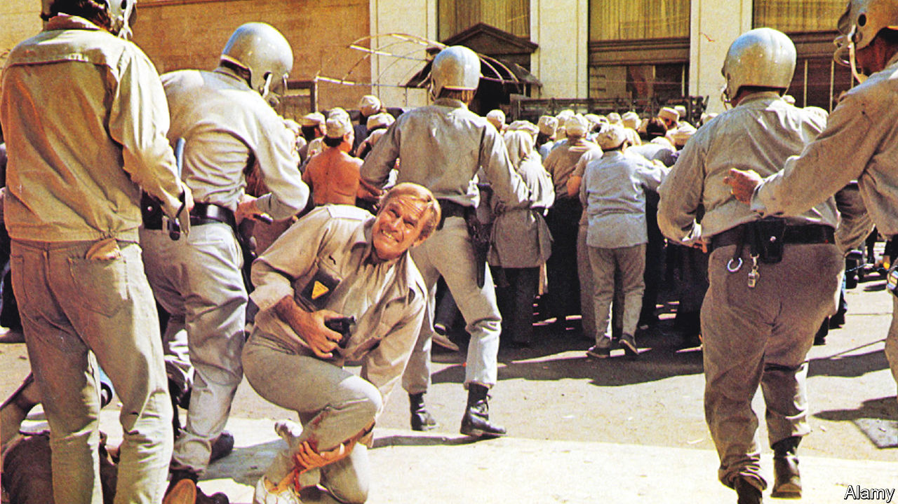

###### Home Entertainment

# Released 50 years ago, “Soylent Green” is an eerie prophecy 

##### It features Charlton Heston as a sweaty cop in the New York of 2022 

 

> Feb 2nd 2023 

In his later years,  was known as the Reaganite president of the National Rifle Association. But as a younger actor he was a Democrat and a civil-rights activist. He starred in three dystopian science-fiction films, the messages of which are positively left-wing. They all warn of the catastrophic damage that humans can do to the environment.

The first and best of these was “” (1968), which ended (spoiler alert) with the revelation that civilisation had been destroyed in a nuclear war. In “The Omega Man” (1971), civilisation had been wiped out again, this time by biological warfare. In “Soylent Green”—released 50 years ago, in 1973—civilisation is hanging on, but the situation is precarious. 

Pollution and overpopulation have ravaged the natural world, resources are scarce and  has brought on “a heatwave all year long”. The unnerving part is that the story is set in 2022. It is impossible to watch the film today without weighing up how accurate its predictions turned out to be. 

Loosely based on “Make Room! Make Room!”, a novel of 1966 by Harry Harrison, “Soylent Green” is a melancholy conspiracy thriller written by Stanley Greenberg and directed by Richard Fleischer. Heston stars as Robert Thorn, a hard-bitten police detective in New York who shares a cluttered flat with his sweet old assistant, played by Edward G. Robinson in his final role (he died before the film was released).

A murder investigation takes Thorn to a plutocrat’s spacious apartment in a fortress-like complex, where he encounters items that, in the world of the movie, are luxuries: soap, fresh apples and, most excitingly of all, air conditioning. “We’ll make it cold like winter used to be,” coos the apartment’s live-in courtesan (Leigh Taylor-Young). The inquiry also takes Thorn towards the truth about Soylent Green, a . It is supposedly made from plankton, but, given that the oceans have been despoiled, it is not.

Considering it was set five decades in the future, “Soylent Green” is remarkably unfuturistic. There are no spaceships or laser guns, just miserable figures shuffling around a dingy brown metropolis. For most people around the world, city life in 2022 was nicer than it is in the film-makers’ imagination, the pandemic notwithstanding. But some elements are too close to reality for comfort: the enmeshing of politics and big business, the separation of rich and poor, and the clashes between the masses and the heavily armed riot police. The relentless, sticky heat may be familiar to modern viewers, too.

The film’s most daringly cynical touch is that New York’s citizens are resigned to the way things are. Nobody thinks that nature might one day recover. Nobody rebels against the corrupt system. Indeed, Thorn himself is happy to be a part of it, as long as he can supplement his income by accepting a few bribes and pilfering a few treats from crime scenes. In its own way, the complacency of the populace in “Soylent Green” is scarier than the mutants in “The Omega Man” and the tyrannical gorillas in “Planet of the Apes”. ■


