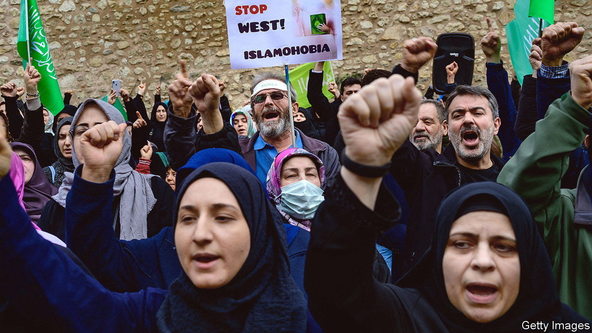
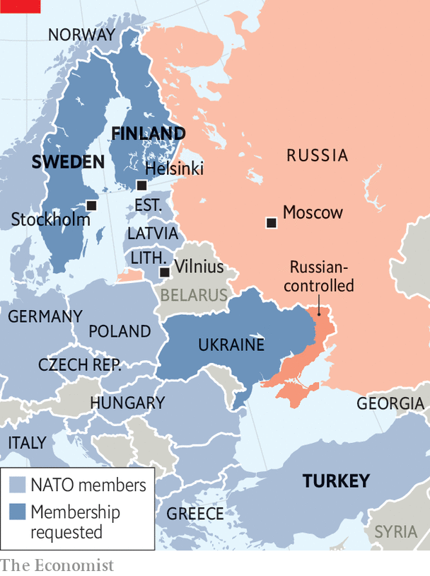

###### Delayed ratification

# A burnt Koran holds back Sweden and Finland from joining NATO 

##### Turkey is taking advantage of its veto power 

 

> Feb 2nd 2023 

NOBODY KNOWS what prompted Rasmus Paludan to burn a copy of the Koran in front of the Turkish embassy in Stockholm on January 21st. Mr Paludan, an attention-hogging far-right Danish politician, had torched Korans before, but his choice of location was significant: Turkey is holding up the . Mr Paludan’s demonstration permit was paid for by a Swedish journalist who once worked for a Kremlin propaganda channel, though the journalist denies any current connection to Russia. The Koran-burning led to anti-Swedish demonstrations across the Muslim world. Two days later Recep Tayyip Erdogan, , suspended his talks on NATO accession with both countries. 

It has been more than nine months since Finland and Sweden decided to give up their long-standing non-aligned status and join NATO, after Russia invaded Ukraine. Their accession has been ratified by 28 of the alliance’s 30 members. Hungary says it will ratify it soon. But Turkey has demanded that both countries first crack down on residents linked to movements that it considers anti-Turkish terrorists, mainly the Kurdistan Workers’ Party, or PKK. The three countries struck a deal last summer, and Finland and Sweden say they have done what they promised. Yet Turkey says it is not enough.

 


“We have fulfilled the memorandum, and it is time for Turkey to act,” Tobias Billstrom, Sweden’s foreign minister, told . Sweden and Finland have both lifted arms embargoes they imposed on Turkey after it invaded Syria in 2019. In March Sweden will introduce legislation criminalising membership of terrorist groups, including the PKK, a step which required it to change its constitution. But Turkey also wants Sweden to extradite over 100 people, including some whom Sweden considers dissidents with a right to asylum. (Because it long had welcoming asylum policies, Sweden has a large Kurdish community of about 100,000. Finland has just 15,000 or so.) 

Turkey’s stance is partly campaign politics. Mr Erdogan faces a tough election in the spring or early summer, and has been whipping up nationalist resentment over Sweden’s alleged pro-Kurdish, anti-Muslim offences. He demands that Sweden “return these terrorists to us” and that it prevent any further Koran-burning before he will approve its NATO membership. Mevlut Cavusoglu, his foreign minister, accuses Sweden of “taking part in the crime” of burning the Koran. Most Finns and Swedes, however, still expect the Turks to shift gear after the election and ratify their countries’ accessions before NATO’s next summit in Vilnius, Lithuania’s capital, on July 11th. “Many times we have seen domestic politics in Turkey leading to expressions like this,” says Mr Billstrom.

Yet that may be wishful thinking. Turkey’s ability to veto the NATO applications gives it a cheap lever over European affairs. Mr Erdogan may even think he can use it to press Western countries to reduce their support for Kurdish groups in Syria, says Asli Aydintasbas of the Brookings Institution, a think-tank in Washington, DC. 

Mr Erdogan now says he might approve Finland’s application but not Sweden’s, trying to split the two to increase the pressure. That “wedge tactic” will not work, says Teija Tiilikainen, a Finnish political scientist; the decision to join NATO was premised on solidarity with Sweden. Finland’s foreign minister has said that no split will be considered. Like so many European impasses, this one may require intervention from America, which could, for instance, use a long-delayed sale of F-16 fighters as a bargaining chip to get Mr Erdogan to approve the accessions. 

While awaiting ratification, Finland and Sweden are not protected by NATO’s Article 5 mutual-defence guarantee. But many member countries have signed promises to come to their aid if they are attacked in the interim. Meanwhile, they are further integrating their armed forces with NATO. Being allowed into committee meetings at the alliance’s headquarters was an eye-opener, says Robert Dalsjo, a Swedish defence expert: “It’s like having been to a house several times and suddenly they open rooms you didn’t know existed.” ■

