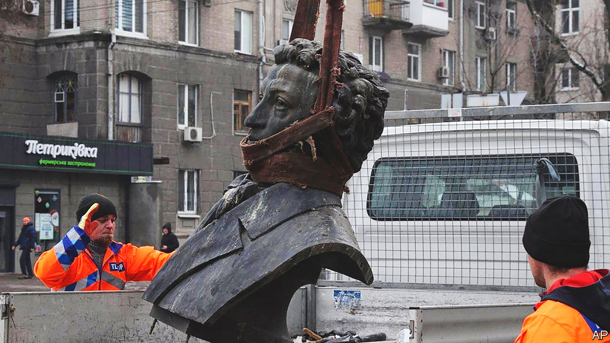

###### Recycling Russia

# A campaign to “de-Russify” Ukraine is under way 

##### Books are being pulped and statues moved 

 

> Jan 29th 2023 


AT A RECYCLING plant on the outskirts of Kyiv, a short drive from the site of a  that killed 14 people (including Ukraine’s interior minister) a week earlier, a group of sorters, most of them middle-aged women, are ripping apart hundreds of Russian books. The cover of Tolstoy’s “Childhood, Boyhood and Youth”, days away from being reborn as a coffee-cup sleeve or an egg carton, goes into one garbage bag. The novel’s pages, destined to end up as paper for other books, in Ukrainian, or as cheap toilet paper, go into another. Next comes a selection of poems by Mayakovsky. Then a Soviet physics textbook. Then biographies of . And so on.

The backlash against  in Ukraine had been picking up steam since 2014, when Russia occupied the Donbas and Crimea. But Russia’s unprovoked invasion of Ukraine, together with the horrors committed by its troops, has sent it into overdrive. De-Russification has mostly been a bottom-up process or a matter of individual preference, as opposed to government policy. Millions of Ukrainians continue to speak Russian without suffering discrimination. But local authorities in many parts of the country are changing street names and pulling down Russian and Soviet statues. 

In Uzhhorod, the capital of the western province of Transcarpathia, red stars have been removed from the tombstones of fallen Soviet soldiers. Busts of Alexander Pushkin have disappeared from dozens of towns. In Odessa, a large statue of Catherine the Great, the 18th-century Russian empress who founded the city, was taken down and boxed up in late December and now collects dust in the basement of the city’s fine-arts museum. On January 27th Kyiv-Mohyla Academy, one of Kyiv’s oldest universities, announced it was banning even spoken Russian, though its president later backtracked and said the ban would not be enforced.

De-Russification has reached literature too. Syayvo, a bookstore in Kyiv, closed at the start of the invasion. When it reopened three months later, the management and some customers came up with the idea of collecting books in Russian, recycling them and donating the proceeds to a charity that buys clothes and equipment for Ukrainian troops. Since July, customers have brought in 60 tonnes of books. 

Russia, which controlled much of Ukraine from the 17th century, and the Soviet Union, of which Ukraine was part until 1991, repeatedly suppressed Ukrainian language and culture. Russification peaked under Alexander II, a 19th-century tsar who banned teaching, publishing books and staging plays in Ukrainian. 

Russia’s modern-day tsar, Vladimir Putin, denies the existence of a separate . Russian occupation forces in eastern and southern Ukraine have set out to destroy it. Access to Ukrainian news websites has been blocked. Place-names have been changed and Russian spellings have replaced Ukrainian ones. In the devastated city of Mariupol, the occupiers took down a monument to the victims of the Holodomor, the famine to which the Soviets condemned Ukraine in the 1930s and which killed millions of people. Schools are now forced to follow the Russian curriculum. Countless Ukrainians suspected of links to the government in Kyiv have been rounded up and abused. Some have been shot. 

The outcome, at least in the rest of Ukraine, is not quite what Mr Putin had in mind. As recently as the summer of 2021, 41% of Ukrainians agreed with the notion that Ukraine and Russia were one people, according to one study. By the spring of last year, after Russia invaded, the number had plummeted to 8%. 

Most Ukrainians support the idea of changing Soviet or Russian place-names. Whether Russian writers buried one or two centuries ago should pay the price for today’s war crimes is a more divisive question. Like many Ukrainians traumatised by the war, Vasyl, browsing for a new novel at the Syayvo bookstore, says he and his wife, who grew up in Russia, have decided to stop speaking Russian. “It grates on my ears,” he says. But he reckons literature should be off-limits, and that turning books into pulp is a step too far. “This reminds me too much of Mussolini,” he says, unpersuaded by Mr Dyak’s argument that recycling books is hardly the same thing as burning them. “A book is a book.”

, perhaps Ukraine’s best-known contemporary writer, was born in Russia and writes in Russian. “I understand emotions,” he says, but adds that some Ukrainian intellectuals are using de-Russification to boost their own patriotic credentials. He knows his own books will probably not be published in Russian until after the war. “The reaction to everything Russian is extremely negative and aggressive,” he says. But while Russian-language writers may be ignored in parts of Ukraine, in others, where Russian dominates, he says, they “cannot be removed”. ■

