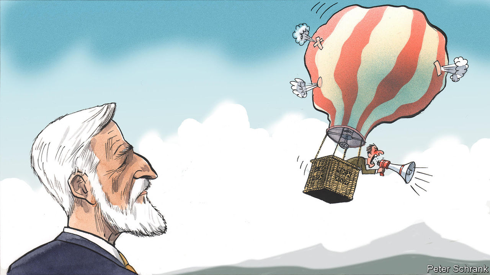

###### Charlemagne

# At last, populism in Europe is losing its mojo 

##### All is not lost for the centrist liberal consensus 

 

> Feb 2nd 2023 

Hollywood casting directors do not get to vote for European heads of state. But if they did, they would plump for . Square-jawed and white-haired, the 61-year-old Czech looks every bit the airborne platoon leader turned top NATO general, then aspiring statesman: think Eisenhower or de Gaulle, special-ops variant. Mr Pavel’s countrymen also saw the appeal, handing the retired soldier a decisive 58% win in a run-off for the Czech presidency on January 28th. Even more enthused at Mr Pavel’s triumph were those Europeans fretting that populism had become an unstoppable force across the continent. The liberal, pro-EU Mr Pavel trounced Andrej Babis, a billionaire elite-bashing understudy of Donald Trump. It is but one election in a mid-sized European country. But it marks another blow for the narrative of European politics shifting inexorably to extremes. 

The political story of the EU in the past two decades has been how populists have gatecrashed what used to be a cushy, mostly liberal, cartel. Elections in Europe once typically pitted centre-right candidates against centre-left ones. Since the turn of the century, but especially from about 2015, candidates from the post-fascist fringe and the still-Marxist one went from being marginal to central. The rise of populists variously inveighing against migrants, gays, globalisation, modernity and all that goes with it has shaken polities from Sweden to Italy, Denmark and Greece. On the continent every election now feels like a test of whether electorates still abide by the post-war centrist consensus, or whether once beyond-the-pale politicians like  in France should get a shot at upending it. In places like Poland, Hungary and most recently Italy, the outsiders have prevailed.

The Czech result shows that populism’s bubble can be deflated. Mr Babis had already been ousted as prime minister (the more important position in Czech politics) in 2021, albeit only because his top-ranked party could not find partners to form a coalition. The presidency for the past decade had been in the hands of Milos Zeman. He was once a centre-left premier but his stint as head of state included racist and homophobic rhetoric—not to mention support for Russia. Predictably, he had supported Mr Babis. Mr Pavel in contrast stood out for his unflashy competence when he was in uniform. He is well-liked in European circles, not least by the French, who showered him with honours after a unit he led saved dozens of their soldiers from capture during a mission in the former Yugoslavia in 1993. 

It is too soon to say that the populist bubble has burst. But the sense of inevitability of populism’s progress has faded. Mr Babis’s defeat comes after the recent political exits of Trumpy politicians in Slovenia and Bulgaria (though Bulgaria has also since turfed out a liberal premier, and is gearing up for new elections), not to mention America and Brazil. Central and eastern Europe has been particularly fertile ground for populists. Voters have felt the whiplash of rapid economic and social change since the fall of communism in 1989. Some resent being made to feel that they can aspire to nothing but to be more like the West—welcoming to migrants, unfussed about gay marriage—yet never quite catching up. But the West has had its share of populist triumphs too. Britain left the EU on the back of dodgy promises straight out of the populist playbook. In Sweden a post-fascist party supports the new government; in Italy, under Giorgia Meloni, one leads it.

Populists are facing headwinds for several reasons. One is the war in Ukraine. It has tainted Vladimir Putin, the politician many European populists hold in highest esteem. The war also fractured an alliance between Poland (whose populists support Ukraine) and Hungary (whose “illiberal democrat” prime minister Viktor Orban still lauds Russia). Leaving the EU is seen by ever more voters as a mistake after Britain’s wretched display. And the price tag of populism has become clearer. Thumbing a nose at the Brussels bureaucracy enforcing EU rules—on how courts should be run free of political interference, say—used to be for the likes of Mr Orban, whose base would lap up stories of flustered Eurocrats. Not so much, these days. A slug of EU funds, notably those tied to the bloc’s recovery from covid-19, is tied to national governments meeting criteria crafted in Brussels. Populists can refuse to accede to Brussels’ demands, but that means being deprived of money that voters know would help in a cost-of-living crisis, as has happened in Poland and Hungary. 

Even when populists win it is not clear that their policies do. In Italy, Giorgia Meloni is not only in power, her party is surging in the polls. That is not an indication of populism’s success, however: Ms Meloni has governed broadly as a centrist in her first hundred days. She has stayed away from her counterparts in Poland and Hungary, favouring meetings with France’s Emmanuel Macron and the European Commission’s boss, Ursula von der Leyen, instead. The Italian leader doubtless took note of the rise of Ms Le Pen, who has toned down her Euro-bashing over the years and has her eye on the 2027 presidential race. 

Off-centre

Populism still matters. In the same way politicians like Ms Meloni modify their ideas once in office, mainstream politicians have added populist ones to their repertoire. A resurgence in illegal migration in recent months is being dealt with in part with policies once unpalatable to the centrist consensus. Talk of building fences at the EU’s borders and cutting development aid to poor countries that fail to help Europe stymie migration flows was once unthinkable. These measures are now firmly on the EU agenda. 

Liberals hope populism’s moment is passing because voters see that it is long on rhetoric yet short on solutions. That is true, if a bit optimistic. Elite-bashers still have many political victories left in them. But what Mr Pavel’s triumph shows is that they will suffer plenty of drubbings, too. ■


