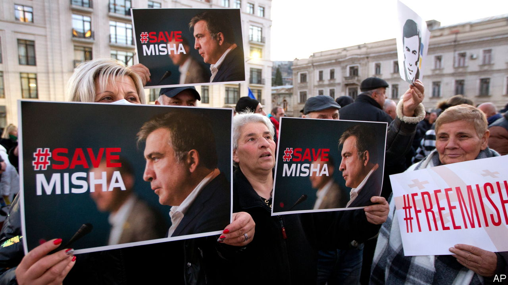

###### The broken toy

# Georgia is drifting into the Kremlin’s orbit 

##### The West once saw it as a beacon of liberty 

 

> Jan 31st 2023 

The road from Tbilisi airport to the old town—a web of steep cobbled streets with ornate balconies and the mouthwatering smell of dumplings and cheese bread—bears the name of George W. Bush, the first American president to visit the small Caucasian country, in 2005. Saluting its democratic reforms, Mr Bush called Georgia “a beacon of liberty” and told its young and restless reformist president, Mikheil Saakashvili, that Georgia had “a solid friend in America”. 

These days it is the Kremlin that is praising Georgia, a country it , for toeing its line and refusing to join Western sanctions against Russia. The 55-year-old Mr Saakashvili is under guard in hospital on the outskirts of Tbilisi, fighting dementia and muscle atrophy. “My health is in deep shit,” Mr Saakashvili wrote to your correspondent in a letter. “Besides all kinds of bad symptoms, what makes me desperate is a terrible memory loss.” Mr Saakashvili believes that he has been poisoned, and says he lapsed into a brief coma after an earlier move to a different prison hospital. In December his legal team distributed a toxicology report said to identify the presence of heavy metals in his body, in which the toxicologist expressed the opinion he had been poisoned. 

Mr Saakashvili modernised Georgia but also became enmeshed in scandal and repression. After standing down once he had been termed out as president, he fled in 2013 fearing arrest at the hands of Bidzina Ivanishvili, a reclusive businessman who made his money in Russia, served briefly as prime minister, and has in effect ruled Georgia ever since, though he holds no formal government post. Mr Saakashvili, subsequently stripped of his Georgian citizenship, moved to Ukraine and took a Ukrainian passport, but in October 2021 he returned to Georgia hoping to rally protests in his favour. Instead he was arrested, having been sentenced in absentia for abusing his powers as president, and is serving a six-year sentence. 

The European Parliament and Volodymyr Zelensky, Ukraine’s president, have asked Georgia to release Mr Saakashvili, who once served as the governor of Odessa and still chairs the National Reform Council in Ukraine, a consultative body, for medical treatment outside Georgia. His incarceration and mistreatment appear to be political revenge, according to Amnesty International, and a favour to Vladimir Putin, who conducted a short war against Georgia in 2008 and once promised to hang Mr Saakashvili “by his balls”. 

Georgian Dream, the party Mr Ivanishvili founded, has held on to power by stoking fears of turmoil and of Mr Saakashvili’s return to power. But while Georgians may be disenchanted with their former president’s politics, they are also repelled by the inhumanity of his treatment. “People are more supportive of Saakashvili as a prisoner than they are of Saakashvili as a politician,” says Iago Kachkachishvili, a Georgian sociologist. 

Mr Saakashvili’s mistreatment is  Georgia’s chances of integrating into Europe. Other breaches of the rule of law include the imprisonment last year of Nika Gvaramia, who runs a leading private TV channel critical of the government, on patently trumped-up charges. Opposition politicians are under surveillance. Georgia’s bid to be granted candidate status by the EU was sent back last June with a list of 12 demands, which the government seems in no hurry to address. 

“Georgia used to be a favourite toy of America and the West. Now the toy is broken and nobody pays much attention to it,” says Shota Utiashvili, a former government official, now a fellow at the Georgian Foundation for Strategic and International Studies, a think-tank in Tbilisi. Georgian Dream now rules in coalition with several of its former members who have set up a more radical and overtly anti-Western movement in parliament, called Power of the People. Its rhetoric and policies, including a proposed bill to bar “foreign agents”, look like a carbon copy of Kremlin tactics. The movement has even blamed America for attempts to overthrow Georgia’s government. 

Georgia is still far less authoritarian than Russia or Belarus, but it is fast drifting into the Kremlin’s orbit. To appease Mr Putin, its government has  sanctions against Russia or return an anti-aircraft missile system that Ukraine gave Georgia in 2008. “I don’t understand why the Georgian government has shackled itself to the Kremlin,” Ben Hodges, a former commander of American forces in Europe, said on a recent visit to Tbilisi.

Many Georgians do seem to object. Ukrainian flags are a common sight, as are houses sporting graffiti reading “Georgia is Ukraine; Ukraine is Georgia”. Mr Kachkachishvili says the sentiment goes far deeper than the liberal Tbilisi middle class. Some 1,000 Georgian volunteers are believed to be fighting on Ukraine’s side. But equally deep is the trauma and fear of war exploited by Mr Ivanishvili’s party. Georgian Dream has seen off pro-Ukraine protests and marginalised the opposition by arguing that they risk dragging Georgia into a war with Russia. 

The picture is complicated by the presence of some  who have taken refuge in Georgia from the very regime that still occupies 20% of the country. Most of them are educated young people who openly back Ukraine and are against the war. But they are careful to keep out of Georgian politics. ■

