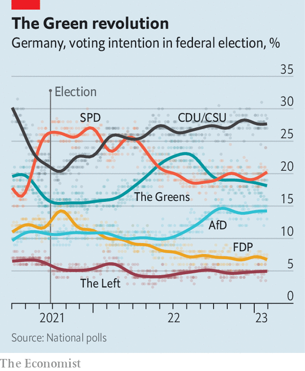

###### Germany’s Greens

# Pragmatism paints a paler shade of Green 

##### Climate climb-downs fail to damage Germany’s Greens 

 

> Jan 30th 2023 

Imagine being a  in a crisis-hit government. Which news image would you dread more: footage of monster mechanical claws tearing up lush fields to expand a coal mine, or of a riot squad dragging away Greta Thunberg, the impish, Swedish-born patron saint of climate-change activism?

Little more than a year into their stint in a three-party national government,  found both of these PR disasters spooling relentlessly across millions of televisions. The events took place in mid-January near the tiny hamlet of Lützerath in North Rhine-Westphalia. In what environmentalist groups had billed as a last stand, thousands of demonstrators braved freezing drizzle to protest against the expansion of an open-cast lignite mine, a city-sized gash of beige in a sea of green. After several days of muddy scuffles against a science-fiction backdrop of giant diggers, police bodily removed the last protesters, including Ms Thunberg.

The political blow to the Greens should have been huge. Spawned by sandal-clad anti-nuclear hotheads in the 1980s, the party now sits in power not just in Berlin but in ruling coalitions in 12 of Germany’s 16 states, including North Rhine-Westphalia. Elected to slash emissions and protect nature, the Greens have instead been forced, thanks to Russia’s invasion of Ukraine and disruption of energy flows to Germany, into embarrassing backdowns across a range of environmental issues. On their watch both nuclear and poison-spewing coal-fired power plants have enjoyed a new lease of life, fresh infrastructure for natural gas has been built, and ugly mines for especially dirty lignite or “brown coal”, such as the one at Lützerath, have grown. As one sodden protester at the doomed hamlet declared with a sneer, “The Greens? Green with mould and green with dollars is what they are.”

 


Yet in spite of accumulating bruises on their once-pristine environmental ideals, the Greens appear to be growing not weaker but stronger. Opinion polls show that in contrast to its two coalition partners, the bigger Social Democrats (SPD) and smaller Liberals (FDP), Germany’s Greens score higher now—garnering close to 20% of “voter intentions” in a national election—than the 15% they got when they were actually elected. Their two top figures in government, Robert Habeck, the vice-chancellor and economy minister, and Annalena Baerbock, the foreign minister (both pictured), have over the past year consistently ranked as Germany’s two most popular politicians, far out-charming Olaf Scholz, the dry-as-a-cracker chancellor.

More surprising, the Greens have gained converts not by responding to the Ukraine crisis with calls for peace and moderation. Both the party leadership and its supporters have instead gone beyond every other party, including the conservative Christian Democratic Union (CDU) of former chancellor Angela Merkel, in pushing for stronger action against Russia. To the occasional chagrin of the Spd, the Greens have argued strongly for Germany to help arm Ukraine, including with heavy weapons. After Mr Scholz’s recent, belated decision to supply German-made Leopard tanks, polls showed that more than three-quarters of Green party members backed the move. Among Germans overall, support was a more squeamish 54%. 

Not long ago few German Greens would have dreamed that protesters outside the chancellor’s office crying “Free the Leopards” were lobbying not for nature conservation but to send man-made killing machines into a war zone. Back in the 1990s, during the party’s first time in a national coalition, its most prominent politician, then-foreign minister Joschka Fischer, split the Greens into bitter factions by backing the dispatch of German troops to impose peace between Serbia and Kosovo. 

Omid Nouripour, the party’s current co-leader, says that while the debate between  and  persists, the dominant trend in the party is pragmatism. Many hardline environmentalists did leave the party 15 years ago, yet its overall membership has quadrupled. Mr Nouripour says that the party used to compete mainly with the left-leaning SPD. “But since Angela Merkel pulled the CDU towards the centre we can now fish in two ponds.” 

Mr Habeck, whose brief includes climate change as well as energy, embodies this pragmatic bent. Instead of shying away from touchy environmental issues he tends to confront them head on, armed with piles of facts and a quiet tone of sincerity. Asked about the Lützerath mine, he has patiently explained that under a deal worked out by his government, only half the lignite that its operator had planned to extract will ever be removed, with the deadline for its closure brought forward by eight years to 2030. Mr Habeck insisted in an interview with , a weekly magazine, that the reason is not an abandonment of climate goals, but a temporary response to a pressing energy crunch. “There are many good reasons to demonstrate for climate protection,” he said. “But Lützerath is simply the wrong symbol.”

Polls suggest that most Germans are, however, puzzled by something that Mr Habeck seems to think is the “right” symbol. Through much of last year, even as the cut-off of Russian energy supplies sent prices soaring and raised the spectre of industrial collapse, he insisted Germany should stick to a schedule set under Ms Merkel and close its only three remaining nuclear power plants by December. Mr Scholz had to intervene with a compromise, allowing the plants, which still produce 6% of Germany’s electricity, to keep running until April. Even many Greens may not see this as much of a victory. ■

