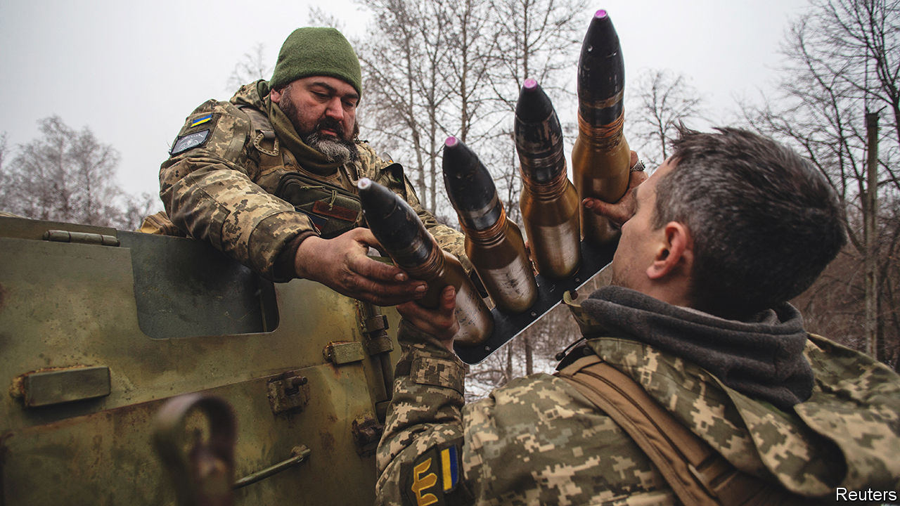
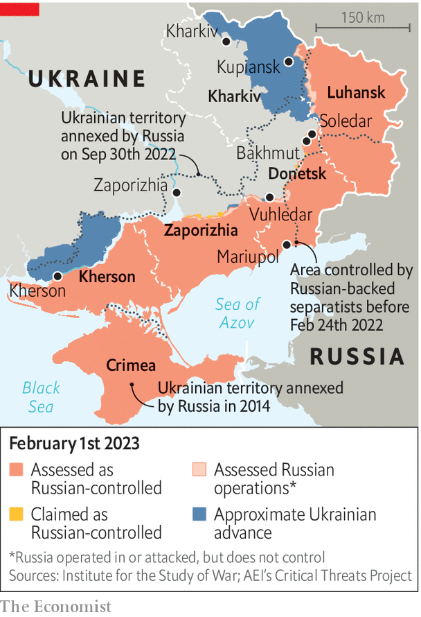

###### All steady on the eastern front

# Ukraine’s troops in the east are quietly confident 

##### They believe they can hold the Russians off 

 

> Feb 1st 2023 


Colonel “Maestro” is a commander in the Kupiansk sector in eastern Ukraine. He has been fighting the Russians since they first invaded, in 2014. His car has a dish for Elon Musk’s Starlink satellite-internet service, now ubiquitous along the front lines, attached to its roof. Thanks to his drone intelligence teams, he can watch what the enemy is doing on the other side of the line in real time, “24/7”. One night this week he monitored 30 Russian men being sent forward. Two of them were killed. When that happened the rest marched on regardless and did not bolt for cover. In the end nine of them died. “They either had no regard for their own lives,” he says, “or they were on drugs.”

On January 30th Jens Stoltenberg, NATO’s secretary-general, said “we see that they [the Russians] are preparing for more war, that they are mobilising more soldiers, more than 200,000, and potentially even more than that.” Mr Stoltenberg is not the only one to warn that a new offensive is in the offing. Ukrainian leaders, including President Volodymyr Zelensky, have said the same, and Russian artillery strikes have sharply stepped up in recent days. But most Ukrainian soldiers at the eastern front seem curiously unfazed. Colonel Maestro’s point is that the reinforcements will not be highly trained professionals. Far from it. Many are convicts who have joined the mercenary Wagner Group deployed in the fighting around the city of Bakhmut, because to do so is a way to get out of jail. Their motivation is low, unlike that of the men they are fighting. 

If yet more Russian recruits are to be thrown at them, says Oleksandr, a sniper serving under the colonel, that means that the smell of the decomposing bodies abandoned by their comrades will be “unbearable”. Meanwhile, Brigadier-General Sergiy Melnyk, who oversees a large part of the Kharkiv region, including its border with Russia, says drones and satellite imagery have not indicated any new build-up of troops there. In fact, he says, the Russians are digging trenches and building defensive positions as if it is they who are expecting an attack. 

Ukrainian commanders say that they believe the main Russian aim in trying to take Bakhmut is to present a success to the public at home, particularly for the Wagner Group. “It is in a valley,” says General Melnyk, so it will be hard, though not impossible, for the Russians to advance from there and to threaten the much bigger cities of Kramatorsk and Sloviansk, which would then become vulnerable to artillery. It is also possible that Ukrainian-held areas in the region could be encircled. From the Ukrainian perspective, General Melnyk says that the point of continuing to fight to retain the city, even at a high cost, is also symbolic. But beyond that, it plays an important role in tying down a large number of Russian troops. General Melnyk thinks that even if it is lost it could be recaptured later. But not all commanders think defending Bakhmut is worth it in terms of the heavy casualties. “If it was up to me I would pull out,” says another of them. 

The general hastens to add that there is no room for complacency. He is preparing in case the Russians do launch a fresh push, he says, just as his own forces are getting ready for their own counter-offensive to drive the Russians out of the Ukrainian territory they occupy. It is almost a year since the Russians began their full-scale invasion of the country, but the general says that since Ukrainian forces pushed the Russians out of almost all of the Kharkiv region in September, and Ukrainian forces recaptured Kherson in November, psychologically everything has changed for his men. “We lost our fear of them. We understood that we can fight back and beat them.” 

The roads leading to the eastern front are full of military traffic. Driving through the ruins of small towns, and past the incinerated remains of tanks and armoured cars, there is a stream of lorries transporting ammunition, cars packed with soldiers and transporters moving armoured vehicles. So much different equipment has arrived in the past few months that soldiers have a problem identifying what is what. As a large Turkish Kirpi armoured car drives past, a couple of soldiers reach for their phones to identify it. 

 


Morale remains high, and Ukraine’s soldiers are learning from experience. Sergeant Vasyl Dubovyi’s team have parked and concealed their car in a small wood giving onto frozen fields within earshot of the Bakhmut front. Before the invasion he was a business analyst. In the distance there is the sound of rocket and artillery fire. Until yesterday a German-made howitzer supplied by the Dutch stood here. Left behind are stacked casings from American-made shells. The team’s car has an Irish numberplate. It was bought for them by a Ukrainian volunteer group. 

Sergeant Dubovyi takes out a gadget. While his colleagues are assembling their drone, he uses his device to scan the airwaves to determine whether there is a Russian drone in the area, or electronic interference that could end in their drone being downed. Two laptops sit on the open tailgate of the car, next to flasks of coffee and pastries. Once the drone is airborne it begins transmitting video to the computers. The gear has become invaluable, says Colonel Maestro, and the software is infinitely superior to anything the Russians have. The nine soldiers his men killed a few hours earlier were spotted by one type of drone and picked off by another, which was directed from his command centre. 

The Ukrainians’ drone equipment is a combination of local and Western kit. Everyone here agrees that Ukrainian forces have only been able to hold their own due to their determination and Western arms. There may still be setbacks, such as the loss of the little town of Soledar last month, for which the Russians paid a high price in terms of soldiers killed. But for now Ukrainian commanders do not think the Russians have the capacity to launch a successful all-out offensive. 

Yet the Ukrainians say that although they have the weapons and the manpower to hold the Russians at bay, they don’t have enough of the former to launch their own full-scale counter-offensive. That will depend on the alignment of three factors. The weather, troops being ready (including those now abroad learning how to use new Western kit) and finally the delivery of tanks and other equipment promised by Western allies. “But”, asks Sergeant Dubovyi, “when will it arrive?” ■

