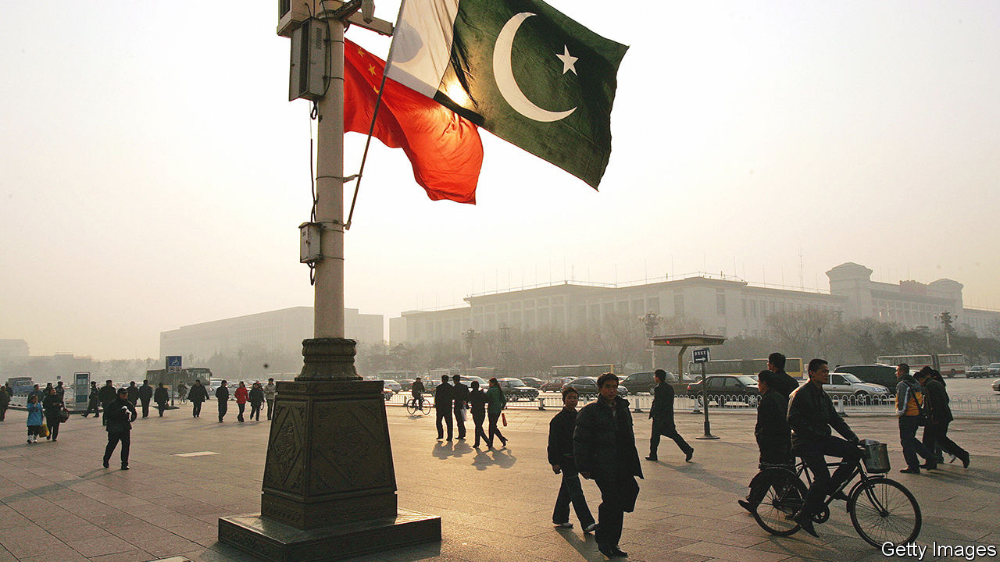

###### No relief in sight

# China is paralysing global debt-forgiveness efforts 

##### Restructurings have all but disappeared 

 

> Feb 2nd 2023 

Given that his country is on the brink, Mohammad Ishaq Dar, Pakistan’s economy minister, is strangely serene. In the week to January 20th, his government burned through a quarter of its dollar reserves, leaving $3.5bn to cover loan repayments and imports that will probably come to more than twice that in the first quarter of the year. Two days later ministers turned off the electricity grid to preserve fuel. Policymakers then abandoned a currency peg. The rupee plummeted, but Mr Ishaq Dar remained cool. Pakistan’s prosperity, he said, is in God’s hands. 

Divinity usually takes the form of the imf, provider of 21 bail-outs to Pakistan since 1960, or Western governments. But the global infrastructure for dealing with irresponsible and unlucky economies is in crisis. China’s lending, growing for two decades, has reached a critical mass. Western financiers are in a stand-off with a lender too big to ignore but too irascible to involve in restructuring. Countries that have borrowed from China, and been battered by covid-19 and rising interest rates, are stuck in turmoil—few so firmly as Pakistan. 

Before China’s lending spree, Western countries built a framework to restructure troubled debts. Starting in 1956, lenders banded together on the basis that all would reschedule repayments on the same terms. Eventually debt forgiveness became the priority. This worked for as long as troubled countries mostly owed to the West. Now, however, at least half of the 38 countries which the World Bank counts as being in or near default have China as their biggest state creditor. 

And China is refusing to play by the old rules. In an attempt to bring it into the fold, the g20 drew up a new set in 2020. Yet the “Common Framework” has turned out to be an empty agreement. In theory, signatories agree to accept similar restructuring terms. In reality, they have too little in common to get the process going.

Restructurings have all but disappeared since the pandemic. Four countries—Chad, Ethiopia, Ghana and Zambia—have asked for help under the framework. Only Chad has secured a deal, and it reschedules rather than cancels payments. Moreover, Chad’s debts were slight ($3bn) and China’s stake small ($264m, or 2% of Chad’s gdp). In 2017 the World Bank calculated that the average low-income country owed China an amount equivalent to 11% of gdp, a figure which will only have risen. 

China’s refusal to accept write-downs is the main issue. The reluctance has drawn ire from the likes of David Malpass, president of the World Bank, and Janet Yellen, America’s treasury secretary. Beijing’s various ministries are simply not set up for forgiveness. In order to write off a loan, civil servants in policy banks must first get permission from the State Council, the equivalent of China’s cabinet. If the borrowing country is not an ally, this is a risky manoeuvre. Being the face of a write down—in effect admitting that the bureaucracy made a mistake—is a professional stain that is hard to scrub. Rescheduling repayments leaves the mess for another day and someone else.

Another disagreement between China and the West reflects different perspectives. In the Common Framework’s terms only loans by states are other states’ business. Private creditors and international institutions get off more lightly, rarely being called upon to cancel a dollar. But China does not separate its political promises to develop the world’s poorest countries from the country’s commercial activities. One of the government’s two main policy banks, China Development Bank, lends to poor countries at market rates. China is adamant that this disqualifies its loans from being bound by rules meant for states. Western lenders insist the opposite. 

A final problem is that China would rather work alone. Co-operating with other lenders involves sharing information. This may be necessary occasionally when borrowers are in enough trouble to default on lots of loans at once. But wary of appearing too soft and encouraging more defaults, China prefers to do its negotiations in private. Since 2008 the Chinese state has restructured the finances of more countries (71) than all the members of the Paris Club of mostly Western countries put together (68), according to World Bank researchers, but it has done so on its own terms. Often it takes repayments in commodities, or their future proceeds. At other times borrowers hand over stakes in the infrastructure they have borrowed to build. Western creditors view the first as little better than extortion and do not have the option of the second, as most of their loans plug directly into borrowers’ budgets. 

Vested interest

So long as lenders are in a stand-off, the imf is hamstrung. The organisation relies on countries to agree to bring down debts before it can risk a bail-out. This means officials are confined to tiny handouts for desperate borrowers. The deal it hopes to sort in Pakistan is worth $1.1bn—a drop in the country’s $275bn debt ocean. 

For years, Pakistan’s friends, many of whom do not get along, have stumped up debt relief and emergency funding for their valuable geopolitical ally. As a result, Pakistan’s politicians have come to expect last-minute miracles. But this time around China has not offered help. After suggesting a package, Saudi Arabia has gone quiet. The imf cannot do all the work. Each party is tempted to leave the rescue to someone else. With many more countries on the brink of default, the stalemate could be a harbinger of doom for the rest of the world’s distressed economies. ■


