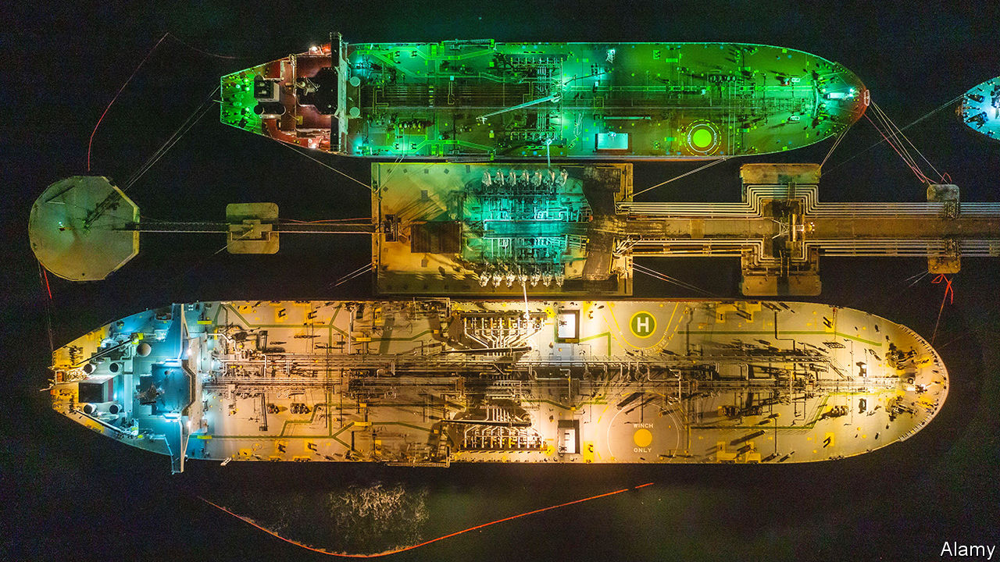
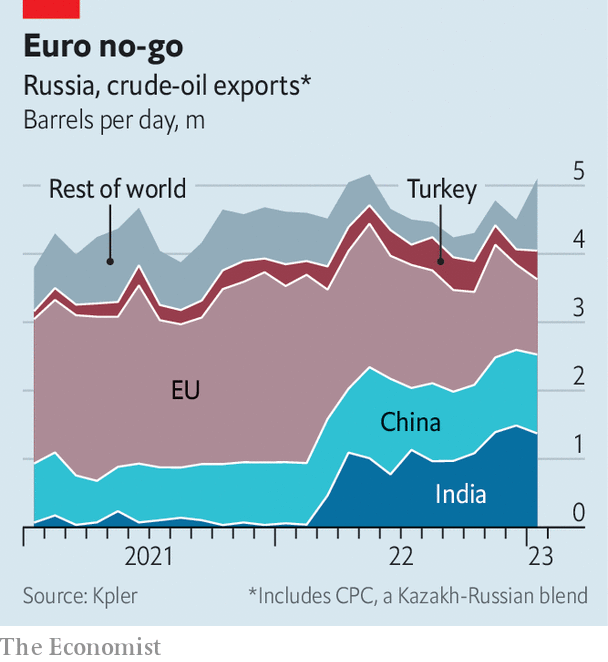
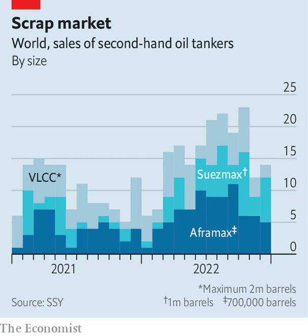
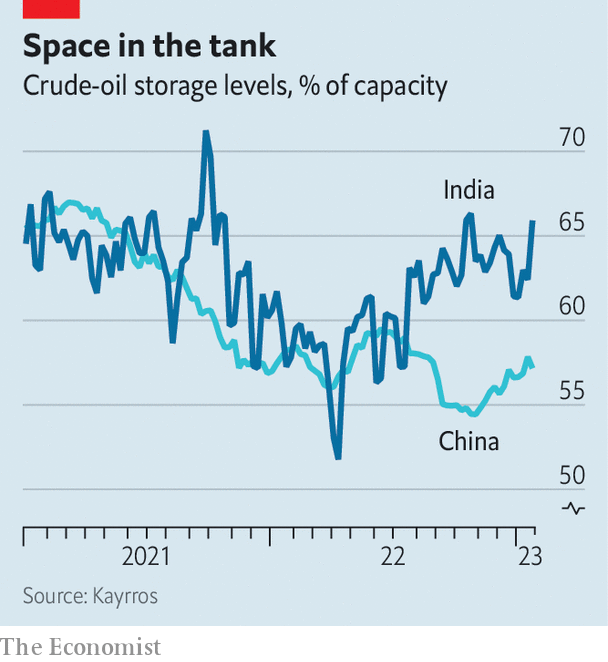

###### Ships in the night

# How Russia dodges oil sanctions on an industrial scale 

##### As another embargo looms, the grey trade is about to explode 

 

> Jan 29th 2023 


In the year since the war in Ukraine began, once-dominant Western firms have pulled back from trading, shipping and insuring Russian oil. In their place, mysterious newcomers have helped sell the country’s crude. They are based not in Geneva, but in Hong Kong or Dubai. Many have never dealt in the stuff before. The  is becoming more dispersed, divided—and dangerous.

Russia’s need for this alternative supply chain, present since the war started, became more pressing after December 5th, when a package of  came into effect. The measures ban European imports of seaborne crude, and allow Russian ships to make use of the West’s logistics and insurance firms only if their cargo is priced below $60 a barrel. More sanctions on diesel and other refined products will come into force on February 5th, making the new back channels more vital still.

 has spoken to a range of intermediaries in the oil market, and studied evidence from across the supply chain, to assess the effect of the sanctions and get a sense of what will happen next. We find, to the West’s chagrin and , that the new “shadow” shipping and financing infrastructure is robust and extensive. Rather than fade away, the grey market stands ready to expand when the next set of sanctions is enforced. 

Russia’s exports, which last year counted for more than 10% of globally traded volumes, took a hit after Europe’s salvo in December. Two months on, though, they have recovered to levels last seen in June. The volume of oil on water, which climbs when the market jams up, is back to normal. As expected, China and India are picking up most of the embargoed barrels. Yet there is a surprise: the volume of cargo with unknown destinations has jumped. Russian oil, once easy to track, is now being moved through more shadowy channels.

Some trade still uses the same Greek shippers, British insurers, and Dutch and Japanese banks that have long ruled the industry. This channel survives thanks to the  enforced by the West in December. That month, as European firms paused to consider the paperwork involved, the share of western Russian crude handled by them collapsed, from 60% to 13%. The legal trudge now done, the share has recovered to 36%. But it seems likely to drop off again. On January 1st the world’s biggest reinsurers, which insure insurers, decided to no longer cover shipping from Russian ports. Western insurers must now either exit the business or pass on the extra costs resulting from the increased risk.

 


At the other end of the spectrum lies the “black” trade, tried and tested by producers such as Iran and Venezuela. Battered tankers as much as half a century old sail to clandestine customers with their transponders off. They are renamed and repainted, sometimes several times a journey. They often transit via busy terminals where their crude is blended with others, making it harder to detect. Recently, several huge tankers formerly anchored in the Gulf were spotted taking cargo from smaller Russian ships off Gibraltar. Oman and the United Arab Emirates (uae), which imported more Russian oil in the first ten months of 2022 than in the previous three years combined, seem to have blended and re-sold some to Europe. Malaysia is exporting twice as much crude to China as it can produce. Much of it is probably Iranian, but ship-watchers suspect a few Russian barrels have snuck in, too. 

As Russian firms can still sell oil legally to much of the world, this channel seems unnecessarily tedious. The share of exports flowing through it, though rising, is small. Instead, most of Russia’s crude runs through grey networks which do not recognise the price cap but are not illegal, because they use non-Western logistics and deliver to countries that are not part of the blockade. These opaque, dispersed operations rely on three main pillars: a novel cast of traders, a vast and growing tanker fleet, and new sources of finance. 

Shifty shades of grey

Russia’s crude used to be sold overseas by the trading arms of Russian producers, those of Western oil majors and Swiss commodity merchants. These were mostly based in Geneva. But many of the former seem to have moved to friendlier locations. Robin Mills of Qamar Energy, a consultancy, reckons that more than 30 Russian trading outfits have set up shop in Dubai—some under new names—since the war started. As Western traders have withdrawn, newcomers have emerged to sell to India, Sri Lanka, Turkey and others. Most have no history of trading Russian oil, or indeed any oil; insiders suspect the majority to be fronts for Russian state firms. 

It is this curious group which orchestrates the sprawling grey fleet. Since the eu first considered sanctions on logistics, the second-hand tanker market has exploded. Last year nearly 200 crude-carrying vessels changed hands, some 55% more than in 2021, according to ssy, a shipbroker. Most were “Aframax” and “Suezmax” tankers: with a maximum capacity of 1m barrels, these are the only ships small enough to dock at Russian ports. Demand for Aframaxes has been so strong that a few recently sold for $35m—the average price China paid last year to buy much larger vlccs, which can carry up to 2m barrels. 

The fleet Russia can use to dodge the price cap now counts 360-odd ships, equivalent to 16% of the global crude tanker inventory. Were all Western ships to shun Russian crude barrels, the shadow fleet would be sufficient to keep Russia’s crude exports flowing at current levels, says Reid l’Anson of Kpler, a data firm. But many of the ships are more than two decades old, and they are undertaking very long journeys. Whereas crude takes less than a week to travel from the Black Sea to Europe, it takes 45 days to reach China. 

As business has boomed, the new middlemen have had to find financiers to bankroll and insure their operations. The ability to hold millions of barrels without putting up capital, by drawing on near-unlimited lines of credit from the world’s biggest banks, has long been a crucial element of oil trading. In the case of Russian oil, which Western banks now shun, it is no longer possible. Instead, the shadow trade appears to be fuelled by credit from the Russian state, with the middlemen only paying for the cargo once they have collected the proceeds. Increasingly, banks in the Gulf are signing cheques too. Locals think they decided to step in when adnoc, the uae’s state-owned energy giant, started receiving Russian crude in November. 

 


Securing insurance has been trickier. Oil shippers do not just need to protect their cargo and vessels. Port authorities controlling passages such as the Bosporus strait also require protection and indemnity (p&amp;i) insurance for the cost of harm ships may cause to people, property or nature. The liabilities from an oil spill can be so big that 90% of global p&amp;i coverage is provided by clubs of shipowners, mostly in London, which pool premiums. Outside the West, no private market has the muscle to extend similar safety-nets, says Ulrich Kadow of Allianz, a German insurer. 

Yet here, too, solutions have been found. Since December, Russian firms, often new to the shipping business, appear to have stepped in to provide cargo and vessel insurance. Some p&amp;i coverage, of equally questionable quality, is probably being offered by the Russian state. Insurance experts suspect some ports serving countries gorging on Russian crude—notably India—have lowered the level of coverage they require incoming tankers to have. 

The grey trade has room to grow.  can buy more Russian crude: their tanks remain less than two-thirds full, according to Kayrros, a data firm, suggesting most of their purchases are being refined and resold—some to Europe—not stashed. On January 3rd China raised its refined-oil export quotas by nearly 50% compared with a year ago, notes Giovanni Serio of Vitol, a trading firm, perhaps as a prelude to buying more crude from Russia and selling the refined products abroad. 

Incentives to follow the price cap may also weaken. In December Vladimir Putin issued a decree banning sales to parties that stick to the rule. The statement’s language is weak, opening the door to exemptions; many think it will not be strictly enforced. But the ruling, which came into effect on February 1st, could still cause a few buyers to change their minds. 

Tanker, sailor, soldier, spy

Price rises would alter the picture more drastically. Today Brent, the international crude benchmark, trades at $83 a barrel, down from an average of $100 last year. Russia’s weak negotiating hand and high freight costs mean that its “Urals” grade crude was being discounted even before the price cap. As a result, a barrel of Urals, which flows from Russia’s west and makes up most of its exports, sells for below the price cap of $60. This tepid market makes life easier for anyone who wishes to abide by the rules. Yet many analysts think a bounceback in Chinese demand, coupled with weak investment in new oil supply, could propel Brent back to $100 in the second half of 2023. In such a scenario, the Urals price would jump, too. Some buyers would probably turn to the shadow trade rather than face compliance headaches. 

 


The next round of sanctions, on refined products, will also give a significant boost to the grey trade. In December Europe bought 1m barrels per day of diesel and other clean distillates, equivalent to 55% of Russia’s exports. Now Russia will have to find new buyers. China and India have little demand for refined products, and the global market is fragmented. Therefore Russia’s best bets may be the smaller markets of Brazil and Mexico, which will see their supplies dwindle as America exports more to Europe. Yet the fleet for carrying such products is small and the long journeys will worsen the shortage. All this suggests Russia will be unable to sell much of its refined oil, and will instead try to push as much crude as it can to the grey market. 

For Russia, growth in the grey trade has advantages. It puts more of its export machine outside the control of Western intermediaries. And it makes pricing less transparent. Western estimates of Urals prices, based on few actual trades, are struggling to track costs. Indian customs data from November—the latest available—show the country bought oil at much lower discounts than those reported at the time, notes Sergey Vakulenko, a former Russian oil executive now at the Carnegie Endowment, a think-tank. Grey-market intermediaries, which capture costs such as freight, offer a conduit for funnelling money to offshore company accounts that the Kremlin can probably influence.

Meanwhile, Russia’s sanctions-dodging will have nasty side-effects for the rest of the world. One will be to further split the oil trade along sharp geopolitical lines. In December several Western majors, including ExxonMobil and Shell, said they would no longer hire tankers that have carried Russian oil, forcing owners to take sides. The other will be to make oil trading a riskier business. A growing portion of the world’s petroleum is being ferried by firms with no reputation, on ageing ships that make longer and dicier journeys than they have ever done before. Were they to cause an accident, the insurers may be unwilling or unable to cover the damage. Ukraine’s allies have good reasons for wanting to wash their hands of Russian oil. But that will not prevent debris from nearby wreckages floating to their shores. ■


