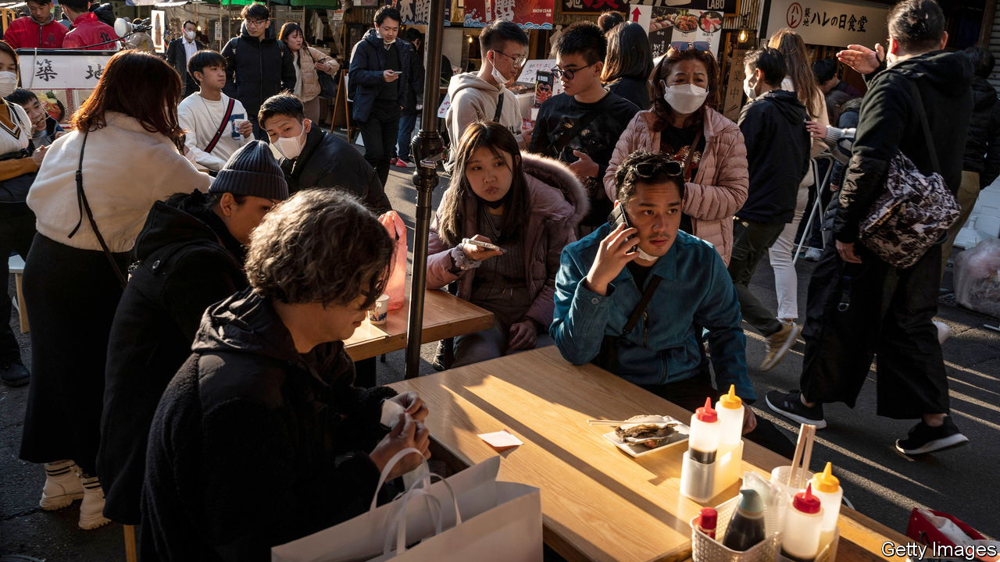

###### A nightmare job

# Is there a fix for Japan’s markets mess? 

##### Finding one is the unenviable task of the next central-bank governor 

 

> Jan 31st 2023 

Kuroda Haruhiko entered the Bank of Japan (boj) with a bang. Upon becoming governor in 2013, the former finance-ministry official fired a “bazooka” of easy money in an attempt to end decades of stagnation. The boj committed itself to buying vast amounts of assets and introduced negative interest rates in pursuit of a 2% inflation target. In tandem with the prime minister, Abe Shinzo, Mr Kuroda ushered in a new era of economic policy. 

Mr Kuroda’s term is ending , too. Consumer-price inflation has been above the boj’s target for nine months; it hit 4% in December, the highest level in 41 years. Officials have remained on the offensive—but the bank’s policy of “yield-curve control”, a cap on ten-year government-bond yields, is facing the fiercest counter-attacks since it was introduced in 2016. Mr Kuroda’s successor, set to be announced in early February, must decide the future of the policy and maybe even oversee rate raises. This will require deft communication, impeccable timing and lots of luck. Missteps could see Japan’s economy grind to a halt and a return to deflation. They could also roil global markets. 

The first question for the new governor will be when to holster the bazooka. The boj’s  in December to widen the trading band around ten-year bond yields, to allow more trading and improve the market’s functioning, was seen as the start of the process. Predictably, speculators tested the target, forcing the boj to defend the cap. Since December 20th the bank has bought bonds worth a record ¥31.5trn ($243bn), taking its total holdings to ¥563trn, equivalent to more than 100% of gdp. At its meeting in January, the bank stood firm, but the fight is far from over. In a report on January 26th, the imf urged more flexibility around the trading band. 

Mr Kuroda is said to have returned from the World Economic Forum in Davos more confident than ever in the bank’s doveish approach. The boj notes that higher import costs, in particular for energy and food, have driven Japan’s inflation. These pressures may soon ease: energy subsidies will bring costs down; signs that global energy prices may have peaked and American inflation seems to have moderated give reason for caution. Most important, wage growth has failed to keep pace with price growth: real wages have declined for eight straight months. The bank reckons inflation will come down to 1.6% for the fiscal year beginning in April 2023 and will hit only 1.8% the following year. 

Even a hawkish successor may wait until after this year’s  (annual wage negotiations) before changing course. Japanese firms have long been reluctant to raise pay. But in the face of protracted inflation, leaders have begun to change their tune. Keidanren, Japan’s business federation, has urged members to give consideration to rising prices. Some multinationals and big regional firms promise hefty pay increases. Fast Retailing, parent company of Uniqlo, a clothing giant, announced raises as high as 40%; Higo Bank, a lender in Japan’s south, plans to lift base salaries by 3%, the first such rise in 28 years. The question is whether the smaller firms that employ 70% of Japanese workers will follow suit. In any case, boj officials reckon the costs of inflation overshooting are less than those of missing a historic chance to change Japan’s inflation mindset.

The problem is that the costs of maintaining the current approach will only grow. The boj now owns 100% of some bond issuances, leaving traders facing shortages. Against expectations, the bank has found itself purchasing more bonds than before yield-curve control was introduced. Buying them at their current high prices means that the boj will probably make big losses on its portfolio, especially if it has to sell the bonds or raise short-term interest rates. Officials would like to exit yield-curve control gradually. That could mean expanding the band again, raising the ten-year target or shifting to targeting bonds of shorter maturities. In practice, this will be difficult. As the experience of exchange-rate pegs suggests, policy regimes can shift rapidly. 

The boj also risks falling behind the inflation curve and having to tighten quickly. Any normalisation, much less a speedy one, will raise questions about Japan’s fiscal health. Some economists see  under Liz Truss as a cautionary tale, highlighting the importance of maintaining confidence in the government’s bona fides. They worry about unknown unknowns in the financial system. Even so, the Japanese government has announced plans to double military and child-care spending, without presenting a credible plan for financing these increases. 

Who will inherit the mess at the boj? Three current or former deputy governors top most lists. Amamiya Masayoshi, right-hand man to Mr Kuroda, has overseen the bank’s monetary policy for years. A classical pianist, Mr Amamiya would bring knowledge of the boj’s sheet music. Nakaso Hiroshi, who served as deputy during the first half of Mr Kuroda’s term, is a financial-markets expert. He helped fire Mr Kuroda’s bazooka, but left thinking that monetary policy is no panacea, and that more structural reform is needed to raise Japan’s growth rate. Yamaguchi Hirohide, who held the job under Mr Kuroda’s predecessor, has been a fierce critic of ultra-loose policies. All three are seen as more hawkish than Mr Kuroda, but whereas Mr Amamiya and Mr Nakaso would represent a difference of degree, Mr Yamaguchi would be a difference of kind, signalling a cleaner break with the current regime. 

The choice falls to Kishida Fumio, Japan’s prime minister. His approval ratings have fallen recently, leaving him in a weaker position within the ruling Liberal Democratic Party. Nominating a figure hostile to “Abenomics”, such as Mr Yamaguchi, would infuriate the powerful faction that Abe led. Whoever is chosen, though, faces a minefield. No candidate has led a central bank, let alone through a situation like that facing the boj. Tightening too much, too soon or waiting too long to act would be missteps with grave consequences. Perhaps that is why all three are said to have shown reluctance. As a government economic adviser whispers: “One job I would not want is the next boj governor.” ■


