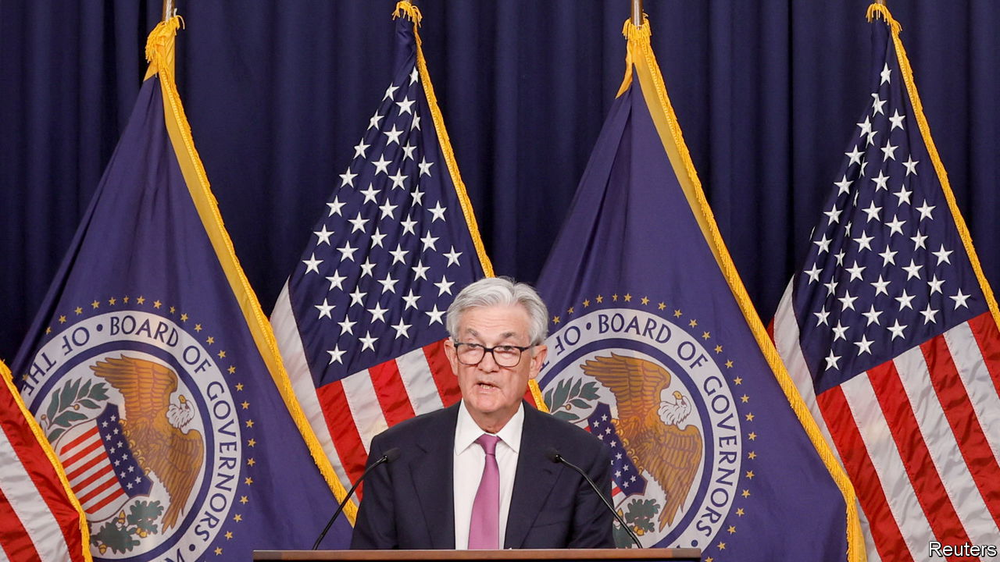
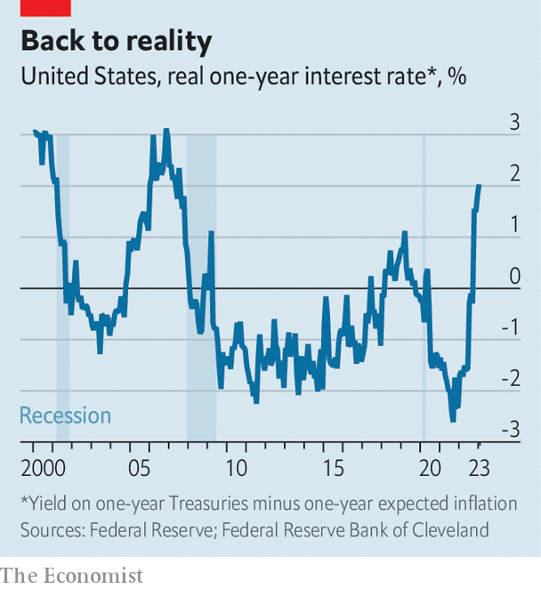

###### A spike in the tail

# Rallying markets suffer from a doveish illusion 

##### Even as the Fed relaxes, real rates rise 

 

> Feb 1st 2023 

The “money illusion” ranks among the more lyrical-sounding concepts in economics. It refers to the mistake that people make when they focus on nominal rather than real values. Anyone chuffed to get a hefty pay rise over the past year without considering whether, after inflation, they can actually buy more has fallen prey to the illusion. Financial investors ought to be savvier, but they too can be seduced by a lovely nominal story. The Federal Reserve’s downshift to smaller interest-rate rises is a case in point. It may look like a step away from hawkish monetary policy; in real terms, though, the central bank’s stance is tighter than it first appears.

On February 1st the Fed raised rates by a quarter of a percentage point, taking short-term borrowing rates to a ceiling of 4.75%, as widely expected. This was half the size of its last increase, a half-point in December, which in turn was down from its previous string of three-quarter-point increases. The immediate question for investors is when the Fed will call it quits altogether. A narrow majority see the central bank raising interest rates by another quarter point next month and then stopping, as evidence mounts of cooling inflation. Even those more concerned by high inflation are pricing in, at most, an extra half-point of rate increases before the Fed stops. This is the light at the end of the monetary-tightening tunnel that has helped to fuel a stockmarket rally in recent weeks.

Yet what ultimately matters for the companies and households that need to borrow money is the real, not the nominal, rate of interest. Here, the outlook is a little more complicated—and almost certainly less rosy. Conventionally, many observers simply subtract inflation from interest to obtain the real rate. For example, with annual consumer-price inflation of 6.5% in December and the federal funds rate that month at a ceiling of 4.5%, the calculation would imply a real interest rate of -2%, which would still be highly stimulative.

 


This, however, reflects a basic mistake. Since interest is a forward-looking variable (ie, how much will be owed at some future date), the relevant comparison with inflation is also forward-looking (ie, how much will prices change by that same future date). Of course, no one can perfectly predict how the economy will evolve, but there are comprehensive gauges of inflation expectations that draw on both bond pricing and survey data. Subtracting one such gauge—the Cleveland Fed’s one-year expected inflation rate—from Treasury yields produces a much steeper trajectory for rates. In real terms they have soared to 2%, the highest since 2007 (see chart).

Even after the Fed stops raising nominal rates, real rates will probably go on increasing for some time. Before covid-19 one-year expected inflation was about 1.7%. Now it is 2.7%. If inflation expectations recede towards their pre-pandemic levels, real interest rates would rise by as much as one additional percentage point—reaching a height that has always preceded a recession over the past couple of decades.

None of this is preordained. If inflation proves to be persistent this year, expectations for future inflation may rise, which would lead to a reduction in real rates. The Fed could end up cutting nominal rates sooner than it has forecast, as many investors predict. Some economists also believe that the natural, or non-inflationary, level of interest rates may have risen since the pandemic, implying that the economy can sustain higher real rates without suffering a recession. Whatever the case, one conclusion is clear. It is always better to stay grounded in reality. ■


