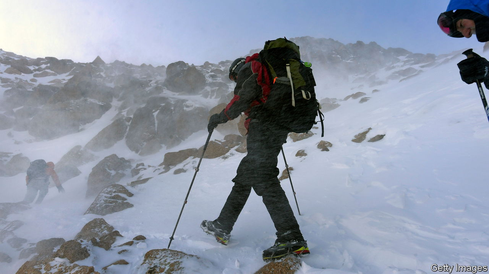
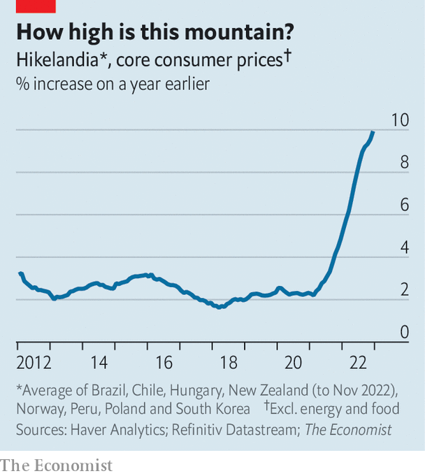

###### The grip tightens

# Super-tight policy is still struggling to control inflation 

##### A return to Hikelandia, where price growth just won’t cool 

 

> Feb 2nd 2023 

In october we examined the fortunes of Hikelandia. In this group of eight countries—Brazil, Chile, Hungary, New Zealand, Norway, Peru, Poland and South Korea—central banks have thrown the kitchen sink at inflation. They started raising interest rates well before America’s Federal Reserve and on average have done so more forcefully, too. Yet we found little evidence that their determination was being rewarded with lower inflation. Hikelandia’s experience raised questions about how quickly monetary policy can control prices. Policymakers at the Fed have been watching closely.

The latest data offer little reason for optimism. Hikelandia’s inflation problems are still worsening. “Core” inflation excludes volatile components such as energy and food, and is thus a better measure of underlying pressure. In December this hit a new high of nearly 10% year on year (see chart). Higher borrowing costs are not yet crushing Hikelandia’s inflation, but they are crushing its economy. Output is shrinking at an annualised rate of about 1%, down from growth of 5% early last year.

 


In some parts of Hikelandia central bankers are having more luck. Core inflation in Brazil is now clearly falling. There are signs of a turnaround in South Korea. Yet elsewhere there is less progress. In Chile average wages are growing by about 10% a year, far too fast when productivity growth remains weak. In Hungary prices are surging. Annual core inflation rose from 19% in August to 25% in December. We estimate that the prices of more than one-fifth of Hikelandia’s inflation basket are rising, year on year, by a remarkable 15% or more.

When will prices in Hikelandia return to earth? Recent data suggest that it is unlikely inflation will move far into double figures. Yet the longer high inflation lasts, the more Hikelandia’s citizens will come to expect it. Just ask Hungarians, many of whom are obsessing about the cost of living. They now search on Google for “inflation” as much as they do for “Viktor Orban”. ■


