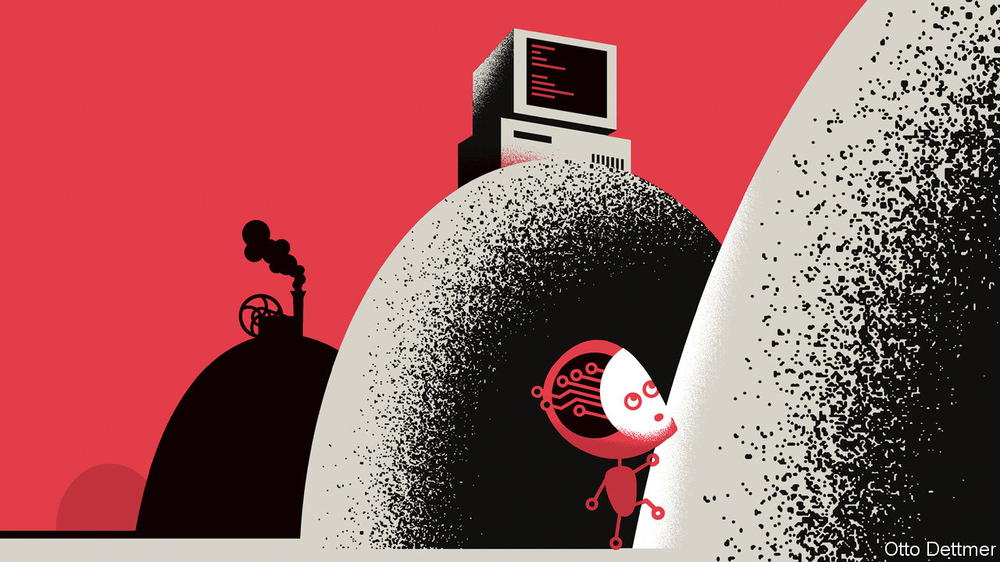

###### Free exchange

# The AI boom: lessons from history 

##### How powerful new technologies transform economies 

 

> Feb 2nd 2023 

It can take a little imagination to see how some innovations might change an economy. Not so with the latest . It is easy—from a writer’s perspective, uncomfortably so—to think of contexts in which something like Chatgpt, a clever chatbot which has taken the web by storm since its release in November, could either dramatically boost a human worker’s productivity or replace them outright. The gpt in its name stands for “generative pre-trained transformer”, which is a particular kind of language model. It might well stand for general-purpose technology: an earth-shaking sort of innovation which stands to boost productivity across a wide-range of industries and occupations, in the manner of steam engines, electricity and computing. The economic revolutions powered by those earlier gpts can give us some idea how powerful ai might transform economies in the years ahead.

In a paper published in 1995, Timothy Bresnahan of Stanford University and Manuel Trajtenberg of Tel Aviv University set out what they saw as the characteristics of a general-purpose technology. It must be used in many industries, have an inherent potential for continued improvement and give rise to “innovational complementarities”—that is, induce knock-on innovation in the industries which use it. ai is being adopted widely, seems to get better  and is being deployed in ever more r&amp;d contexts. So when does the economic revolution begin?

The first lesson from history is that even the most powerful new tech takes time to change an economy. James Watt patented his steam engine in 1769, but steam power did not overtake water as a source of industrial horsepower until the 1830s in Britain and 1860s in America. In Britain the contribution of steam to productivity growth peaked post-1850, nearly a century after Watt’s patent, according to Nicholas Crafts of the University of Sussex. In the case of electrification, the key technical advances had all been accomplished before 1880, but American productivity growth actually slowed from 1888 to 1907. Nearly three decades after the first silicon integrated circuits Robert Solow, a Nobel-prizewinning economist, was still observing that the computer age could be seen everywhere but in the productivity statistics. It was not until the mid-1990s that a computer-powered productivity boom eventually emerged in America. 

The gap between innovation and economic impact is in part because of fine-tuning. Early steam engines were wildly inefficient and consumed prohibitively expensive piles of coal. Similarly, the stunning performance of recent ai tools represents a big improvement over those which sparked a boomlet of ai enthusiasm roughly a decade ago. (Siri, Apple’s virtual assistant, was released in 2011, for example.) Capital constraints can also slow deployment. Robert Allen of New York University Abu Dhabi argues that the languid rise in productivity growth in industrialising Britain reflected a lack of capital to build plants and machines, which was gradually overcome as capitalists reinvested their fat profits. 

More recent work emphasises the time required to accumulate what is known as intangible capital, or the basic know-how needed to make effective use of new tech. Indeed, Erik Brynjolfsson of Stanford University, Daniel Rock of the Massachusetts Institute of Technology and Chad Syverson of the University of Chicago suggest a disruptive new technology may be associated with a “productivity J-curve”. Measured productivity growth may actually decline in the years or decades after a new technology appears, as firms and workers divert time and resources to studying the tech and designing business processes around it. Only later as these investments bear fruit does the J surge upward. The authors reckon that ai-related investments in intangible capital may already be depressing productivity growth, albeit not yet by very much. 

Of course for many people, questions about the effects of ai on growth take a back seat to concerns about consequences for workers. Here, history’s messages are mixed. There is good news: despite epochal technological and economic change, fears of mass technological unemployment have never before been realised. Tech can and does take a toll on individual occupations, however, in ways that can prove socially disruptive. Early in the Industrial Revolution, mechanisation dramatically increased demand for relatively unskilled workers, but crushed the earnings of craftsmen who had done much of the work before, which is why some chose to join machine-smashing Luddite movements. And in the 1980s and 1990s, automation of routine work on factory floors and in offices displaced many workers of modest means, while boosting employment for both high- and low-skilled workers. 

Gee, Pretty Terrific

ai might well augment the productivity of workers of all different skill levels, even writers. Yet what that means for an occupation as a whole depends on whether improved productivity and lower costs lead to a big jump in demand or only a minor one. When the assembly line—a process innovation with gpt-like characteristics—allowed Henry Ford to cut the cost of making cars, demand surged and workers benefited. If ai boosts productivity and lowers costs in medicine, for example, that might lead to much higher demand for medical services and professionals. 

There is a chance that powerful ai will break the historic mould. A technology capable of handling almost any task the typical person can do would bring humanity into uncharted economic territory. Yet even in such a scenario, the past holds some lessons. The sustained economic growth which accompanied the steam revolution, and the further acceleration which came along with electrification and other later innovations, were themselves unprecedented. They prompted a tremendous scramble to invent new ideas and institutions, to make sure that radical economic change translated into broad-based prosperity rather than chaos. It may soon be time to scramble once again. ■


