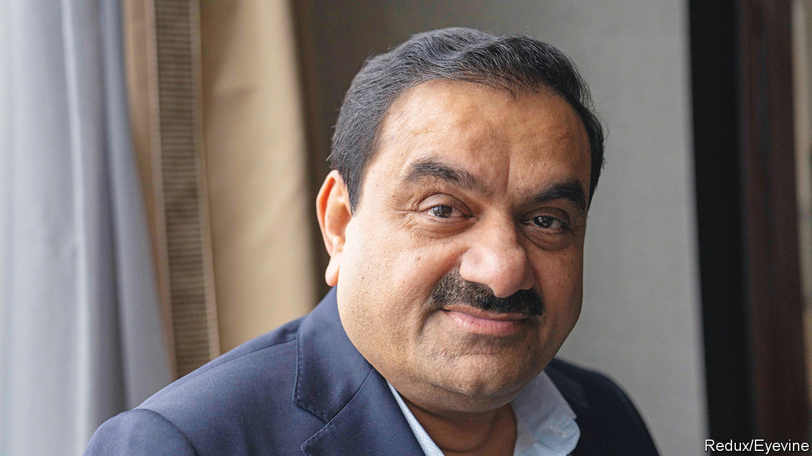

###### Adani v Hindenburg

# Nagging questions over the Adani empire won’t go away 

##### A short-seller’s report raises uncomfortable questions for India’s policymakers, too 

 

> Jan 31st 2023 

On the surface it was a huge mismatch—David versus an army of Goliaths. Yet in a matter of days a  by Hindenburg Research, a fledgling short-selling firm, resulted in a fall of over $50bn in the wealth of , hitherto one of the world’s richest men and a close associate of Narendra Modi, India’s prime minister. Along the way, a $2.5bn share offering by Adani Enterprises, flagship of the Adani Group’s listed companies, was . Hindenburg alleged that Adani is a giant con. Adani countered that the charges are baseless and, moreover, count as an attack on India itself. 

Mr Adani is a big target. His empire has expanded rapidly in recent years, and now includes everything from ports to power plants. Its share offer initially closed on January 31st with enough interest to seem a success, underpinned by anchor investors including International Holding Company, a firm based in Abu Dhabi. But after a sustained rout in share prices, Adani suddenly cancelled the sale on February 1st, saying it would be morally wrong to impose losses on its sponsors. Global investors are now left with nagging questions about the finances of one of India’s biggest firms.

The allegations are startling. Hindenburg claims that offshore shareholding entities based in Mauritius and elsewhere are not independent investors but fronts for the Adani family. These entities, it alleged, accounted for much of the trading in the group’s shares and pumped up the prices of Adani’s listed companies to stratospheric levels. The short-seller further claims that Adani uses offshore vehicles to hide losses and to launder money through the listed companies.

In a 413-page document released on January 29th, the Adani Group rebutted these charges, arguing they had already been thrown out by India’s courts and regulators. Adani has also threatened legal action (bring it on, said Hindenburg). Yet its defence has failed to instil confidence. The share prices of Adani firms have kept falling—around $100bn has been wiped off the group’s market value. Some global banks are reportedly refusing to take Adani bonds as collateral for their private-wealth clients. 

Verifying the more startling charges in Hindenburg’s report is no straightforward matter, and Adani’s denials have been forceful. The allegations may ultimately be settled by legal action outside India. What seems clear is that Adani shares are closely held and thinly traded; that the group’s acquisition spree was fuelled by borrowing; and that the explosion in share prices was at odds with the capital-heavy, utility-like businesses it owns—where investors cannot expect explosive profits.

The drama of recent days also reveals the risk of relying too much on tycoons to propel investment. For many in India, including the Modi government, firms such as Adani are crucial vehicles for building much-needed roads, railways, airports and green power plants. Yet such a model ties the fate of India’s infrastructure to the integrity of its tycoons. Adani alone now accounts for 7% of the capital spending of India’s 500 largest listed companies. If the group makes good on its plans over coming years, that share will rise. 

All the more reason, then, to clear the air around the firm. India needs to mobilise domestic savings to invest in its future. It will also continue to rely on foreign capital and expertise to finance its development. So it is important that the country’s capital markets are above board and seen to be so. A good place to start would be for the Securities and Exchange Board of India, the markets regulator, to declare the status of any ongoing probes into the Adani Group. 

India has an exciting growth story. It has a young population, a vast and increasingly integrated single market, and a thriving business culture. But were people to lose faith in the finances of the country’s largest firms or the oversight of its institutions, the shine would quickly come off. ■

