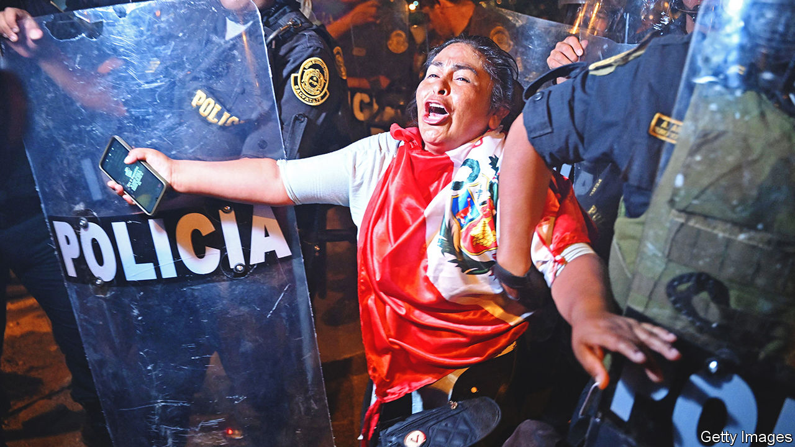

###### Latin American democracy

# Peru needs an early election and outside support, not interference 

##### A self-serving Congress and some neighbouring countries are fanning the flames 

 

> Feb 2nd 2023 

IT BEGAN ON December 7th when Pedro Castillo, then the president of Peru, abruptly announced on television that he was ordering the dissolution of Congress, dominated by his opponents, and a takeover of the judiciary, which was investigating him for corruption. For Peruvians the announcement brought bad memories. In 1992 another president, Alberto Fujimori, carried out a similar “self-coup” against Peru’s democratic institutions, sending the army to do the job. Mr Castillo had no such support and he was swiftly arrested. Congress impeached him for breaking the constitution and appointed Dina Boluarte, his elected vice-president, in his stead.

Two months of  have followed in which dozens have died, many seemingly killed by the security forces. Protesters have blocked scores of roads, especially in the Andes. They have launched violent attacks on five airports. Numerous courthouses, prosecutors’ offices and police stations have been vandalised. The economic damage will take years to repair. The protesters’ main aims are to force Ms Boluarte to resign, to close the hated Congress, and to secure a referendum on calling a Constituent Assembly that will write a new constitution. Making things worse is that several foreign governments, notably those of Mexico, Colombia and Bolivia, support the insurrection against what they claim, speciously, was a “coup” against Mr Castillo.

What explains all this fury? Mr Castillo, a rural schoolteacher and trade union leader of indigenous descent and no political experience, was narrowly elected in 2021 at the head of a far-left coalition. He misgoverned woefully. But a third of the country, mainly in the highlands, sympathises with him and his claim that the right and the Congress prevented him from governing. Many more abhor the Congress, whose members seem more interested in looking after themselves than in legislating for the general good. They blame Ms Boluarte for betraying the election result by allying with the right, though she had little choice.

However, the protests are fuelled by more than spontaneous popular anger. Far-left groups, illegal miners and drug traffickers are orchestrating them so as to force through the Constituent Assembly. It is a familiar tactic and a lamentable one: Hugo Chávez in Venezuela and other populist leftists in Latin America have used such assemblies to win themselves absolute power. 

The obvious way to calm the country would be to call a fresh general election. In December Congress approved a plan for one in April 2024, two years early. The idea was to give time for political reforms. Now many, including Ms Boluarte, say the election should happen in the second half of this year. Congress is reconsidering, but approval is far from assured. Disgracefully, some on the right are stalling to hang on to their lavish salaries, and the far left’s support for an election is contingent on securing a Constituent Assembly. That would be a big, perhaps irrevocable, mistake. No settled majority backs it. The constitution does need reform, but its pro-market economic chapter, which the left wants to overturn, has underpinned Peru’s rapid growth and poverty-reduction.

Two other steps are needed. The government should announce a swift and independent inquiry into protesters’ deaths. And the police should arrest, and courts imprison, the ringleaders behind the violence. Blocking highways and seizing airports are not a democratic right. In time, Peru will need better-trained and -equipped police who can control crowds by non-lethal methods, especially in the provinces. 

Many factors lie behind Peru’s chronic political instability. A ban on the re-election of legislators, regional governors and mayors undermines accountability and the chance of a political career. It should go. Peruvian society is more polarised today than it has been since at least the 1980s. Bridges need to be built. 

Peru deserves help from its neighbours, but they have meddled instead. The populist leaders of Mexico and the others support a coup against democracy when it is by one of their own. They reject the political pluralism that legislatures embody, because their implicit belief is that only the president has real democratic legitimacy. Brazil recently suffered an attempted coup by the far-right supporters of Jair Bolsonaro, the defeated former president. Peru is suffering one from the far left. In Latin America the enemies of democracy lurk at both extremes. ■

