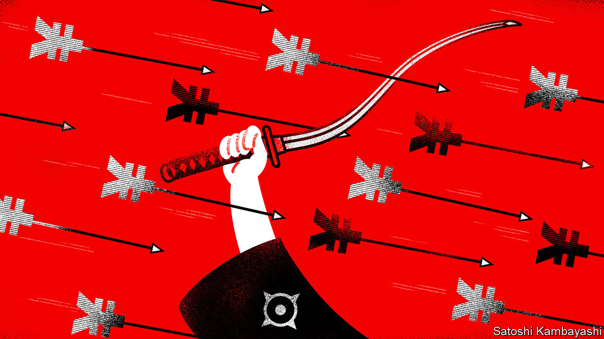

###### Out of control

# The Bank of Japan should stop defending its cap on bond yields 

##### “Yield-curve control” has left the central bank facing huge losses 

 

> Feb 2nd 2023 

Changing the helmsman halfway through a tricky manoeuvre at sea is a risky prospect. Yet that is what is happening in Japan, where the government will soon propose a successor to Kuroda Haruhiko as the head of the Bank of Japan, just as the central bank prepares to tighten monetary policy for the first time since 2007. In December, amid rising inflation and speculative pressure, the bank raised its cap on ten-year government-bond yields, from 0.25% to 0.5%. The next governor is expected to raise the cap further, or even to abandon the policy, which is known as yield-curve control. 

Unfortunately, the regime change is not off to a good start. Lifting the cap has only increased bets against it. Since December the Bank of Japan has had to defend the higher cap by buying bonds worth a staggering $240bn, nearly 6% of Japan’s gdp and about three times the pace of purchases in the preceding three months. The bank seems determined to keep the cap in place until a change of leadership is complete. Doing so is a costly mistake. It should change course now. 

Yield-curve control has been the most awkward part of the monetary-policy toolkit developed after the global financial crisis of 2007-09. Having run out of space to cut short-term interest rates, central banks tried to drive down long-term bond yields instead. To that end, they bought bonds with newly created money. By 2016, however, the Bank of Japan’s balance-sheet was ballooning, and it introduced a yield cap in the hope of keeping yields low while making fewer purchases. The idea was that yields would adjust purely on the expectation that the central bank would act if necessary to enforce the cap. And for a time, the policy worked as intended. 

As inflation has risen, however, such caps have lost their credibility. In 2021 Australia suddenly abandoned its experiment with yield-curve control as investors began betting that interest rates would need to rise to fight inflation. 

In Japan the situation is more finely poised, because inflation has been too low for decades and ongoing stimulus may be necessary to ensure the Bank of Japan hits its 2%  over the next few years. But Japan’s policy is far more aggressive than Australia’s, which capped bonds at a three-year, rather than a ten-year, horizon. A small change in the outlook for the next decade is enough to bring a ten-year cap under pressure. 

Investors know that Mr Kuroda’s successor is likely to adjust and eventually abandon the policy—especially if it is a hawk, such as Yamaguchi Hirohide, a former deputy governor. The result has been rampant speculation, forcing the bank to hoover up more bonds: exactly what yield-curve control was supposed to avoid. The bank now owns more than half the Japanese government-bond market, including two-thirds of bonds with a maturity between one and 11 years. Bizarrely, its accounts imply that it owns more than 100% of the issuance of some bonds, having lent out its purchases only to buy them back again. 

For investors, selling bonds to the bank seems a one-way bet. Yields move inversely to prices. Why own a bond that will fall in value as the cap is lifted, if you can sell it for a higher price today? But for the Bank of Japan the purchases could prove correspondingly costly. We calculate that a rise in bond yields of just 0.25 percentage points would cause paper losses of over $60bn. The bank’s cash flows will suffer if short-term rates rise before the bonds mature, forcing the bank to pay interest on the reserves it has created in the banking system to finance its purchases. With every bond bought, the potential loss mounts. 

Some argue that the yield cap must be maintained until after wage negotiations in the spring, so that it stimulates average pay rises high enough to be consistent with price growth of 2%, ensuring Japan’s escape from decades of low inflation. But the limited extra stimulus brought about by the cap is not worth the possible losses, which pose a threat to taxpayers. Instead, the central bank’s most important tool is its short-term interest rate, which it can still pledge to keep low to act as a stimulus.

Signalling the end of a price peg is unwise, because it attracts speculation and forces a messy exit. It is too late to avoid that. Everyone knows that the end of yield-curve control is coming in Japan. The central bank—whoever is at its helm—can at least kill off the policy before it loses a lot more money. ■

