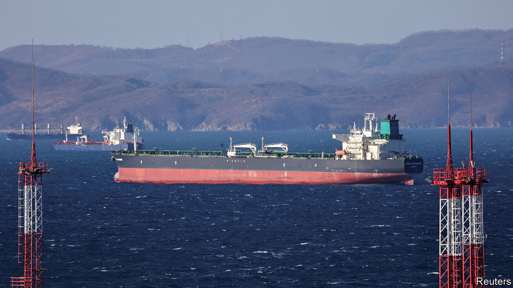
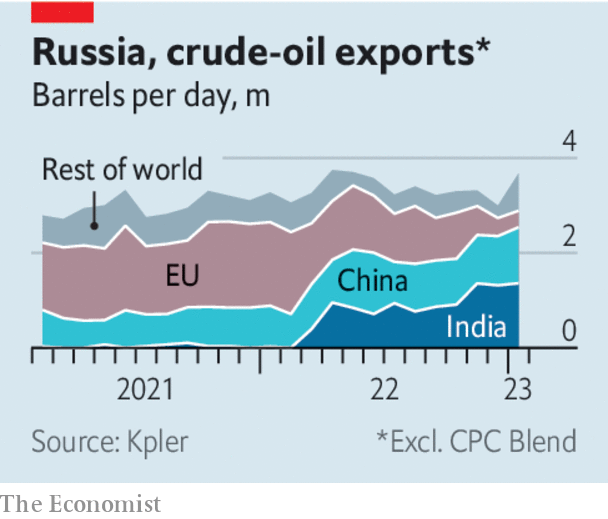

###### Dodged penalties

# Why the West’s oil sanctions on Russia are proving to be underwhelming 

##### Another embargo comes into force on February 5th. Manage your expectations 

 

> Feb 1st 2023 


In december the West took aim at Russian oil revenues, unleashing the biggest package of energy sanctions ever imposed on a single country. Europe, which had been a big buyer of Russian seaborne crude, banned imports of the stuff. It also barred its long-dominant shippers, lenders and insurers from facilitating the sale of Russian crude to other buyers—unless the oil was sold below a “price cap” of $60 a barrel set by the West.

Two months in, plenty of people seem to think that the cap is a big success. A second round of European sanctions, on diesel and other refined products, is due to come into force on February 5th. Unfortunately, our reporting suggests that the scheme is not biting. 

 


The December ban-and-cap policy has not succeeded in curbing sales of Russian crude. After a lull while European firms worked out how to comply with the new price cap, shipments have resumed at pace—directed not to Europe, but to China and India instead. Russia’s exports of unrefined oil, excluding cpc, a Kazakh blend shipped from Russia, averaged 3.7m barrels a day in the four weeks to January 29th. That is the highest level since June, and more than in any four-week period in 2021. 

An advocate of the price cap would say that this is proof of the scheme’s success. The point, after all, was to ensure that Russian oil continued to flow, keeping the global market stable, but to limit the price of it so that the profits for Russia’s president, Vladimir Putin, were kept in check. The cap, they argue, gives buyers negotiating power; the longer export routes also raise freight costs, for which Russia must compensate customers. 

As evidence that the cap is working, many also point to the gap in price that Western agencies report between Brent, the global benchmark, and Russia’s Urals crude. This emerged soon after the invasion of Ukraine, but widened a little after the embargo, to $32 a barrel. Thus Russian oil now trades at a discount of 38%. On January 10th Janet Yellen, the American treasury secretary and an architect of the price cap, said that the scheme was making progress towards its goals. 

The problem, however, is that price-reporting agencies have not adapted their methods to a world in which Russian oil no longer sells through channels they can observe. Whereas European refiners and traders used to share data with price-trackers, Indian ones do not. Agencies also used to rely on publicly available indicators to estimate shipping costs between Russia’s western ports and European oil terminals. Rates for ferrying oil from Russia to Asia, by contrast, are set in private. 

The result is that the discounts cited by Western officials are inaccurate—and often exaggerated. Customs data from India and China show that they paid more for their Urals oil this winter than is widely thought. Another reason true pricing is hard to assess is that everyone has an interest in pretending that prices are low. Russia’s oil firms are keen to minimise their tax bills and Indian refiners want to squeeze other suppliers. 

Even more striking is the extent to which Russia’s export machine has become less reliant on the West’s shipping and financing infrastructure, and has therefore escaped the scope of sanctions. As we report this week, a shadow trade that uses a parallel system is . Before December, more than half of western Russian crude was handled by a European shipping or financing firm. That share has since fallen to 36%. 

Could the next batch of sanctions, on refined oil, do more damage? At first glance it seems that they could curb Russian exports of diesel and other products in the near term. From February 5th, Europe will no longer buy such fuels, and it will make the use of its shipping and insurance firms subject to compliance with a price cap. Russia will not easily find buyers to make up for the loss of demand from the eu: both China and India have refineries of their own. And substituting for Europe’s refined-oil tankers will be hard. A chunk of Russian refined products, which account for a third of the country’s oil-export revenues, could thus go unsold, raising global prices. 

Yet over time these effects are likely to fade. Unable to sell refined oil, Russia would probably boost its capacity to export more crude instead, further energising the shadow trade. Europeans may find themselves turning to China and India for diesel, but it would increasingly be produced from Russian crude. As more Russian oil flows outside the West’s control, blockades will become even less effective. For the West, the lesson is that sanctions are no substitute for sending Ukraine more money and arms. Shunning Russia’s oil will not win the war. ■

