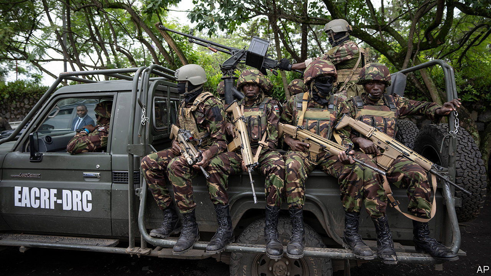

###### To fight or not to fight

# Can Kenya bring peace to eastern Congo? 

##### Not if Rwanda can help it 

 

> Feb 2nd 2023 

For people living in the east of the Democratic Republic of Congo, foreign soldiers generally come in two types, the larcenous and the feckless.  have mostly been responsible for the larceny, periodically plundering eastern Congo’s vast mineral riches ever since Rwanda and Uganda first invaded in 1996. By contrast, the fecklessness has worn a blue helmet: the UN mission in Congo, one of the most expensive ever mounted, has proved singularly ineffective at stanching the  that has forced 5m people from their homes and is impoverishing a region of more than 100m people.

Many Congolese cheered when the East African Community (eac), a regional economic bloc, announced plans in June to deploy an intervention force. True, Uganda and Burundi, both past invaders with less-than-cuddly reputations, are contributing men. But Kenya, untainted by such grubbiness, was to lead the force. Here, at last, was an honest broker with sufficient diplomatic and economic heft to make a difference, with a genuine belief that stability will make the region richer. Better still, the force had a robust mandate to “contain, defeat and eradicate negative forces”. With eastern Congo facing its gravest crisis in a decade, a Kenyan show of leadership could not have been more timely. 

Pride rose across the region, too. Even South Sudan, penurious, war-ravaged and more used to hosting peacekeepers than deploying its own, chipped in a battalion. Salva Kiir, its president, beamed with pride as he waved his men off on December 28th. “Don’t go engaging in the raping of women and girls,” he said. “Don’t take anything from shops and civilians.”

Alas, it has not taken long for the mood to sour. On January 18th police in Goma, the main city in Congo’s east, dispersed a demonstration called to denounce the perceived inaction of Kenyan troops since they arrived there two months ago. True, the protest was small—but anti-eac sentiment is undoubtedly growing. 

Goma’s 1m residents are understandably twitchy. In November 2021 a powerful rebel outfit, known as M23, re-emerged from its hideouts and embarked on a blood-soaking offensive. A leaked UN report alleges that Rwanda has armed it with sophisticated weapons and fought alongside it at pivotal moments. 

At a summit in Angola last November, regional powers demanded that the rebels withdraw from all territory seized since the start of the offensive. Kenya’s contingent was meant to move in as M23 pulled back. The rebels, however, have called their bluff. Far from withdrawing, they have expanded their operations. On January 27th they seized the strategic town of Kitshanga, severing another road artery into Goma, which is now at serious risk of encirclement. Through all of this, the eac force has failed to fire even a single shot.

There are good reasons for Kenya to avoid a fight with m23. The deployment of the regional force was more about giving weight to diplomatic pressure on Rwanda than becoming involved in the fighting. Clashing with the rebels would risk a conflict with Rwanda. Yet by raising expectations and doing nothing, Kenya is squandering goodwill and emboldening the rebels, who seem to have little to lose from continuing their offensive. ■

