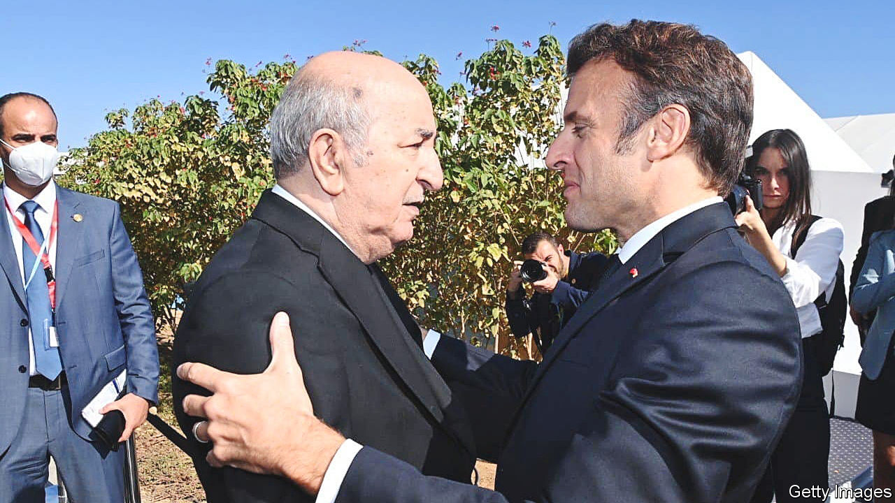
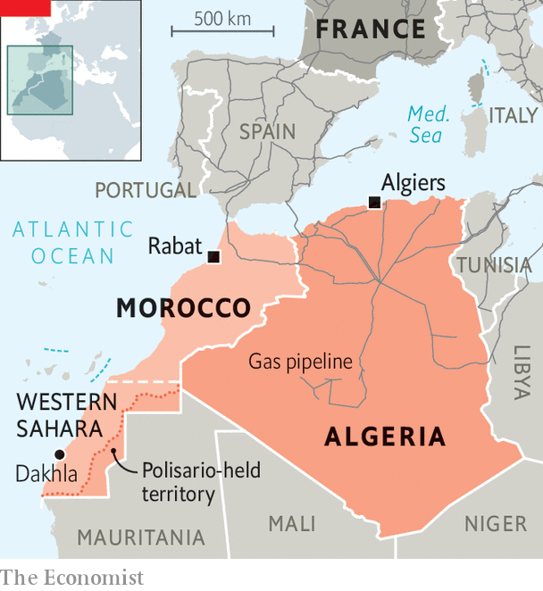

###### A jilted mistress

# France dumps Morocco in favour of Algeria 

##### Europe needs the gas 

 

> Feb 2nd 2023 

How the tables have turned. Just over a year ago, France’s president, Emmanuel Macron, dismissed Algeria, France’s troubled former colony, as a spent regime and cut the number of visas issued to its citizens. Algeria huffily recalled its ambassador and banned France’s air force from its skies. Since then, however, France has eagerly sought a rapprochement. On January 23rd Mr Macron hosted General Saïd Chengriha, Algeria’s top general, the most powerful man in the land. A large French delegation followed him back to Algeria. There is “an exceptional dynamic”, says a diplomat who helped organise it.

As France’s relations with Algeria blossom, those with Morocco, its erstwhile protégé and a bitter opponent of Algeria, may be wilting. Mr Macron last visited Morocco in 2018 and has since made a trip to Algeria. Morocco’s king, Mohammed VI, spent at least four months in Paris last year but never met France’s president.

 


On January 19th Mr Macron’s party, Renaissance, helped push through a resolution in the European Parliament that condemns Morocco’s human-rights abuses without a simultaneous swipe at Algeria, whose record is at least as dismal. “The Moroccans thought that they were running circles around Algeria in Europe and the US,” says Geoff Porter, an American expert on Algeria. “All of a sudden, Algeria is more important and less problematic.” 

In light of the war in Ukraine, the abundance of gas in Algeria is the prime cause of the rapprochement with France and Europe. Italy’s prime minister, Giorgia Meloni, was recently in Algeria and Libya to discuss investments in energy. Italy now depends on Algeria for 40% of its gas, up from 30% before the Ukrainian war. The share of Russian gas in Italy fell from 40% to 10%. Morocco, by contrast, has almost no hydrocarbons to offer. Russia has for years been Algeria’s prime supplier of weapons, so it was striking that General Chengriha discussed arms sales with French firms during his trip. To the delight of the Europeans, Algeria’s president, Abdelmadjid Tebboune, has indefinitely suspended a planned visit to Moscow.

Morocco is partly to blame for its drop in France’s esteem. King Mohammed is often absent and Morocco’s foreign policy seems to drift. The country’s relentless demand that Europe should accept its claim to sovereignty over the disputed territory of Western Sahara remains unmet. Its representatives were allegedly recently caught lobbying European MPs with bribes (Morocco has denied any part in a corruption scandal and has rejected allegations that it sought to influence the disputed status of Western Sahara). It has also been accused of using Israeli spyware to bug the phones of its one-time allies, including Mr Macron. In any case, Morocco seems to be turning its back on what it calls “old Europe”. Instead, it is looking increasingly to Israel and America for its defence. 

Morocco has been described by a seasoned observer in Rabat, the kingdom’s capital, as “a jilted mistress fuming after her partner went back to his true love”. After the European Parliament passed its resolution condemning Morocco for its human-rights record, the parliament in Rabat voted unanimously to review ties with its eu counterpart. Moroccan politicians castigate European ones, especially the French, for colonial meddling.

Meanwhile, Morocco’s friendship with Israel is blooming. Israel’s foreign minister, along with his peers from America and the United Arab Emirates, is expected to be hosted by Morocco to celebrate the second anniversary of the Abraham accords that have normalised relations with the Jewish state. The gathering is, tellingly, set to take place in Dakhla, a port in Western Sahara.

Meanwhile tension along the Algerian-Moroccan border is once again rising dangerously. Relations between the two, which last came to lethal blows in 1963, have long been sour. Morocco fears that Algeria may supply drones to Polisario, the movement that has long sought independence for Western Sahara. Algeria, for its part, fears that Israel may help Morocco plan a cyber-strike against its oilfields. When France drops a mistress for a new lover, sparks in the desert may fly. ■

