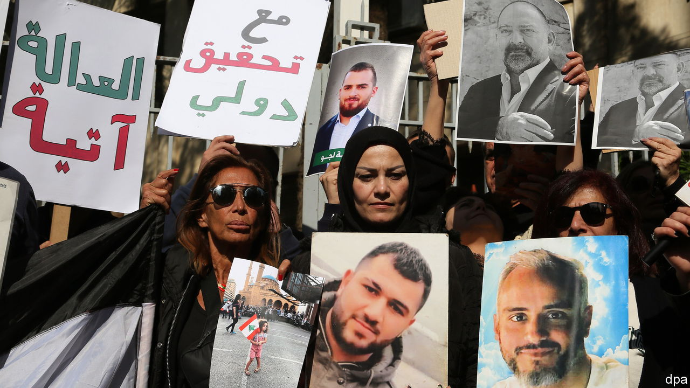

###### Courting disaster

# Lebanon’s judges battle over their probe of Beirut’s port blast 

##### The feud adds to tensions in a country that already has no president and a ruined economy 

 

> Feb 2nd 2023 

“Judge not, lest ye be judged.” Lebanon’s top prosecutor seems to have taken the biblical commandment to heart. For years he has stalled probes into the country’s financial crisis, among the worst in modern history. Now he wants to sabotage the investigation of the  at Beirut’s port, setting off a judicial feud some fear could turn violent.

Tarek Bitar, the judge overseeing the port probe, had been  for more than a year. Officials and MPs he wanted to interrogate filed dozens of lawsuits arguing that he had no authority to do so. Some of their arguments were frivolous—but the court that should have heard their claims lacked a quorum to convene.

The pending lawsuits halted the inquiry until January 23rd, when Mr Bitar unexpectedly resumed it and issued new summonses for senior officials, including Ghassan Oueidat, the chief prosecutor. Mr Oueidat accused him of overstepping his powers, then released all the detainees held over the blast, slapped Mr Bitar with a travel ban and charged him with judicial misconduct (that case, too, will be stalled by the absence of a quorum).

It is a farce, but not a funny one. The explosion, caused by thousands of tonnes of ammonium nitrate stored improperly at the port, killed more than 200 people and wrecked much of the city centre. There is plenty of blame to go around: dozens of Lebanese officials knew the chemicals posed a danger but failed to remove them. Families of the victims continue to hold regular protests for justice, but few Lebanese expect they will get it.

Hizbullah and Amal, two Shia political parties, have been Mr Bitar’s staunchest opponents. They have threatened him in the past and accuse him of running a politically motivated witch-hunt; more likely, they have something to hide.

Both have lots of armed supporters. So does Samir Geagea, the head of a right-wing Christian party who supports Mr Bitar. The fear is that the furore over the port investigation could lead to violence. A protest in October 2021 against the judge, sponsored by Hizbullah and Amal, turned into a , the worst such incident in Beirut in more than a decade.

While the judges joust, the currency collapses. Once pegged at 1,500 to the dollar, the Lebanese pound has lost 97% of its value. It dropped through 50,000 on the parallel market in mid-January and then 60,000 days later. Average inflation in 2022 was 171%, up from 155% a year earlier. The pound is so volatile that prices for bread, fuel and medicine are adjusted daily. Many businesses are no longer accepting credit cards so shoppers must carry around bricks of .

Lebanon reached a provisional agreement worth $3bn with the IMF in April, but it has yet to be finalised. The fund has long pushed Lebanon to unify its exchange rates and recognise the scale of losses in its financial sector. On February 1st Riad Salameh, the central-bank governor, at last devalued the currency. Banks will now use a rate of 15,000 on their balance-sheets, an arbitrary figure that he seems to have reached simply by adding a zero to the old one. The change is unlikely to garner much praise from the IMF.

Mr Salameh may have other things on his mind: he is being investigated in no fewer than six European countries. In January a team of European investigators landed in Beirut to scrutinise his finances. They suspect he and his brother, Raja, embezzled money from the central bank and used some of the profits to buy property in Europe. (The brothers have not been charged and deny any wrongdoing.)

Yet he continues to run the central bank, as he has since 1993. His latest term should end in July. Replacing him would require a deal among Lebanon’s factious politicians, who cannot agree on much.

Michel Aoun, the president, left office on October 30th at the end of his six-year term. Parliament has held 11 sessions to pick a replacement; none has produced a winner. These, too, have been nonsensical. Many MPs have cast blank ballots. A few chose historical figures like Nelson Mandela and Salvador Allende. Given the state of Lebanon’s governance, a dead president may not be worse than the alternatives. ■

