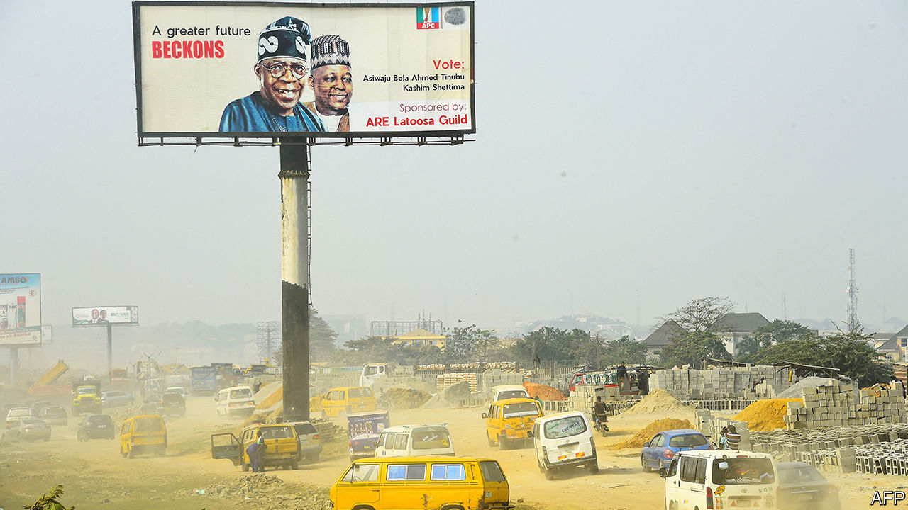
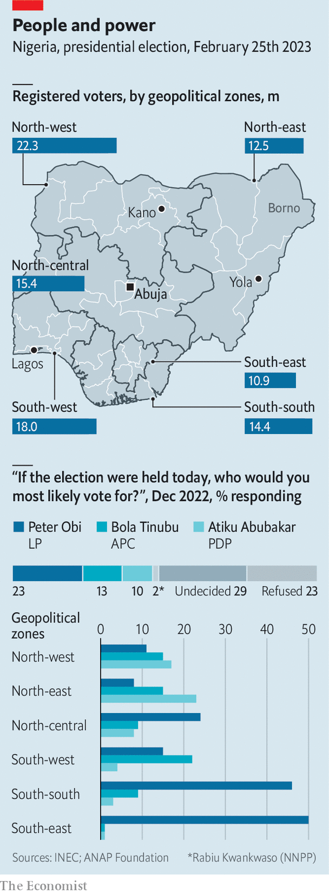

###### The amazing race

# Nigeria’s presidential race goes down to the wire 

##### Three candidates still have real hopes of victory 

 

> Feb 2nd 2023 

If presidential elections were won by advertising, Bola Tinubu of the incumbent All Progressives Congress (APC) party would win Nigeria’s by a landslide. His face grins relentlessly over all corners of the country (pictured). “Posters don’t vote,” quips a member of the campaign team for , the candidate of a rival minor party who unexpectedly leads the polls in what is usually a two-horse race.

The contest is close, chaotic and crucial to the future of Africa’s most populous country and biggest economy. Nigerians, who will vote on February 25th, are poorer today than eight years ago. Much of the blame falls on the outgoing president, Muhammadu Buhari, who has  during his eight years in office. Fully 89% of Nigerians think the country is heading in the wrong direction, according to Afrobarometer, a pollster. On his watch the economy has stagnated and violence has spread: last year at least 10,000 people were killed by criminal gangs, terrorists or the army. A country that once exported security through peacekeeping missions now exports trouble, destabilising neighbours. 

Yet for all its travails, Nigeria is also Africa’s biggest democracy—with an opportunity for renewal. That matters in a country that has gone through five coups. The use of modern voting technology will make it harder to rig the results. More Nigerians are likely to vote than ever before. There is an “unprecedented awakening” among the young, who make up 40% of registered voters, says Opeyemi Oriniowo of the Nigeria Youth Futures Fund, an NGO based in Lagos, the commercial capital. These are telling signals in a continent where democracy is in retreat. Should an opposition party win, this would be only the second time since the generals returned to barracks in 1999 that voters have ejected an incumbent party by the ballot.

Three hopefuls seem to have a shot at victory. To secure it they have to gain not only the most votes nationally, but also win at least 25% of the vote in two-thirds of Nigeria’s 36 states and federal capital. If no candidate clears that bar, there will be an unprecedented run-off. 

What will decide who wins? Despite the huge challenges facing Nigeria, it will not be policy proposals. Little distinguishes the candidates on the key issues; other factors come into play. Power-brokers often deliver blocks of votes by fair means or foul. “Whoever the camp leaders say, that is who we will vote for,” says Falmata Abdulrahman as she breastfeeds her daughter in a camp for displaced people in the north-east. Intimidation and vote-buying are common. “We were at the mercy of hoodlums and thugs,” says Ahmadu Duste, who worked at a polling station in the last election. “I saw voters being given cash.”

The 70-year-old Mr Tinubu has the clearest path to victory because he has deep pockets and his APC controls 21 of Nigeria’s 36 governorships. He expects to win handsomely in the south-west, his regional stronghold. He is hoping that his Muslim faith and that of his running-mate, Kashim Shettima, a former governor of the north-eastern state of Borno, will help him in the mostly Muslim north. Yet given the violence, fuel shortages and economic malaise in Nigeria, many voters may be wary of backing the incumbent party. Many also worry about Mr Tinubu’s health, since he looks increasingly frail and has had to skip several big campaign events. 

And some may question his character. Last year he settled a lawsuit in which he was accused of secretly owning 70% of a private company that was given a contract to collect taxes on behalf of Lagos state during his time as its governor (1999-2007). Court papers alleged that it earned a commission of 10% of all revenues it collected there. Mr Tinubu denies any wrongdoing. 

Some voters also question the probity of the main opposition’s candidate, 76-year-old Atiku Abubakar of the People’s Democratic Party (pdp), a wealthy former customs official and vice-president. In 2010 a Senate committee in America said he was implicated in the transfer of over $40m of “suspect funds” to that country. He too denies wrongdoing. 

 


Across much of Nigeria, religious leaders—Christian and Muslim—are pushing people to vote for their co-religionists. That may set an imposing hurdle for Mr Abubakar. He is a northerner and a Muslim representing a party that in recent years has found support mainly in the Christian south. This time Mr Obi, a Christian who is backed by neither of the two dominant parties of yore, will eat into much of that support. “My pastor encourages us to vote for him,” says Lydia Adamu, a churchgoer. Mr Abubakar is struggling to rally even his own party. Five pdp governors have withheld their endorsements and seem set to back his southern rivals. And in the north he will probably lose votes to Rabiu Kwankwaso, a popular former governor who is also running for the top job. 

Mr Obi, a 61-year-old former governor and trader, owes his popularity in part to citizens’ desperation for an alternative to Nigeria’s venal, ego-laden politicians. Many voters are attracted by his frugal, energetic style and see him as more honest than his rivals. Kayode Fayemi, a former APC governor advising Mr Tinubu’s campaign, concedes that Mr Obi will probably take 80% to 90% of the vote in the south-east, his home region. Rivals deride his young fans as keyboard warriors who are not registered to vote. Yet as supporters hung off nearby balconies at a recent rally, Mr Obi cried, “If you have your PVC [voter card], raise your hand.” A forest of arms rose to the sky. 

Still, Mr Obi’s path to victory is a narrow one. Election officials are accused of dragging their heels in registering new voters, particularly in his stronghold, which has fewer voters on the books than other regions (see map). And his weakness in northern states means he may struggle to clear the 25% bar. His best hope is that urbanites turn out in such large numbers that the election goes to a run-off. 

The poll seems unlikely to be completely free, fair and peaceful, but it should still deliver a legitimate result. Election offices have been repeatedly attacked. Polling booths will be largely absent from areas infested with jihadists. Losers may stir up violence. More worryingly, some talk of a return to Nigeria’s dark past of coups, among them Mr Fayemi. Some powerful Nigerians “want to pre-empt the people”, he says, because they “feel that none of the candidates in the running now would be good for the country.” Thankfully, a putsch would be hard to pull off. Whatever the failings of the contenders, a return to military rule would be worse for Nigeria. ■

