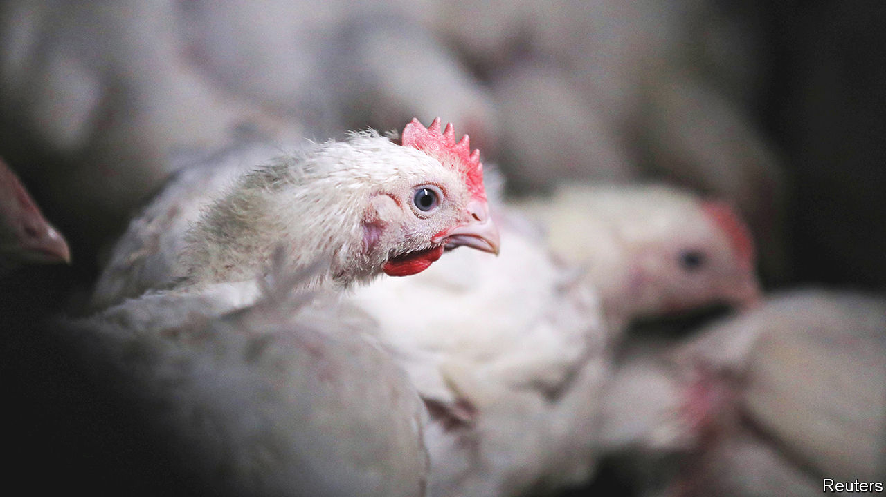

###### Old birds and power cuts

# South Africa’s blackouts hurt the economy in unexpected ways 

##### While politicians behave like headless chickens, there are fewer of the real sort 

 

> Feb 2nd 2023 

“We slaughter chickens 24 hours a day,” says Izaak Breitenbach of the South African Poultry Association (SAPA), an industry body. At least that is the plan. Normally 4m birds are sent to abattoirs every day. But , the state-owned utility, have been “an absolute disaster”, he says, causing butcheries to cease butchering. The curious yet potent effects on this one industry hint at the vast cost of blackouts for the rest of the country’s economy. 

The question of what came first, the chicken or the egg, is irrelevant for poultry producers; all they see is one long value chain. They raise parent chickens, whose eggs are taken to hatcheries. The hatched chicks are moved to broiler farms, the cacophonous prelude to the abattoir. Chickens are typically slaughtered at a precise, young age—34 days old—to meet buyers’ requirements. Fast-food restaurants such as KFC have tightly controlled processes: if wings or legs or breasts are too big, then the allotted cooking time is insufficient and the meat is raw. South African consumers are generally too poor to afford large birds, so retailers also encourage producers to slaughter birds earlier than happens in richer countries. 

Last year the total amount of “load-shedding”, as the local euphemism goes, was more than twice as high as in any previous year. In 2023 there is literally no light at the end of the tunnel. South Africans expect to be without electricity for six to ten hours a day. That means a quarter fewer chickens are being slaughtered, with two direct effects. First, farmers breed fewer chicks, since there is no space at broiler farms. Second, the 1m or so poults that are spared every day are growing bigger. They are too big, in fact, for the likes of KFC, meaning lost sales for chicken firms. 

Power cuts mean higher prices, too. In part this is because of reduced supply. But it is also a result of higher costs. One farmer says that he spends 800,000 rand ($47,000) a day on fuel for his generators. 

Poultry is just one sector hurt by load-shedding. Mining output has fallen year-on-year for ten consecutive months. The small businesses that serve millions of consumers in poor, mostly black townships are going bust. Shoprite, a large grocery chain, forecast that if power cuts continue, it will spend 1.2bn rand a year on diesel to keep the lights on, a sum equal to about a fifth of its annual profits. Economists reckon power cuts may tip the country into recession in 2023. 

There are other unexpected consequences, too. In parts of Johannesburg taps have run dry because the water utility is unable to pump without power. And with traffic lights going dark, motorists are regularly stuck in jams on gridlocked roads.

Cyril Ramaphosa, the president, is considering declaring a national state of disaster over the power crisis. But South Africans have lost faith in the ruling African National Congress’s ability to fix Eskom, which has , crime, mismanagement and a failure to maintain coal plants. So long as politicians behave like headless chickens, there will be fewer of the real sort. ■

