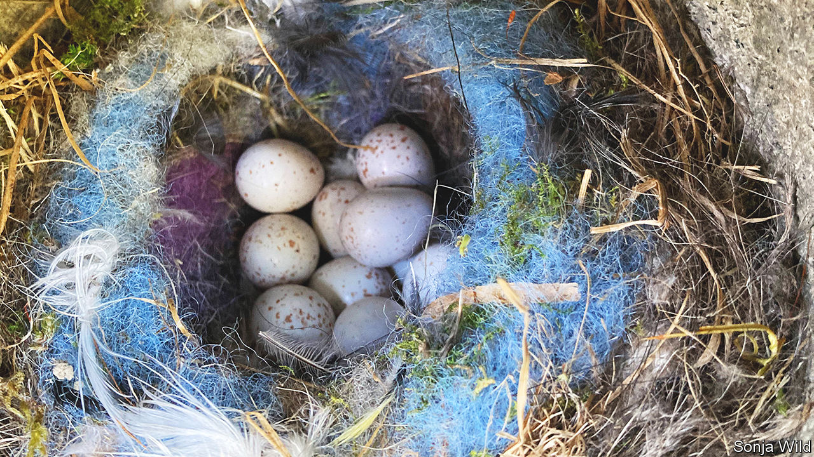

###### Trendy tits

# Birds are just as fashion-conscious as people 

##### You can see it in their nests 

 

> Feb 1st 2023 

Humans are not the animal kingdom’s only fashionistas. Tits can be fashion-victims, too, apparently. A study published in  by Sonja Wild and Lucy Aplin of the Max Planck Institute for Behavioural Biology, in Radolfzell, Germany, shows that, given the chance, they decorate their nests with this season’s must-have colour.

Dr Wild and Dr Aplin were following up work published in 1934 by Henry Smith Williams, an American naturalist. He noticed that when he put various coloured balls of yarn out in his garden, almost always one and only one became popular that season for incorporation into local birds’ nests. But which particular hue was favoured varied from season to season. This suggested that the colour chosen by one of the early birds was spotted and copied by others. 

Williams’s work was, however, forgotten until Dr Wild and Dr Aplin came across it while following up on a different study, published in 2009 by a team at the University of Toulouse. This group noted that, during any given breeding season, the blue tits they were investigating tended to incorporate the same herbaceous plants into their nests regardless of how abundant those herbs actually were. This, too, suggested fashion-following—and it likewise led Dr Wild and Dr Aplin to speculate that birds were studying the nests of others and copying them. They therefore set out to re-run Williams’s experiment, but this time to collect some actual numbers.

The birds they followed were part of a well-monitored population of blue, great and marsh tits in a wood near the institute. Most birds in this wood carry transponders fitted to them after their capture in mist nets. That allows the institute’s researchers to keep track of a vast number of individuals by logging their arrival at food dispensers scattered throughout the wood. 

One day in March 2021 Dr Wild, Dr Aplin and their collaborators deployed five RFID-enabled dispensers loaded with wool rather than food. Each contained strands of two colours—either orange and pink or blue and purple—but all were rigged to dispense only one of these. This remained so until at least one local nest was seen to include wool from a dispenser. At that moment, the other colour was made available, too. As a control, Dr Wild and Dr Aplin set up, in a separate area, four further wool-dispensers, each of which provided two colours from the get-go. 

Of 68 tits’ nests built that season in the experimental areas, 26 included wool from a dispenser. Of these, 18 were constructed after both colours had become available from all dispensers. Even so, ten of that 18 included only the colour of wool first chosen by a nestbuilder. By contrast, all eight wool-bearing nests in the control zone contained a mixture of colours—a statistically significant difference.

Tits, then, do seem to be “on trend” when it comes to nest-building materials. Why that should happen remains obscure. Dr Wild and Dr Aplin suspect the trendsetters are older birds, and that evolution favours younger ones copying their elders since those elders have evidently survived what fortune has to throw at a tit. Williams’s original work, though, suggests such initial choices are arbitrary. A bit like those of the leaders of human fashions. ■


