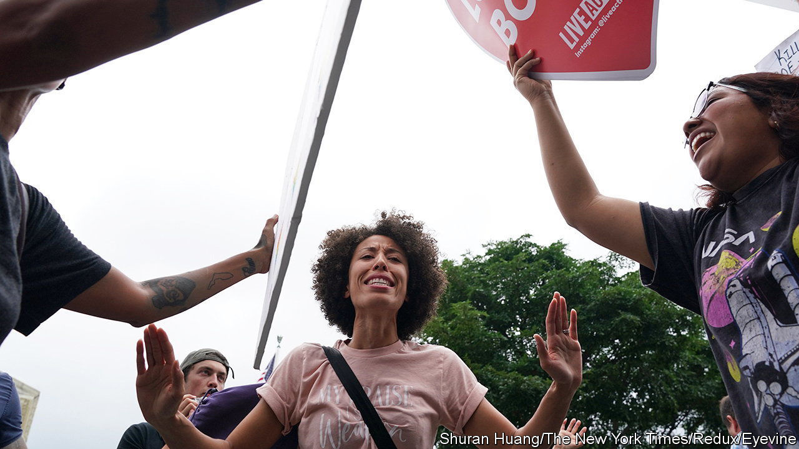

###### Brain scans and politics

# People of different opinions process political data differently 

##### Brain scanning suggests activity patterns cluster with ideology 

 

> Feb 2nd 2023 

That those who lean to opposite ends of the political spectrum think differently from each other is obvious. That such differences show up in brain scans is intriguing. Brain scanning is a low-resolution approach to studying neural activity, incapable of seeing how the cells which do the actual thinking are connected to each other. Yet, using this fairly crude technique, two groups of researchers now claim to be able to distinguish the neural responses of left- and right-wingers. 

Daantje de Bruin and Oriel FeldmanHall, of Brown University, in Rhode Island, published their study in . Noa Katabi and Yaara Yeshurun of Tel Aviv University, in Israel, chose the . Both used functional magnetic-resonance imaging, which measures changes in blood flow as a proxy for neural activity, to look at groups of 44 and 34 volunteers respectively, from across the political spectrum.

Ms de Bruin and Dr FeldmanHall first asked their volunteers to read a list of words—some politically charged, some not—while lying in the scanner. For each word, they recorded activity patterns in the amygdala (which handles aspects of the emotions) and the striatum (which handles aspects of cognition). Neutral words showed no difference. But for words related to “immigration” and “American” the activity patterns in the striatum clustered according to participants’ politics. 

Next, they asked people to watch a neutrally worded news clip on abortion and also heated debates on policing and immigration. Patterns of activity stimulated by the news clip were indistinguishable between left- and right-wingers, but those generated by the immigration debate (though, surprisingly, not by the policing debate) clearly divided them. 

Ms Katabi and Dr Yeshurun, by contrast, went straight for videos. They asked participants to watch campaign ads and speeches, and a neutral clip. They found differences in the responses to politically charged material of parts of the cortex that deal with vision, hearing and movement. Moreover, unlike Ms de Bruin and Dr FeldmanHall, who merely noted correlations, they said they could predict an individual’s political views from the scan. Not quite Big Brother in 1984, yet. Getting someone to lie still in a scanner is a palaver. But surprisingly close. ■


