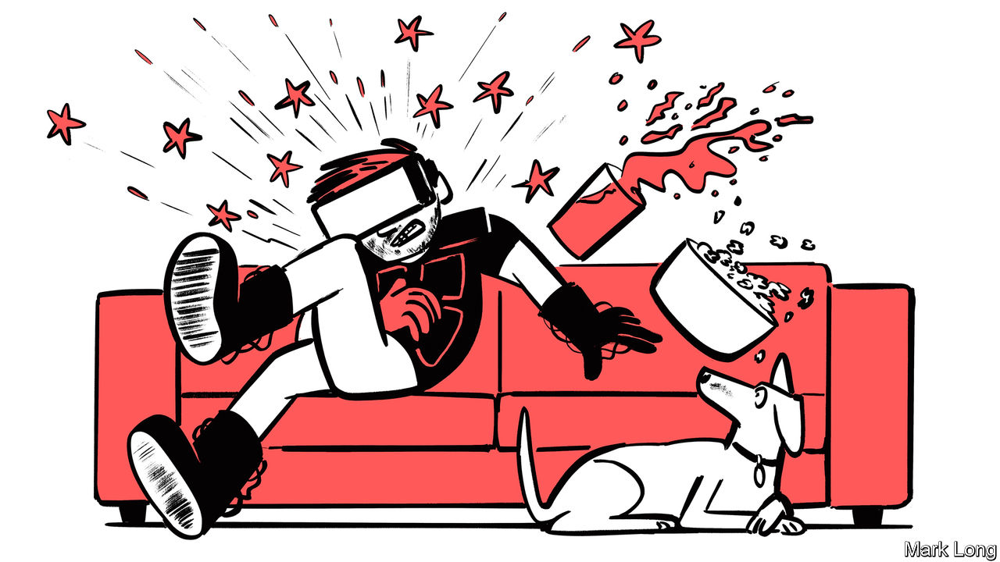

###### Haptic technologies

# The touchy-feely world of the metaverse and future gadgets 

##### Soon, game players will able to pick things up—and feel the bullets, when they are hit 

 

> Feb 1st 2023 

The Brave New World Aldous Huxley describes in his novel of that title features the “feelies”. In 1932, its year of publication, movies were turning into talkies. Feelies must have seemed a logical, if creepy, extension of that. The book alludes to a film at a local theatre with a love scene on a bearskin rug, in which the sensation of every hair of the bear is reproduced.

The feelies have still not arrived. But people are working on them. In computer games and virtual reality (VR), two heirs to cinema’s role in light entertainment, practitioners of the discipline of haptics are attempting to add a sense of touch to those of vision and hearing, to . In future, they hope, if you reach out to pluck an apple from a tree in such a paradise, your hand will no longer go through it. You will, rather, be able to feel and grasp the fruit, if not actually eat it. Conversely, if it is a paradise lost you are in, and a baddy hiding behind the apple tree shoots you, you will feel the bullet’s impact.

To experience all this a user will wear haptic clothing. The ambitious talk of whole-body haptic suits, but in the case of the apple, the tree and the gunman haptic gloves and a haptic vest would suffice. Moving a gloved hand creates corresponding movement of a user’s virtual hand, with sensations appropriate to objects “touched” being fed back via devices called haptic actuators, incorporated into the glove. Haptic vests similarly stimulate parts of the upper body. 

Hand in glove

Actuators themselves come in a variety of forms. Those most widely used at the moment are ERMs (eccentric rotating masses) and LRAs (linear resonant actuators). An ERM is a tiny motor that drives a shaft fitted with an off-centre weight which causes the whole thing to vibrate when the shaft spins. An LRA uses an electromagnetic coil to shake a surface. Nowadays, these devices are employed for jobs like alerting smartphone users to incoming messages and reacting when a touchscreen is tapped. But adapting such well-understood technologies for use in VR and gaming should be fairly easy.

ERMs and LRASs are not, however, the only possible approaches to immersive haptics. For instance, OWO Game, a Spanish firm, is about to put on sale a haptic vest, worn next to the skin, that relies on electrical stimulation rather than vibrating actuators. It delivers tuneable levels of current to different parts of the torso. Besides creating tingling sensations, these can also cause muscles to contract. Effects replicable using this approach apparently include being shot, stabbed and blown up. 

In Redmond, Washington, meanwhile, a firm called HaptX has reached for pneumatics, a technology many might think had seen its heyday. Bob Crockett, one of the company’s founders, explains that the firm needs compressed air to produce a big enough displacement of the skin to effect a realistic sensation of touch. Other haptic devices, he says, cannot do that.

HaptX’s gloves, branded G1, have their air pumped in and out through a network of tubes which inflate or deflate 135 tiny balloons incorporated into each glove. The most sensitive of these balloons—those in the finger tips—are less than 1mm in diameter. The gloves’ fingers also include pneumatic “exotendons”, which brake the fingers’ movement, thereby simulating the feeling of touching a solid object. The compressor and electronics powering the system are held in a backpack, so a user can move around freely. 

None of this will be cheap. A pair of G1 gloves will set you back at least $4,500. The initial market, though, is corporate, rather than retail. Early customers are expected to include organisations that already use VR for training and want to improve the experience: medical schools teaching operating techniques to surgeons, for example, or workshops that repair jet engines. Another use might be to permit collaboration between engineers living in different parts of the world. People working on a new car, say, could meet in a virtual laboratory, tinker with virtual components, and pass around virtual copies of their designs.

There is, though, a further reason why HaptX has chosen pneumatics: it does not intend to stop at making gloves. It has plans for a whole-body haptic suit and thinks pneumatic actuation will be easier to scale up than something based on electric motors. It is cagey about details, but users would don an exoskeleton that could create sensations all over the body—including forces that pull a user’s hands downward, so he or she would feel the weight of virtual objects.

Unvested interest

VR and gaming are the high end of haptics. But ways of improving haptic feedback in the non-virtual world are important, too. Smartphones, computers and the touchscreens now proliferating in vehicles, fast-food venues and so on could all benefit from a bit of haptic feedback. 

Aito, a firm based in Amsterdam, hopes to provide just that. It produces haptic systems for laptops and other digital devices. These employ actuators based on piezoelectric materials, which shrink or expand in response to a voltage, producing a slight movement. And the process works in reverse, as well. When squeezed, a piezoelectric crystal generates a current. This means piezo materials can be employed both as actuators and as sensors.

Aito’s actu-sensors have three layers. Their covers are plastic, glass or even wood. Below lies a capacitance grid, which determines, from the change created in the grid’s electric field, the position of a finger touching the device. The third layer is a matrix of piezo activators. All three combine into something barely 1.8mm thick that can be incorporated into touchscreens and touch pads. 

When an actu-sensor detects a finger it responds appropriately, according to the position and pressure of the digit in question. It might create clicks. Or rumbles. Or form the screen’s upper layer into a stable but scratchy surface that would cause a finger or a plastic stylus to feel like a fountain pen gliding over paper, or like a brush painting on canvas.

With the introduction of portable devices that have foldable screens, the lower half might thereby be used as a haptic keyboard. It could be programmed to provide a tactile response like that of a mechanical keyboard, but with additional features, says Nedko Ivanov, Aito’s boss. For instance, pressing down harder would capitalise a letter, doing away with the need for a shift key.

This would also allow devices to be slimmer and lighter. And the same machine could be sold in different places without having to modify its hardware, for a screen-based haptic keyboard could be programmed to use whatever character set was appropriate to the local language.

Some of these new features will work their way into cars, too—especially as conventional dashboard switches are replaced more and more by icons on a screen. Without a satisfying mechanical click, it can be hard to tell, without taking your eyes off the road, whether such icons have been activated or deactivated. 

And there is also one other potentially big use for haptics. Pornographers were early pioneers of the internet (and, indeed, of film and photography before that). So it is hardly surprising a number of them are now working on virtual-sex encounters—known in the trade as “teledildonics”. Some companies producing sex toys, for example, have already begun adding Bluetooth-enabled items to their range, allowing couples to link up remotely, as it were. Perhaps Huxley wasn’t so far off the money after all. ■


