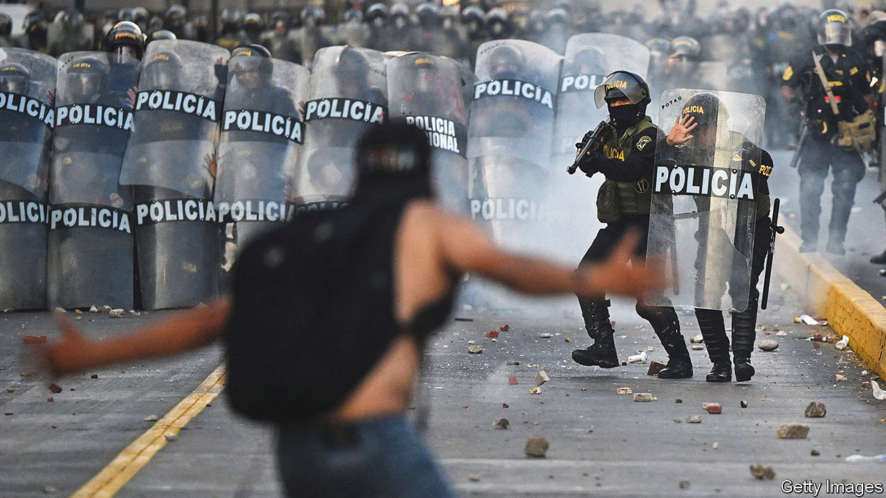
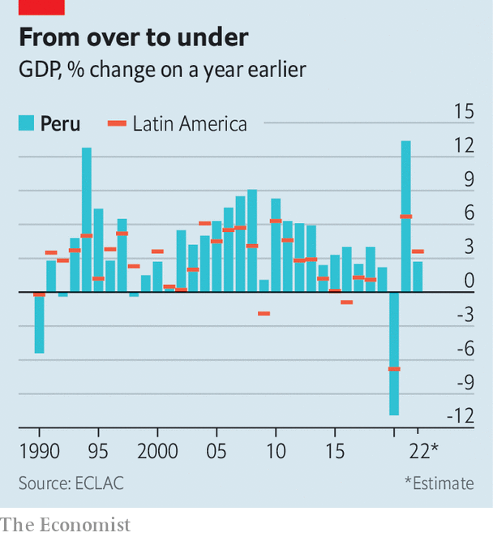
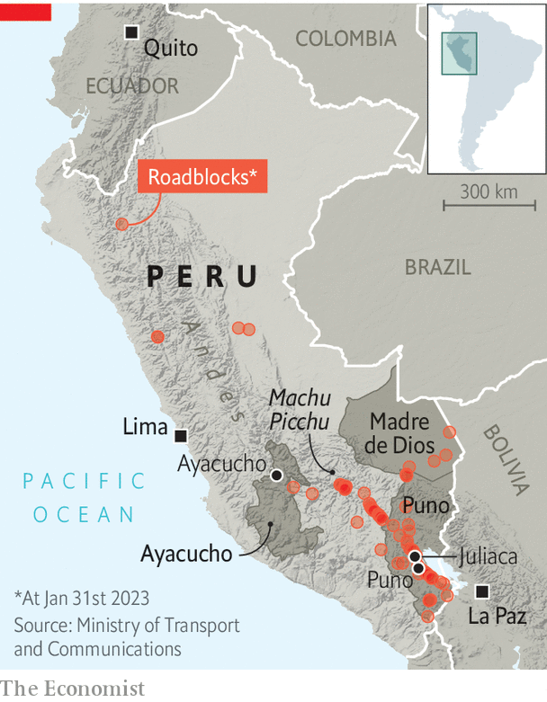

###### Americas

# Political turmoil is tearing Peru apart 

##### Two months of often violent protest threaten democracy’s survival 

 

> Jan 30th 2023 

For the past few weeks the cry of “Dina ! Dina !” has rung out across the streets of several of Peru’s bigger towns and cities. It is unfortunate for the country’s president that her first name rhymes with the Spanish word for “murderer”. Dina Boluarte is the legal, constitutional head of state. But since she took over on December 7th at least 58 people have died during protests, 46 of them civilians in clashes with the security forces, according to the ombudsman’s office. Her name has become toxic, and for many Peruvians her government has lost any legitimacy.

Peru is suffering an explosion of street conflict of the kind seen in Chile in 2019, in Colombia in 2021 and in Ecuador last year. Peru’s has been especially violent, seditious and dangerous. It also has a racial edge: the country’s indigenous population has long been disadvantaged and has been at the forefront of the protests. At stake is whether democracy can survive. The society has become so polarised that some Peruvians talk of an impending civil war, far-fetched though that seems.

At least ten people have died as a result of the protesters’ actions in blocking roads. Scores of highways, especially in the southern highlands, remain blocked and some big mines and the tourist railway to the Incan citadel of Machu Picchu closed. Several airports were out of action for much of January. Food, petrol and oxygen for hospitals are running short in some towns. Intimidation of travellers and businesses that defy roadblocks and orders to stop work is widespread.

According to the economy ministry, the conflict had cost around $625m (0.3% of gdp) in lost production by late January, besides the damage to infrastructure, factories and farms. Central Lima is ghostly behind protective fencing erected by the police, the trinket shops empty of tourists. Almost every evening demonstrators try to reach the Congress building. Groups of youths wielding sharpened staves, stones, slingshots and Molotov cocktails attack the police. On January 28th a demonstrator was killed, the first fatality in the capital.

The conflict was triggered on December 7th, when Pedro Castillo, a left-wing president narrowly elected in 2021, ordered the closure of Congress and the takeover of the judiciary. This failed and Mr Castillo was arrested. It echoed a more successful “self-coup” in 1992 by Alberto Fujimori, who governed Peru as an elected autocrat until 2000. For that reason, many on the left, as well as Mr Castillo’s conservative opponents, initially denounced it. Congress voted swiftly to remove him by 101 votes to six with ten abstentions, and appointed Ms Boluarte, his elected vice-president.

But Mr Castillo and his supporters swiftly broadcast an alternative narrative in which the perpetrator of a coup became its victim. A leader of a teachers‘ union and of indigenous heritage, as president he misgoverned, naming more than 70 different ministers, few of whom survived more than a few weeks. According to prosecutors, he and his circle were corrupt, though he denies that. He placed many ill-qualified far-left activists in state jobs. His defenders argue that the right and the Lima elite never let him govern. His opponents claimed, without evidence, that he had won fraudulently, and at once set about trying to impeach him.

He retained the support of around 30% of Peruvians, mainly in the Andes, who identify with him. “He was useless, corrupt, whatever you like, but he was one of them,” says Carolina Trivelli, a former social-affairs minister. Now, according to Alfredo Torres, a pollster, around half of Peru’s people—and two-thirds in the Andes—believe his false claim of victimhood and think that Ms Boluarte is a usurper who has allied with the right-wing. 

 


The protesters want Ms Boluarte to resign, the closure of Congress and an immediate general election. An election this year may indeed be the only way to restore calm. But they also want a Constituent Assembly to write a new constitution. And they want Mr Castillo to be freed, although that demand is fading. Much of this is hugely popular. In a poll published on January 29th by the Instituto de Estudios Peruanos, a research institute, almost 90% of respondents disapproved of Congress and 74% wanted Ms Boluarte to resign. These demands both reflect and hasten the collapse of the political system in a country that for much of this century seemed a Latin American success story.

In the 1980s, as today, Peru reached an impasse. It suffered hyperinflation, an economic slump and the terrorist insurgency of Sendero Luminoso (Shining Path), a fundamentalist Maoist outfit founded in Ayacucho, a town in the Andes. In the eyes of many, Mr Fujimori rescued the country. His authoritarian government quashed the terrorists. His free-market policies, reflected in a new constitution in 1993, unleashed more than two decades of rapid economic growth. Income per person rose at an annual average rate of 3% between 1990 and 2013, compared with a Latin American average of 1.7%. Whereas around 55% of Peruvians were officially poor in 1992, by 2014 that share had fallen to 23%, the fastest reduction in the region.

 


But Mr Fujimori, who is serving a jail sentence for human-rights abuses in the same prison where Mr Castillo is held, also planted some of the seeds of the current malaise. His regime practised bribery and corruption to get its way. He had no time for political parties. And in some ways he weakened the state. Economic growth and free-market policies continued under democratic governments since 2000. But corruption flourished and the political system decayed.

Growth was not accompanied by institutional development. Three-quarters of the workforce labours in the informal economy of unregistered businesses. In recent years, unlawful economic activity has expanded. According to Carlos Basombrío, a former interior minister, up to 200,000 people work as illegal miners, mainly of gold and copper. Illicit businesses, including mining and drug-trafficking, generate at least $7bn a year, he reckons. Others put the figure much higher.

Political instability has intensified. Ms Boluarte is the sixth president since 2016. None has had a legislative majority. Six of the nine presidents since 2001 have been accused of corruption. The party system has fractured: the 130 members of Congress are divided among a dozen parties. Many of these are run as businesses by the holders of their legal registration. For many Peruvians the state is a tenuous presence. With such a large informal economy, “the role of parties becomes irrelevant,” says Carlos Meléndez, a political scientist.

The protests “express structural fatigue with politics and the lack of responses of the state” to the population’s problems, says Raúl Molina, an adviser to Ms Boluarte. This fatigue is especially acute among the mainly indigenous population of the rural southern Andes. The pandemic, too, heightened economic stress among poorer Peruvians. The poverty rate rose to 30% in 2020 and was 26% in 2021.

Since December, spontaneous anger has increasingly given way to organised, co-ordinated action by a range of forces of questionable democratic pedigree. These start with the parties of the Marxist left which backed Mr Castillo and have ties to Cuba and Venezuela. They also include the remnants of the Shining Path, which has reorganised itself as a far-left party, controls a teachers’ union and has a particular presence in Ayacucho and Puno. Co-ordinated attempts to seize airports in the south smack of the Shining Path, according to Mr Basombrío. 

The Aymara population in southern Puno shares cultural ties with the people of the Bolivian altiplano. Aides to Evo Morales, a former Bolivian president of Aymara descent, have been active in southern Peru. Then there are illegal miners, who appear to be behind roadblocks in several areas, including Madre de Dios in the Amazon. Officials say that common criminals may be behind arson attacks on 15 courthouses, 26 offices of the prosecution service and 47 police stations.

The protesters “want to generate chaos and disorder and use that chaos and disorder to take power,” Ms Boluarte said on January 19th. That ambition does indeed seem to be behind the idea of a Constituent Assembly, a device used by Mr Morales and by Hugo Chávez in Venezuela to secure absolute power, with until recently few supporters in Peru. Now polls show that around 70% like the idea, perhaps because Congress is so hated. A referendum on a Constituent Assembly would be “very dangerous”, according to Luis Miguel Castilla, the economy minister in a centre-left government from 2011 to 2014. The economy recovered from the pandemic despite Mr Castillo, because the constitution “imposes a lot of padlocks”, he says. 

Self-inflicted wounds

Protest is fanned by the blunders of Ms Boluarte and a self-serving Congress. The first deaths were at the hands of the army and police when protests began in December. Anger flared again after 18 died in Juliaca where a vastly outnumbered police detachment apparently panicked. Perhaps the government’s biggest mistake was not to order a swift independent investigation into the deaths. 

Ms Boluarte is from the highlands and unlike Mr Castillo speaks Quechua, the main indigenous language. She was a mid-level civil servant and is a political neophyte. She has appointed some competent ministers but in other ways has blundered. “The government is losing the communications battle,” says Mr Castilla. “The issue has become government excesses.”

An early election seems the only way out. But Congress, whose members enjoy lavish salaries and perks, has stalled and the government was slow to press for one. The constitutional amendment needed for an election must be approved on first reading by February 14th. Fail to take this chance and “Peru will become pandemonium,” says an official. But the left insists on linking the election to a Constituent Assembly. The right wants an election next year. They are fiddling while Peru burns. ■

