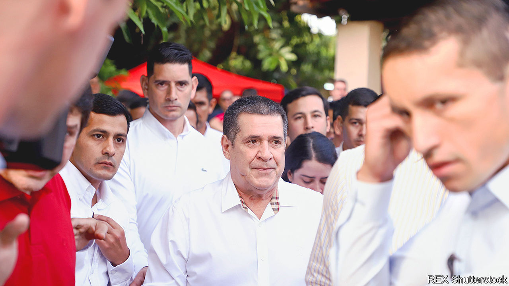

###### Smokes and fire

# The United States says corruption in Paraguay starts at the top 

##### The ruling party will shrug off fresh sanctions 

 

> Feb 2nd 2023 

CORRUPTION IS nothing new in Paraguay. But the scale of the backlash from the United States it has provoked may be. At a press conference in his embassy in Asunción on January 26th, Marc Ostfield, the us ambassador, unveiled harsh new sanctions on the two most powerful figures in the ruling Colorado Party. Horacio Cartes, the country’s president from 2013 to 2018, and Hugo Velázquez, the current vice-president, are accused of “rampant corruption” and ties to terrorists. 

Mr Cartes, a rich businessman, is accused of having paid party members as much as $10,000 to back his presidential candidacy. He also allegedly greased legislators’ palms with up to $50,000 a month and promised to split $1m between them if they amended the constitution to allow his re-election. For more than a decade, the Biden administration argues, Mr Cartes has “leveraged his illicitly acquired wealth and influence to expand his political and economic power over Paraguayan institutions.” Mr Velázquez is accused of making threats and offering bribes to “protect himself and criminal associates”. Both men deny all the allegations.

America also accuses the two of sending representatives to collect bribes in exchange for state contracts and favours at events in Paraguay staged by Hizbullah, a Lebanese Islamic militant group that is backed by Iran and designated a terrorist organisation by the United States. The two are now blocked from doing business with American citizens and banks. Earlier sanctions already barred them and their families from American soil.

There was a time when the United States was kinder to Paraguay’s rulers. As dictator from 1954 to 1989, Alfredo Stroessner bought the loyalty of his generals and the Colorado Party by allowing the smuggling of whisky, cars and cocaine into Brazil. But at least until 1977, America trained Paraguayan soldiers, provided guns and helicopters, and helped the country secure multilateral loans and aid. 

The world has changed, and Paraguayan graft has worsened. In South America, only in Venezuela are perceptions of official corruption more acute, according to Transparency International, an ngo. This is bad for Paraguay’s 7m people, and matters far beyond its borders. Drug gangs as well as Hizbullah and other groups increasingly use the country as a staging-post. It is South America’s leading marijuana producer and an important pipeline for Andean cocaine. Record hauls of it are being found stashed in shipments of Paraguayan paint, rice and soyabeans. Journalists, officials and bystanders are murdered with alarming frequency.

Mr Cartes has 30 businesses—television stations, hotels, ranches, banks, pharmacies and supermarkets. The jewel in his crown is Tabesa, a maker of cigarettes. Millions of packs are smuggled abroad every year, especially from Ciudad del Este in the triborder area near Argentina and Brazil. They are reportedly sold by a gallery of rogues: FARC guerrillas in Colombia, the Sinaloa cartel in Mexico, and the pCC, a ruthless Brazilian narco-multinational. 

Mr Cartes’s people insist that Tabesa’s sales are “100% legal”. They point out that the company is Paraguay’s biggest taxpayer and has never been charged with smuggling—a phenomenon they blame on higher foreign duties on cigarettes. The American allegations, they claim, were “orchestrated” by the current president, Mario Abdo Benítez, a rival to Mr Cartes in the Colorado Party. America, they allege, hopes to swing the presidential election due in April in favour of Mr Cartes’s enemies. They argue that no Paraguayan enjoys a warmer relationship with Israel—Hizbullah’s sworn enemy—than Mr Cartes. As for Mr Velázquez—a former prosecutor in Ciudad del Este—his lawyer says the allegations are “completely false” and that “no one has done more for the fight against organised criminality in Paraguay.”

A stream of allegations

In recent years, judges, navy officials, congressmen, prison guards, policemen, cabinet ministers and health officials have all been implicated in breathtaking corruption schemes, mostly escaping serious punishment. Of late, the sleaze has taken on a scarier edge. Kattya González, an opposition congresswoman, says many of her fellow legislators are bankrolled by gangsters. She has called some out to their faces, and posts clips online. Her videos have been viewed 42m times. 

This is dangerous. In the past year alone hitmen, probably in the pay of drug gangs like the pCC, have murdered a local mayor, a radio journalist, a former prison director and a prosecutor. Ms González and her family have received death threats. “We’re a quasi-narcostate,” she frets.

Washington’s sanctions are unlikely to hurt the ultraconservative Colorados—in power for all but five years since 1947—at the ballot box. Paraguayans grumble about venal politicians, but most have more pressing priorities. One in four lives in poverty; two-thirds hold informal jobs. Drought probably nudged the economy into recession in 2022. Equivalent to 13.9% of gDP, the government’s tax take is South America’s lowest; cancer hospitals have no medicines. Desperate, citizens are forced to rely on the Colorado Party’s embrace.

Mr Cartes, for all his unpopularity in Washington, looks safe enough. In December the Colorado Party held internal elections. Mr Cartes was voted its leader in a landslide, and the party chose Santiago Peña, a former finance minister and his chosen candidate, to contest the presidential election in April. Against a divided opposition, also tainted by (less serious) corruption allegations, he is favourite to win. ■

