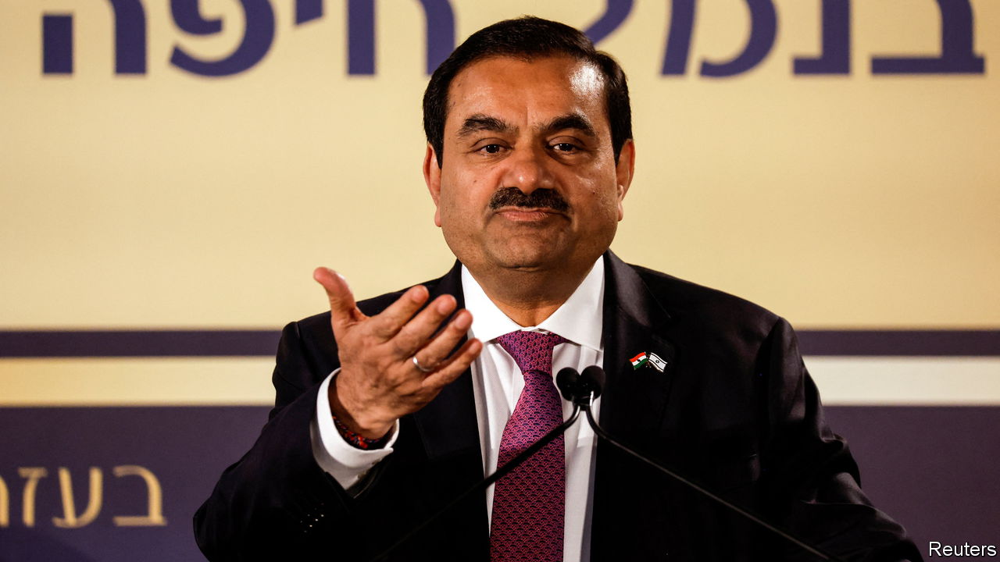

###### The Economist explains

# Who is Gautam Adani? 

##### India’s richest man avoids the limelight 

 

> Jan 31st 2023 

ON JANUARY 24TH Hindenburg Research, a tiny American investment firm that specialises in short-selling,  the Adani Group, a huge Indian conglomerate, of pulling off the “largest con in corporate history”. The group denies the Hindenburg report’s allegations in their entirety. Before the report’s release, the group had a market value of $235bn and Gautam Adani, its founder and boss, was the world’s third-richest man. Since then, $70bn has been  off the market value of the Adani Group’s firms. Who is Mr Adani, and how did he amass his empire?

Mr Adani was born in 1962 in Gujarat, a state in north-western India. He was one of eight children in a middle-class family of Jains, a religion that preaches asceticism and strict vegetarianism. Like many other Gujaratis, Mr Adani’s father was an entrepreneur, running a small textile business. But Mr Adani had little interest in textiles. After dropping out of education aged 16 he moved to Mumbai, in the neighbouring state of Maharashtra, and took a job sorting diamonds. 

In 1981 his elder brother began a venture processing plastics, and Mr Adani moved home to manage it. He later began importing related raw materials, then metals, pharmaceuticals and an expanding array of commodities. When the Gujarat government outsourced management of the port of Mundra, Mr Adani, who has always deftly navigated Indian bureaucracy, won the contract; the port opened in 2001. Today Mundra is the largest port in India.

Much of Mundra’s growth came after 2001. That was when Narendra Modi, now India’s prime minister, began his 13-year tenure as Gujarat’s chief minister. Mr Modi’s administration reportedly leased land to Mr Adani at knock-down prices, helping him expand the port. (Mr Adani has denied claims of such favouritism.) A flourishing Mundra, along with a massive coal-fired power plant nearby, were the basis of the tycoon’s empire. His approach was simple: he bought rail and water rights, land and natural resources, and used one successful enterprise to finance the next. Today the Adani Group’s interests range from cement to media. 

Mr Adani’s successes helped Mr Modi, too. The politician used them to portray himself as a pro-growth leader. When he became India’s prime minister in 2014 he made the journey to Delhi, the capital, on Mr Adani’s plane. Their friendship seems to have continued. In 2019 Mr Adani secured government consent to set up a lucrative Special Economic Zone in the eastern state of Jharkhand. Hindenburg alleges that the government has also been lenient in its investigations of the group. But Mr Adani rejects allegations that Mr Modi’s government has shown his enterprises undue favour. He attributes his success to reforms implemented more than 30 years ago that made India more business-friendly. 

In contrast with many Indian tycoons Mr Adani keeps a low profile. That is despite a colourful past. In 1998 he was kidnapped along with an associate and reportedly released for a multimillion-dollar ransom. In 2008 he was at the Taj Mahal Hotel in Mumbai during a terrorist attack, and spent a night hiding in the basement. He rarely speaks publicly about these ordeals. There are no striking homes or flashy cars. He dresses in forgettable dark suits and white shirts, and describes himself as an introvert who does not enjoy attending parties. The share sell-off reduced Mr Adani’s personal wealth of $90bn by less than 10%; he is still the 11th-richest person in the world, down from second in September 2022. 

He seems intent on building a dynasty. His son, Karan, runs Adani Ports. Rajesh, his younger brother, is the managing director of the group. Hindenburg claims that his older brother, Vinod, exercises influence from Dubai. The company denies this—but a recent biography, written with co-operation from the group, says that Vinod oversees “most financial arrangements, especially global financing”. Hindenburg has accused both brothers of manipulating the group’s share price through offshore entities. The Adanis deny these allegations. They say the short-seller is launching a “calculated attack on the growth story and ambition of India”. ■

